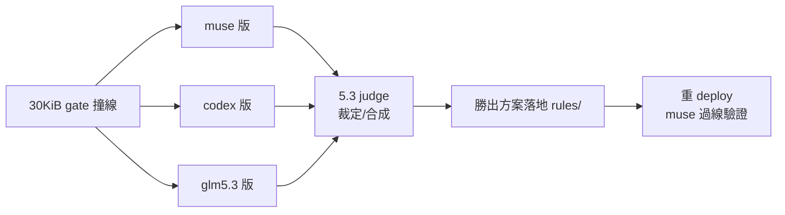

## Description

<!-- SECTION:DESCRIPTION:BEGIN -->
來源＝0925 AIR-192 落地後 muse bundle 撞 30KiB gate（30,965B > 30,720 gate；實際截斷線 32,000B 前僅 1,035B 餘裕；deploy [FAIL] 拒寫 muse 面已手動同步）。晨間合議⑥『瘦身延後撞線再說』——現在撞線。user 裁決形態＝muse/codex/glm5.3 三家族各寫一版瘦身修訂，5.3 judge 裁定勝出/合成。

```mermaid
flowchart LR
  A[30KiB gate 撞線] --> B[muse 版]
  A --> C[codex 版]
  A --> D[glm5.3 版]
  B --> E[5.3 judge<br/>裁定/合成]
  C --> E
  D --> E
  E --> F[勝出方案落地 rules/]
  F --> G[重 deploy<br/>muse 過線驗證]
```

手段正典（rules/AGENTS.md size-gate note＋memory-audit 載體表）：demote on-demand 內容至 reference skill（rule 留 always-on 核心＋pointer）——禁刪知識、禁升 hook。目標：新 bundle ≤30,700B（gate 內）且知識零損失（demote 有指針可達）。
<!-- SECTION:DESCRIPTION:END -->

## Acceptance Criteria
<!-- AC:BEGIN -->
- [ ] #1 三家族瘦身修訂版各一（逐 rule 處置表＋預估 bytes＋風險）
- [ ] #2 5.3 judge 裁定勝出/合成方案＋理由
- [ ] #3 勝出方案落地 rules/＋重 deploy muse 面 ≤30,700B＋三面內容探針
<!-- AC:END -->

## Implementation Notes

<!-- SECTION:NOTES:BEGIN -->
0925 compact 後續作：三版競標稿讀畢→marshal 合成（glm 主幹 5 條處置＋codex 驗證觀點；muse gate 面切割不採）→已落地 commit 0e01e1ca（11 檔：三 pointer 投影 bridge-dispatch/python-standards/symbol-query-routing＋design-thinking/context-management trim＋新 skills/python-standards＋deep-thinking POC 節＋arch-thinking 三 lens＋bridge skill 三家族寫面語義＋AGENTS.md glm provision 指路）。機驗：expected bundle 28,990B 三面同值（gate 30,720／目標 30,700，餘裕 1,710B）；bundle preview 5 個 projection 註解＋hard lines 抽查全命中；pre-commit 2,604 tests 綠。5.3 judge 已派（job-muh4hr8a-ywc76x，plan mode 唯讀，watcher 掛 sink=judge-verdict.md＋錨點 JUDGE）——verdict GO 後才 ff-only merge＋canonical 正式部署（28,990B 會一併帶上 tool-discipline dedup 舊檔，揭露無害）。帶外標記：scripts/memory_guard_rules.py:68 SyntaxWarning（187 弧遺留 docstring escape，待清）。

0926 晨：v1 judge job-muh4hr8a 空轉 6.5h 停派（病因＝brief 步驟含 git diff 但 glm carrier 無 Bash 面——機械不可執行＋每 request 205K tokens 失血；42K events 無 verdict）。修法：diff 由 marshal 預落 .agent-tmp/landed-diff.patch（25.9KB）＋brief v2 收緊（工具白名單 Read/Grep/Glob、閱讀 fence、一步寫完）。v2 已派 job-muhjo3vh-4mycfe＋watcher 重掛（sink verdict＋錨 JUDGE）。教訓候補入 bridge-dispatch skill：brief 驗證步驟須配 carrier 工具面——無 Bash carrier 禁派命令步驟，材料預落檔案。
<!-- SECTION:NOTES:END -->
