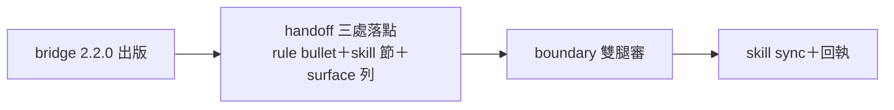

## Description

<!-- SECTION:DESCRIPTION:BEGIN -->
來源＝delegate-bridge marshal handoff（sess_1e76bc75，user 指派；DB-40 Stage 2／db-52＋db-53——2.2.0 已出版＋CC live 實證）。三處落點：①rules/bridge-dispatch.md 加 MCP face bullet（plugin .mcp.json auto-registration＋codex wiring 工具＋bridge_task 恆 --background＋knownFalseNegative re-dispatch trap）②skills/bridge-dispatch/SKILL.md 加 MCP face 節（兩種合法接線按 harness 分流＋MCP tool dispatch 紀律）③Caller surface 對照表加一列。handoff 包＝/Users/ctai/Github/delegate-bridge/.agent-tmp/handoff-mcp-face-ai-guide.md（draft proposal＋錨點齊）。分類預期 boundary（dispatch gate 面——knownFalseNegative re-dispatch trap 是有後果決策）→雙腿審。完成回執 scbus sess_1e76bc75。

<!-- SECTION:DESCRIPTION:END -->

## Acceptance Criteria
<!-- AC:BEGIN -->
- [ ] #1 三處落點依 instruction-writing 精修落地（卡 WT 隔離）
- [ ] #2 boundary 雙腿 review 過
- [ ] #3 skill sync＋回執 scbus
<!-- AC:END -->
