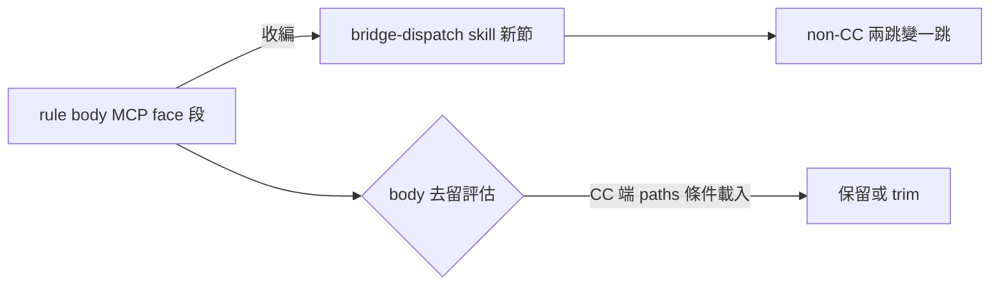

## Description

<!-- SECTION:DESCRIPTION:BEGIN -->
judge 驗收 AIR-201 時發現：rules/bridge-dispatch.md body 的 MCP face 段（.mcp.json 註冊／codex-mcp-wiring／bridge_task 恆 --background）在 bridge-dispatch skill 無對應節。body 是 pre-existing 內容未動，但三條 projection 落地後 non-CC 常駐面只剩泛指針，MCP face 知識對 non-CC 變成兩跳且無錨。收編＝把 MCP face 段落成 skill 一節＋rule body 該段評估去留。

<!-- SECTION:DESCRIPTION:END -->
