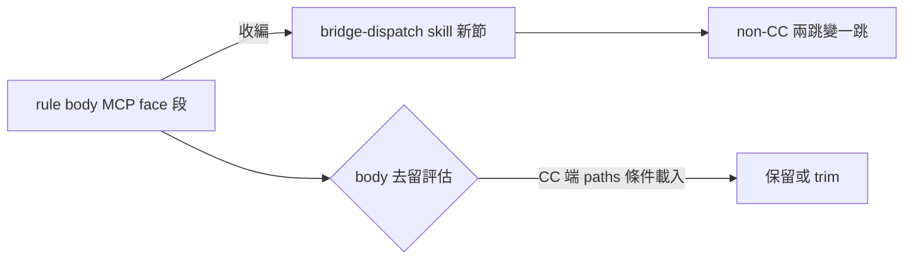

## Description

<!-- SECTION:DESCRIPTION:BEGIN -->
judge 驗收 AIR-201 時發現：rules/bridge-dispatch.md body 的 MCP face 段（.mcp.json 註冊／codex-mcp-wiring／bridge_task 恆 --background）在 bridge-dispatch skill 無對應節。body 是 pre-existing 內容未動，但三條 projection 落地後 non-CC 常駐面只剩泛指針，MCP face 知識對 non-CC 變成兩跳且無錨。收編＝把 MCP face 段落成 skill 一節＋rule body 該段評估去留。

<!-- SECTION:DESCRIPTION:END -->

## Acceptance Criteria
<!-- AC:BEGIN -->
- [x] #1 rule body MCP 段壓縮為指針行；skill 節為細節單一源；fresh 腿零損失 GO
<!-- AC:END -->

## Implementation Notes

<!-- SECTION:NOTES:BEGIN -->
實作發現：judge 觀察 1 的 drift 為 rebase 時差——skill MCP face 節（AIR-202 落地）merge 後已完整承載 rule body facts；本次改為 body bullet 壓指針行（消重複維護面）。fresh 腿 GO（零損失七項機驗）。
<!-- SECTION:NOTES:END -->

## Final Summary

<!-- SECTION:FINAL_SUMMARY:BEGIN -->
結案：judge 觀察 1 的 drift 實為 rebase 時差——skill「MCP face 接線與 MCP tool dispatch」節（AIR-202 落地）在 judge 讀的 pre-rebase branch 上不存在，merge 後已完整承載 rule body 全部 MCP facts（fresh reviewer 機械比對七項全 ✓）。本次實作＝rule body MCP bullet 壓縮為指針行（消重複維護面）；零損失 GO（reviewer：F1/F2 均 🟢 可選建議——re-dispatch trap 操作句退場由 skill 觸發詞錨接手；CC 端 symlink live 無需重部署）。回執：classification=ordinary／review=in-harness fresh GO／session-freshness=fresh／deployment-surfaces=N/A（body 非投影面，bundle 不變）。

結案：judge 觀察 1（rule body MCP face 段在 skill 無對應節）經查為 rebase 時差——AIR-202 落地的 skill「MCP face 接線與 MCP tool dispatch」節在 merge 後已完整承載 rule body 全部 facts（pin transition／command 綁 arch／wiring 易腐／knownFalseNegative／短等，fresh reviewer 七項機驗全 ✓）。本次實作＝rule body MCP bullet 壓縮為指針行，消掉雙處維護面；CC 端 symlink live。回執：classification=ordinary／review=in-harness fresh GO／session-freshness=fresh／deployment-surfaces=N/A（body 非投影面，bundle 不變）。

<!-- SECTION:FINAL_SUMMARY:END -->
