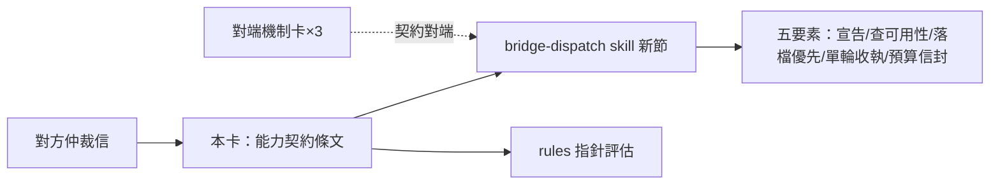
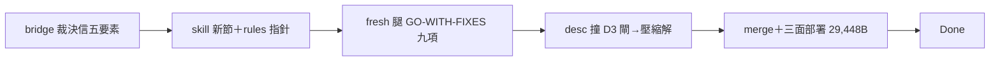

## Description

<!-- SECTION:DESCRIPTION:BEGIN -->
bridge 委派機制昨晚發生「仲裁工作空轉」事故；對方 repo 已完成三腿研究＋5.3 仲裁，寄來預防契約，本 repo 負責其中「派工前能力契約」條文落地。要點五項：每條工作腿派工前宣告可用工具面；派工前查可用性（含 Bash 白名單開關）；素材落檔優先、開放執行權為例外；單輪產出配具名收執檔；預算封頂為選配信封。落點＝bridge-dispatch skill 新節＋rules 指針評估；brief 模板擴節與機械閘由對方 repo 承接。

證據指針：對方來信 message id 與裁決／事實兩腿 job 帳本，均可於 delegate-bridge workspace 的 bridge show 查得；對端機制條款以其 repo commit 為錨。
<!-- SECTION:DESCRIPTION:END -->

## Acceptance Criteria
<!-- AC:BEGIN -->
- [x] #1 五要素契約落 bridge-dispatch skill 新節＋rules 指針；fresh 腿 GO-WITH-FIXES 全修；desc 過 D3 預算閘；三面部署 healthy
<!-- AC:END -->

## Final Summary

<!-- SECTION:FINAL_SUMMARY:BEGIN -->
結案：brief capability contract 五要素落地（skill 新節＋rules pointer 84B）。fresh reviewer GO-WITH-FIXES 九項全修——F1(🔴) materialize-first 主語矛盾（唯讀腿=dispatcher 落檔／寫腿=carrier 落檔，對端模板 §6 對齊）、F2 bash-allow 未落地 as-of 標記、F3 自創錯誤碼錨刪除、F4 description/觸發詞/索引同步、F5 seal 定義收斂單一源、F6 pre-ledger exit 2 限定、F7 指針語順、F8 枚舉開放列、F9 具名 sink 用語統一。審查腿實證：db-58 In Progress/59-60 To Do（對端未落地事實已 as-of 標記）；模板 v2 六→八節 bridge 側已 landing。回執：classification=ordinary／review=in-harness fresh GO-WITH-FIXES→修／session-freshness=fresh／deployment-surfaces=healthy。

結案：brief capability contract 五要素落地（skill 新節＋rules pointer）——manifest 開放列、availability lint（bash-allow 為 db-58 增補，落地前 availability＝衍生 surface，as-of 標記）、materialize-first 分腿型主語（唯讀腿=dispatcher 落檔附路徑／寫腿=carrier 落檔，對端模板 §6 對齊）、one-shot 具名 sink＋seal 模式定義單一源收斂、envelope 給值。fresh reviewer GO-WITH-FIXES 九項全修（F1🔴 主語矛盾／F2 as-of／F3 自創錯誤碼刪／F4 desc+觸發詞+索引同步——desc 撞 D3 1024 預算閘後壓縮冗餘括注解決／F5 seal 單一源／F6 pre-ledger 限定／F7-F9 語順枚舉用語）。部署 29,448B 三面 healthy。回執：classification=ordinary／review=in-harness fresh GO-WITH-FIXES→修／session-freshness=fresh／deployment-surfaces=healthy。事故自省：收線鏈管線遮蔽 commit 失敗（pre-commit 1 測試紅被 tail 吃掉）——更正信已發 bridge 對端。

<!-- SECTION:FINAL_SUMMARY:END -->
