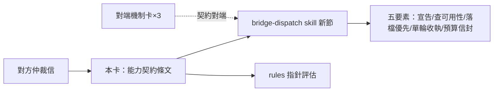

## Description

<!-- SECTION:DESCRIPTION:BEGIN -->
bridge 委派機制昨晚發生「仲裁工作空轉」事故；對方 repo 已完成三腿研究＋5.3 仲裁，寄來預防契約，本 repo 負責其中「派工前能力契約」條文落地。要點五項：每條工作腿派工前宣告可用工具面；派工前查可用性（含 Bash 白名單開關）；素材落檔優先、開放執行權為例外；單輪產出配具名收執檔；預算封頂為選配信封。落點＝bridge-dispatch skill 新節＋rules 指針評估；brief 模板擴節與機械閘由對方 repo 承接。

證據指針：對方來信 message id 與裁決／事實兩腿 job 帳本，均可於 delegate-bridge workspace 的 bridge show 查得；對端機制條款以其 repo commit 為錨。
<!-- SECTION:DESCRIPTION:END -->
