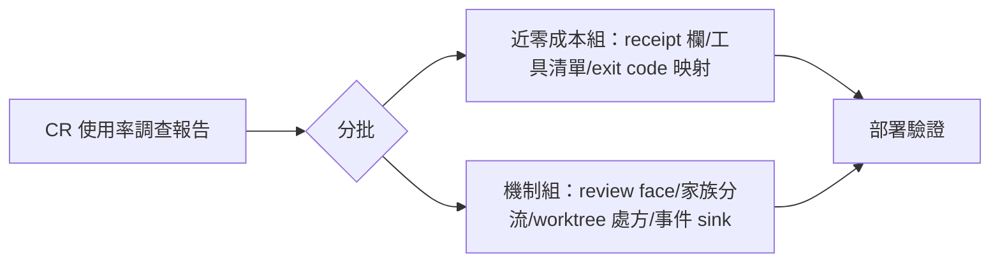
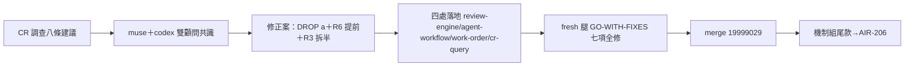

## Description

<!-- SECTION:DESCRIPTION:BEGIN -->
code-reality 工具鏈的實際使用率遠低於預期（審查派工只有約 4% 真用到、查詢閘注入率不到 3%）。專用調查弧已完成三軸調查＋三方詰問，產出八條 ai-guide 側設計建議，全部待落地。核心結論：工具在場是必要條件，spawn 級注入才是 reviewer 的真正觸發器——修復錨點應放在派工產生器，不是把條文寫得更兇。建議分兩批：近零成本組（調查員代理補工具清單、freshness 判定改用 exit code 映射、review 派工 receipt 增加工具面註記欄）先落；機制組（review face 收斂、家族分流模板、worktree 借用處方、條款改寫、事件落持久 sink）逐卡評估。

證據指針：調查報告全文與八條建議詳 code-reality repo 的 .agent-tmp/cr-usage-investigation/report.md（第 6 節有逐條證據連結）；調查 ticket at-20260926-0011。
<!-- SECTION:DESCRIPTION:END -->

## Acceptance Criteria
<!-- AC:BEGIN -->
- [x] #1 共識修正案四處落地（review-engine C10／agent-workflow crsurface／work-order 分流 guard／cr-query Detect exit 映射）；fresh 腿 GO-WITH-FIXES 全修；(a) DROP＋機制組尾款移交 AIR-206
<!-- AC:END -->

## Final Summary

<!-- SECTION:FINAL_SUMMARY:BEGIN -->
結案：CR 使用率八條建議經 muse＋codex 雙顧問獨立討論（共識 AGREE-WITH-CHANGES）修正後落地四處——①review-engine C10 改雙通道表述（可及必要＋spawn 注入觸發器，604 jobs 梯度證據）②agent-workflow dispatch preview 增 crsurface=<mcp|attach|cli|absent> 欄＋review 語義派工 CR materialization boundary（dispatcher 事實聲明非自報；非 review 派工恆 absent 免理由）③work-order §7 carrier 分流 guard（codex 發 CLI 字串禁 MCP 名）④cr-query Detect「Graph DB exists ≠ graph usable」＋freshness exit 0/1/2 映射（1=合法 verdict 非 shell failure；判 stale 佐 stdout/stderr）。共識裁決：(a) DROP（零使用是正確軸紀律＋MCP 白名單觸發 spawn 炸彈）、R6 提前、R3 拆半、R4 不提前（borrowed-index 證據語義未收緊）。機制組尾款→AIR-206。數字校準：review face 5/604（muse 限定）非 0/604。回執：classification=ordinary／review=muse＋codex 雙顧問共識＋in-harness fresh GO-WITH-FIXES 七項全修／session-freshness=fresh／deployment-surfaces=N/A（全 skills 面，bundle 不變）。

<!-- SECTION:FINAL_SUMMARY:END -->
