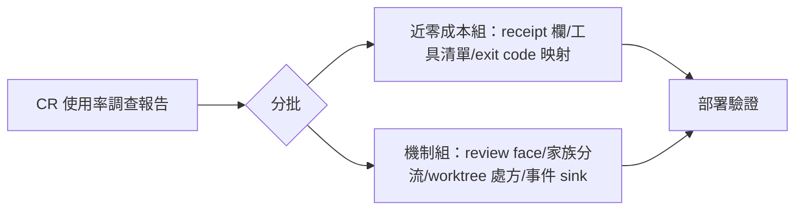

## Description

<!-- SECTION:DESCRIPTION:BEGIN -->
code-reality 工具鏈的實際使用率遠低於預期（審查派工只有約 4% 真用到、查詢閘注入率不到 3%）。專用調查弧已完成三軸調查＋三方詰問，產出八條 ai-guide 側設計建議，全部待落地。核心結論：工具在場是必要條件，spawn 級注入才是 reviewer 的真正觸發器——修復錨點應放在派工產生器，不是把條文寫得更兇。建議分兩批：近零成本組（調查員代理補工具清單、freshness 判定改用 exit code 映射、review 派工 receipt 增加工具面註記欄）先落；機制組（review face 收斂、家族分流模板、worktree 借用處方、條款改寫、事件落持久 sink）逐卡評估。

證據指針：調查報告全文與八條建議詳 code-reality repo 的 .agent-tmp/cr-usage-investigation/report.md（第 6 節有逐條證據連結）；調查 ticket at-20260926-0011。
<!-- SECTION:DESCRIPTION:END -->
