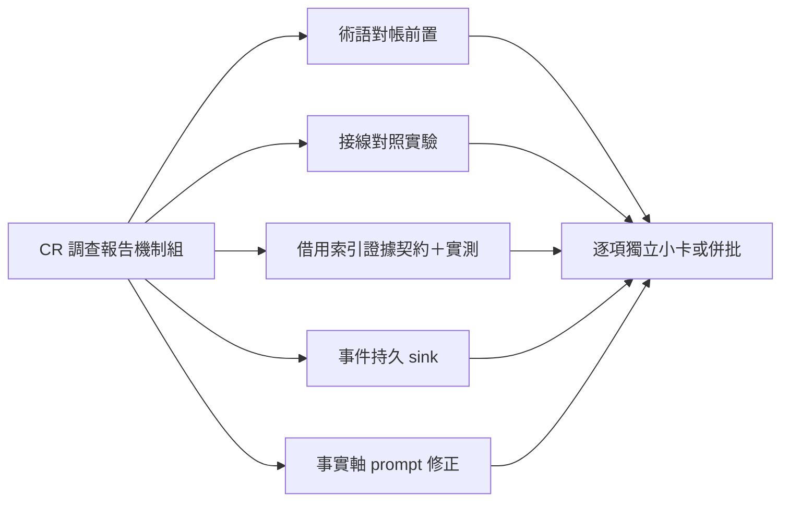

## Description

<!-- SECTION:DESCRIPTION:BEGIN -->
CR 使用率調查的機制組尾款（近零成本組已由 AIR-205 落地，本卡收其餘）。五項逐個評估：①review 語義派工收斂到 review face 並泛化附掛通道——前置：先做術語對帳（新註記與既有四態命名撞車，歸 review-engine 擁有）；②codex 生成器接線對照實驗——定位外掛已裝但工作面吃不到的斷點；③worktree 借主 checkout 索引的證據契約——先定義借來的索引能支撐哪些結論（禁支撐負向結論），配一次真 worktree 實測；④CR 呼叫事件定期落持久儲存（現行日誌會輪轉，下輪調查將無錨）；⑤事實軸工作腿的提示必帶 repo 根路徑與命令列字串（調查發現的正確修法，非補工具清單）。

證據指針：調查報告 .agent-tmp/cr-usage-investigation/report.md（code-reality repo）；共識裁決兩腿 job 帳本（ai-guide workspace bridge show 可查）；AIR-205 Final Summary 節。
<!-- SECTION:DESCRIPTION:END -->

## Implementation Notes

<!-- SECTION:NOTES:BEGIN -->
205 reviewer F6 掛帳：crsurface（dispatch preview 拼法）vs cr-surface（bridge receipt/ledger 面拼法）——bridge 側 receipt 欄落地時統一拼法或互相標注等價。
<!-- SECTION:NOTES:END -->
