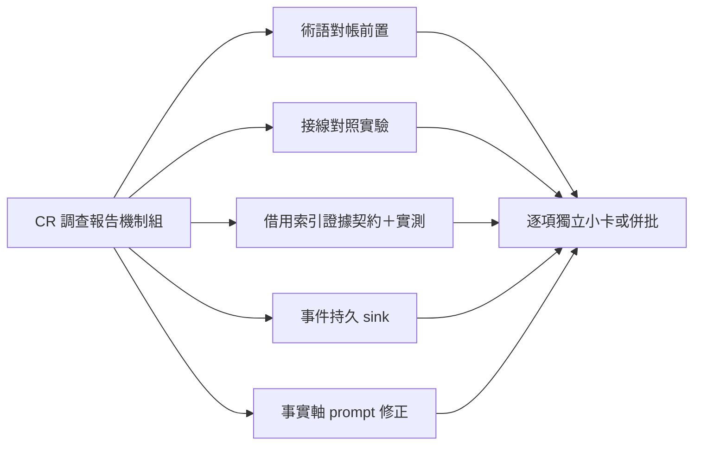
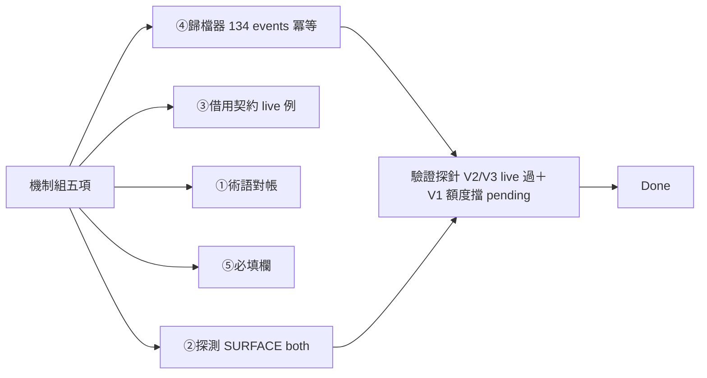

## Description

<!-- SECTION:DESCRIPTION:BEGIN -->
CR 使用率調查的機制組尾款（近零成本組已由 AIR-205 落地，本卡收其餘）。五項逐個評估：①review 語義派工收斂到 review face 並泛化附掛通道——前置：先做術語對帳（新註記與既有四態命名撞車，歸 review-engine 擁有）；②codex 生成器接線對照實驗——定位外掛已裝但工作面吃不到的斷點；③worktree 借主 checkout 索引的證據契約——先定義借來的索引能支撐哪些結論（禁支撐負向結論），配一次真 worktree 實測；④CR 呼叫事件定期落持久儲存（現行日誌會輪轉，下輪調查將無錨）；⑤事實軸工作腿的提示必帶 repo 根路徑與命令列字串（調查發現的正確修法，非補工具清單）。

證據指針：調查報告 .agent-tmp/cr-usage-investigation/report.md（code-reality repo）；共識裁決兩腿 job 帳本（ai-guide workspace bridge show 可查）；AIR-205 Final Summary 節。
<!-- SECTION:DESCRIPTION:END -->

## Acceptance Criteria
<!-- AC:BEGIN -->
- [x] #1 ④歸檔腳本＋plist（實跑 134 events＋冪等＋去 3x）；③借用索引契約入 cr-query（live 例 exit 1）；①術語對帳入 review-engine；⑤work-order 事實軸必填欄；②codex 探測 both＋三處 as-of 化；bridge 兩點（MCP 斷線指針＋bashAllow 翻正追蹤）入檔；驗證探針 V2/V3 live 過
<!-- AC:END -->

## Implementation Notes

<!-- SECTION:NOTES:BEGIN -->
205 reviewer F6 掛帳：crsurface（dispatch preview 拼法）vs cr-surface（bridge receipt/ledger 面拼法）——bridge 側 receipt 欄落地時統一拼法或互相標注等價。

scbus 機制縫隙（0926 發現，user 追問 hook 是否生效時確診）：address-face queue_next_turn 信（to.name=null）注入後，legacy --to 回信不清隊列——清除需位址面 ack（--address），但信無 address mailbox、兩端 session 都 name=null，ack 無可指位址（本 session 已 claim durable address ai-guide-primary 供未來位址面收發）——淨效果＝重複注入到 TTL。owner＝sc-router 契約（scbus-address-contract）；已回報橋端。hook delivery 本身正常（首輪即注入全文）。

SCR-6 裁定更正（sc-router owner 否證，收訖）：719fdfe8 為 legacy --to 直寄非位址面（queue_next_turn＝legacy DELIVERY_MODE 常數）；「重複注入機制」不存在——drain 消費即終態 cur/ 永不再掃，重複出現感知來自我方恢復鏈引用信件內容；「借用過期租約位址」假設同否證（envelope 從未進位址信箱）。本側已照 §指引 scbus acquire ai-guide-primary（lease 24h）。sc-router 已落 protocol v2.2 amendment（§5.5/§3.11/§5.8）。我方先前 note 的「address-face 縫隙」診斷撤回。
<!-- SECTION:NOTES:END -->

## Final Summary

<!-- SECTION:FINAL_SUMMARY:BEGIN -->
結案：CR 機制組五項全落地。④scripts/cr_usage_archive.py＋deploy/cr-usage-archive.plist（每日 08:20；首跑 134 events、冪等驗證、V2 review F1 去 3x 高估——收 result 終態＋callId 欄；**尚未 launchd bootstrap 安裝**——render+bootstrap 留 user 或下批）。③cr-query「Worktree 借用處方」節（serves=committed-baseline＋禁 negative verdict＋真實案例 exit 1 live）。①review-engine 四態節尾術語對帳（crsurface 正交、命名對帳基準）。⑤work-order §7 事實軸 cr 軸必填 repo_root＋CLI 字串。②codex wiring 探測（V-probe）：**SURFACE both**（mcp__code_reality__* server＋CLI binary 都在——0922-26 錯配為歷史；bridge 2.3.0/包版演化），三處條文 as-of 化（當次探測為準禁歷史推定）。bridge 對端兩點入檔：MCP 斷線→CLI fallback＋重啟紀律指回 repo SOP（0926 2.2.0→2.3.0 斷線實證）、bashAllow as-of 補 db-62 翻正追蹤。**驗證探針（非射後不理）**：V2 registry code-reviewer＋MCP 注入＝live 觸發（callers 0+65 item-level＋impact_radius 0＋heal 呈報——「0 callers 是嫌疑」紀律自發走 rg 互補）；V3 investigator cr 軸 CLI 形態＝live 過（四腿證據，repo_root＋CLI 字串必填欄直接治好 3/3 零使用）；V1 codex MCP 實呼＝discovery ✓ 但被 usage limit 擋（11:48 重置後補一發，pending）。附帶發現：scbus address-face queue_next_turn 信寄 address-less session＝重複注入縫隙（已回報橋端＋本側 claim ai-guide-primary）。回執：classification=ordinary／review=in-harness fresh GO-WITH-FIXES 十項全修／session-freshness=fresh／deployment-surfaces=N/A（skills＋scripts＋deploy 面，bundle 不變）。

<!-- SECTION:FINAL_SUMMARY:END -->
