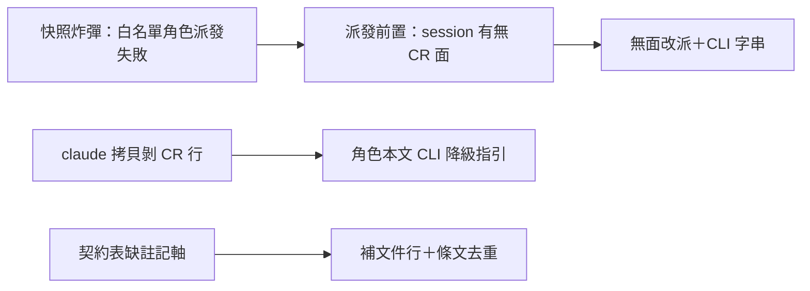

## Description

<!-- SECTION:DESCRIPTION:BEGIN -->
昨夜 AIR-205 弧的架構盤點發現 agents/ 三個改善點：①五個角色掛 CR MCP 全名白名單，在沒有 CR 外掛的 session 會直接派發失敗（啟動快照炸彈），而 205 落的注入邊界檢查攔不到這種死法——補一條派發前置：判斷本 session 有無 CR 面，沒有就改派無白名單角色加命令列字串；②claude 端拷貝生成器會剝掉 CR 工具行，等於 claude 端審查者結構性沒有 CR——在角色本文補「MCP 缺場改用 CLI 等效命令」的降級指引，讓剝行從缺陷變降級路徑；③契約表補上派工面註記軸的文件行，並檢查角色本文有無與單一源重複的 CR 條文要改指針。

<!-- SECTION:DESCRIPTION:END -->
