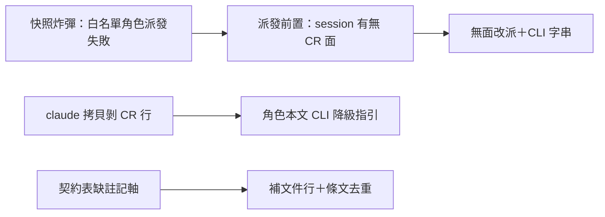
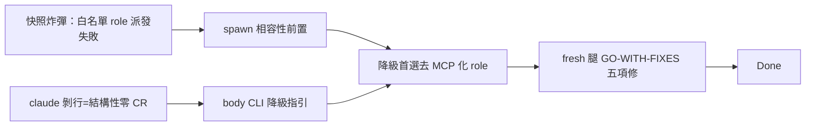

## Description

<!-- SECTION:DESCRIPTION:BEGIN -->
昨夜 AIR-205 弧的架構盤點發現 agents/ 三個改善點：①五個角色掛 CR MCP 全名白名單，在沒有 CR 外掛的 session 會直接派發失敗（啟動快照炸彈），而 205 落的注入邊界檢查攔不到這種死法——補一條派發前置：判斷本 session 有無 CR 面，沒有就改派無白名單角色加命令列字串；②claude 端拷貝生成器會剝掉 CR 工具行，等於 claude 端審查者結構性沒有 CR——在角色本文補「MCP 缺場改用 CLI 等效命令」的降級指引，讓剝行從缺陷變降級路徑；③契約表補上派工面註記軸的文件行，並檢查角色本文有無與單一源重複的 CR 條文要改指針。

<!-- SECTION:DESCRIPTION:END -->

## Acceptance Criteria
<!-- AC:BEGIN -->
- [x] #1 spawn 相容性前置落 agent-workflow（ban 鍵＝快照在場）；code-reviewer 族 body CLI 降級指引三拷貝同步；agents/AGENTS.md 派工面註記軸＋roles 表備註；fresh 腿 GO-WITH-FIXES 五項全修
<!-- AC:END -->

## Implementation Notes

<!-- SECTION:NOTES:BEGIN -->
實作：sync_agents.py 再生成後 claude/zcode 拷貝各僅 body 一行變更（tools 白名單與剝行設計未動）；reviewer 實跑 scip_refs/graph_query --help 核對 CLI 形態；F1 校正 binary 偵測 owner 為 code-reality skill「存在性偵測」節（原誤指 cr-query）。
<!-- SECTION:NOTES:END -->

## Final Summary

<!-- SECTION:FINAL_SUMMARY:BEGIN -->
結案：agents/ 三項補強全落地——①agent-workflow dispatch 增「spawn 相容性前置（快照炸彈防護）」：ban 鍵＝CR MCP server 不在啟動快照（非 crsurface 值），降級腿首選去 MCP 化 registry role（cross-verify-investigator 範式）、generic/Explore 末位；②code-reviewer／primed 兩端 body 降級句補強：MCP 缺場或 claude 剝行形態→CLI 等效命令（scip_refs/graph_query，binary 偵測 owner 校正為 code-reality skill「存在性偵測」節；CLI 形態變更同步義務句）；③agents/AGENTS.md roles 表備註更新＋dispatch matrix 增「派工面註記軸」段。sync_agents.py 再生成雙 registry（9/9；claude 剝行設計保持、body 三處同步）。fresh 腿 GO-WITH-FIXES 五項全修（實跑 scip_refs/graph_query --help 核對命令形態）。回執：classification=ordinary／review=in-harness fresh GO-WITH-FIXES→修／session-freshness=fresh／deployment-surfaces=N/A（agents＋skill 面，bundle 不變；skills symlink live）。

<!-- SECTION:FINAL_SUMMARY:END -->
