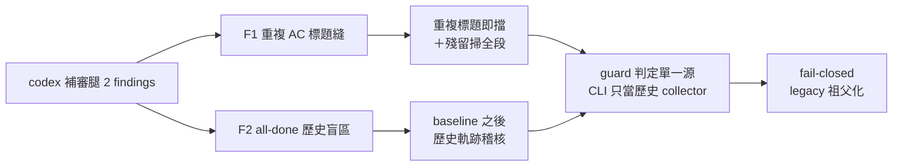

## Description

<!-- SECTION:DESCRIPTION:BEGIN -->
這張卡修結案守門閘的兩個繞過縫（codex 補審腿發現、muse＋codex 雙腿討論定案，設計文件 .agent-tmp/air193-fix/）。

**做什麼**
- F1：老式卡片（AC 沒有正式標記、只有 markdown 標題）若出現兩個「## Acceptance Criteria」標題，現在的檢查只掃第一段——第二段藏未勾項可溜過閘。修法：重複標題直接擋＋殘留掃描改掃全部標題段（聯集）。
- F2：卡片在 hook 失效期間被直接從 To Do 翻成 Done 並 commit，之後的 --all-done 稽核看不出這段歷史。修法：稽核改查軌跡閘上線 commit（baseline，immutable OID）之後的完整檔案歷史，非法跳變報出、上線前的舊卡全部祖父化不誤炸。

**不做什麼**
- 不動 fail-closed 語義與 CARDCLOSE_STRUCT_SKIP 逃生口
- 歷史稽核只跑在稽核 CLI（慢路徑），不進 pre-commit 快路徑
- code fence 內標題解析（已知盲點，pin 現狀）另立後續卡

**現在到哪**：設計雙腿合議定案，待實作（TDD，glm writer lane 承接）。

<!-- SECTION:DESCRIPTION:END -->

## Acceptance Criteria
<!-- AC:BEGIN -->
- [ ] #1 F1 攻擊形態（第一 AC 段全勾＋第二重複標題段藏未勾）→ guard 與 CLI 同報 duplicate＋residue、exit 非零
- [ ] #2 單標題存量卡零新 violation——全 repo dry-run 重複標題數 0 萬 notes；F1 討論測試清單 11 條落 tests（fence 條 pin 現狀）
- [ ] #3 F2 正測：hook 缺席期間 To Do→Done 已 commit、clean checkout 後 --all-done 報軌跡 violation 含 commit hash；baseline 前非法跳 grandfather 通過
- [ ] #4 rename（tasks→completed）合法軌跡通過；D/A 無法唯一配對與 shallow clone → fail-closed 非零 exit 非 pass
- [ ] #5 CARDCLOSE_STRUCT_SKIP 行為不變；python3.9 相容；歷史稽核不進 pre-commit；heads[0] 慣性全 repo rg 檢查結果記 notes；全量 uv run pytest 綠
<!-- AC:END -->

## Implementation Plan

<!-- SECTION:PLAN:BEGIN -->
〔baseline：ai-guide c337cceb〕
〔已決策勿重辯：
①F1 雙層並存：(a) 精確標題 strip()=="## Acceptance Criteria" 命中>1＝structural violation（與 markers 有無無關）；(b) markers 缺席時殘留掃描掃全部標題段聯集（取代 heads[0]-only）。共用 heading-ranges 純 helper 防 drift。marker 恰一組仍 authoritative；marker malformed 不得被 fallback 救成合法；單標題存量卡零行為變化；小寫/變體標題不觸發（防意外收緊）。
②F1 上線前全 repo dry-run：現存重複標題數須 0（codex 已掃 0，實作後複驗落 notes）；非零逐卡合併、不做 grandfather 名單。fence 內標題維持現狀＝pin 測試＋deferred 後續卡。
③F2 baseline＝immutable OID f1f022386c9863a993a999e32154bdf9ff14d14e（trajectory predicate 上線 commit）住 guard 常數（CLI import 單一源）；不用日期（rebase/時區歧義）。baseline 前置 fail-closed 檢查：cat-file -e ^{commit}＋merge-base --is-ancestor baseline HEAD，任一失敗＝audit ERROR 非零 exit（shallow clone 自然落入，不冒充已驗證）。
④F2 機制：--all-done 對「WT=Done 且 HEAD=Done」盲點集合卡，單趟 rev-list --reverse baseline..HEAD＋逐 commit diff-tree --no-commit-id -r -M --name-status -z 掃 backlog/tasks＋backlog/completed；old/new blob 以 guard frontmatter_status 解析、相鄰 pair 餵 guard status_trajectory_violation——collector 在 CLI、判定在 guard（禁二刻）。D/A 無法唯一配對（比對 frontmatter id）＝identity-ambiguous fail-closed；Done→Done rename 自然過；解析失敗打斷相鄰鏈＋history-gap 警告。
⑤F2 邊界：--no-history 逃生 flag（預設全審）；--since defer；歷史稽核永不進 pre-commit 快路徑（誤用明令禁止）；偵測控制定位——committer date 偽造/merge 衝突手寫 status 為已知邊界文件聲明。
⑥muse 風險#4 納入驗證步：rg 掃 heads[0]-only 慣性全 repo（唯讀，命中另記不擴 scope）〕
範圍：.githooks/card-diagram-guard.py＋scripts/closeout_check.py＋tests/test_card_diagram_guard.py；禁碰 CARDCLOSE_STRUCT_SKIP 語義與其他 predicate。雙腿設計全文：.agent-tmp/air193-fix/muse-design.md＋codex-design.md（設計出處，實作前必讀）。
<!-- SECTION:PLAN:END -->
