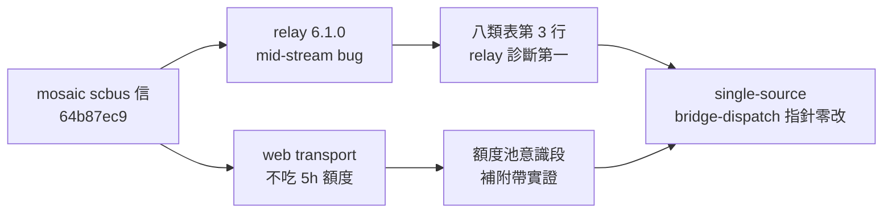

## Description

<!-- SECTION:DESCRIPTION:BEGIN -->
mosaic 端 scbus 信（message 64b87ec9，0926）傳來的排障知識落檔：

**做什麼**
- model-routing webgpt 八類失敗態表第 3 行（「stopped responding」）：排障順序改為 relay 版本第一——curl 127.0.0.1:17841/healthz 查 codex-chatgpt-web 版本（6.1.0 有 mid-stream bug，升 6.1.1＋重啟 daemon 即癒，mosaic 0926 實證）；「查 ChatGPT tab」降二線。
- 額度池意識段補一句附帶實證：web transport 不吃 codex API 5h 額度（native allowed:false 下照樣跑通——同信實證）。

**不做什麼**
- bridge-dispatch skill 零改動（L54 已指針到 model-routing 表，無雙寫）
- relay 本體升級（mosaic/ codex-chatgpt-web repo 主權）

**現在到哪**：idle-time task 落地中——已驗本機 relay 現值 6.1.1（升級已發生）。

<!-- SECTION:DESCRIPTION:END -->
