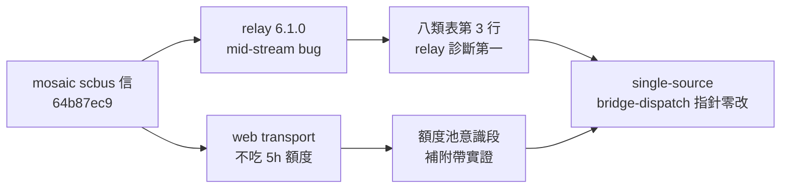
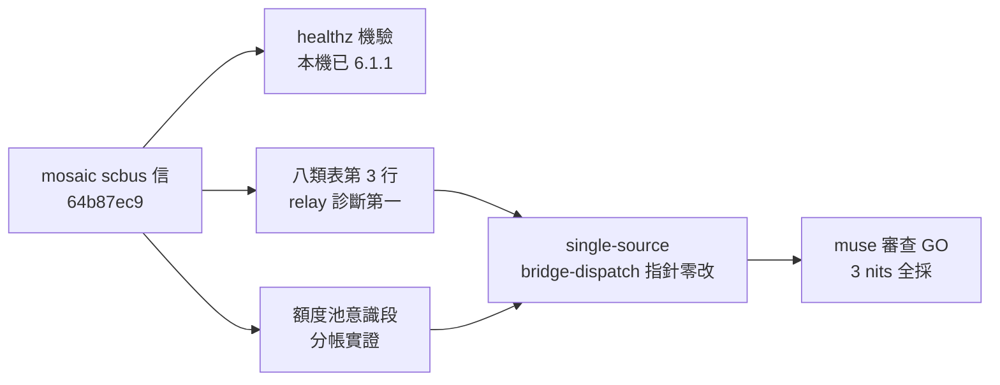

## Description

<!-- SECTION:DESCRIPTION:BEGIN -->
mosaic 端 scbus 信（message 64b87ec9，0926）傳來的排障知識落檔：

**做什麼**
- model-routing webgpt 八類失敗態表第 3 行（「stopped responding」）：排障順序改為 relay 版本第一——curl 127.0.0.1:17841/healthz 查 codex-chatgpt-web 版本（6.1.0 有 mid-stream bug，升 6.1.1＋重啟 daemon 即癒，mosaic 0926 實證）；「查 ChatGPT tab」降二線。
- 額度池意識段補一句附帶實證：web transport 不吃 codex API 5h 額度（native allowed:false 下照樣跑通——同信實證）。

**不做什麼**
- bridge-dispatch skill 零改動（L54 已指針到 model-routing 表，無雙寫）
- relay 本體升級（mosaic/ codex-chatgpt-web repo 主權）

**現在到哪**：idle-time task 落地中——已驗本機 relay 現值 6.1.1（升級已發生）。

<!-- SECTION:DESCRIPTION:END -->

## Acceptance Criteria
<!-- AC:BEGIN -->
- [x] #1 八類失敗態表第 3 行排障順序改 relay /healthz 版本檢查第一（6.1.0 bug 標注 mosaic 機上 as-of 0926 實證、tab 降二線）
- [x] #2 額度池意識段補附帶實證：web transport 不吃原生池 5h 額度（native allowed:false 下跑通）
- [x] #3 single-source：bridge-dispatch skill 零雙寫（指針既在）；muse 審查通過（job-mui6kvwk）
<!-- AC:END -->

## Implementation Notes

<!-- SECTION:NOTES:BEGIN -->
落地記錄：relay healthz 機驗本機現值 6.1.1（升級已發生，mosaic 13:01 修）；落點 single-source＝model-routing 八類表第 3 行（排障順序 relay /healthz 第一、tab 二線）＋額度池意識段附帶實證（web transport 不吃原生池 5h 額度）；bridge-dispatch L54 既是指針零改動。審查：muse job-mui6kvwk GO-WITH-FIXES 3 nits 全採（機器限定詞 as-of 0926、術語對齊原生池、註腳登記實證源 message 64b87ec9）。過程：guard 攔 canonical 直寫（改走 --ephemeral）、主樹漏 commit 翻卡致收線連鎖失敗（補 commit＋cherry-pick 修復）。
<!-- SECTION:NOTES:END -->

## Final Summary

<!-- SECTION:FINAL_SUMMARY:BEGIN -->
結案：mosaic relay 排障知識落檔——八類表第 3 行排障順序改 relay /healthz 版本檢查第一（6.1.0 mid-stream bug 機上實證 as-of 0926）、額度池意識段補 web transport 不吃原生池 5h 額度實證；bridge-dispatch 指針零改（single-source）；muse 審查 GO（3 nits 全採）。

<!-- SECTION:FINAL_SUMMARY:END -->
