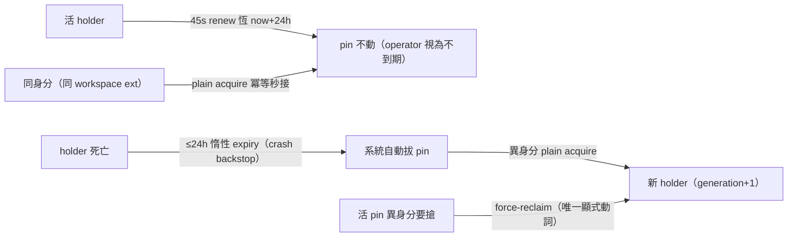

## Description

<!-- SECTION:DESCRIPTION:BEGIN -->
三方討論（muse/codex/GLM-5.3 兩輪）裁定：user 的「不會到期的租約，切換條件＝pinned」模型 adopt-with-refinement。本卡把裁定落地為 ai-guide 文檔正典：①新建 consumer 側 governance/scbus-address-ownership.md（pin 模型 canonical 措辭）②STATE.md 退役必失敗的 renew 交接行（glm 席實證：renew 綁 holder 身分，新 session 必失敗）③AIR-168 舊契約檔頭加 superseded 指針。零行為變更：southchariot/sc-router/skills 全不動。

<!-- SECTION:DESCRIPTION:END -->

## Acceptance Criteria
<!-- AC:BEGIN -->
- [x] #1 governance/scbus-address-ownership.md 落地：pin 綁身分不綁視窗（ext=scbus-ext-sha256(realpath)[:16] per-workspace 決定論）＋活著永續/死後 24h 分面（ext 面 24h 結構不可達）＋切換動詞三態（同身分冪等 acquire/異身分死 pin plain acquire/異身分活 pin force-reclaim）＋routing-ownership 非 authN 紅線＋CLI 惰性 recipe
- [x] #2 STATE.md：renew 交接行退役改惰性 recipe（一行）；pending 台帳刪 ai-guide-primary renew 項
- [x] #3 AIR-168 舊契約（scbus-address-contract.md）檔頭 superseded 指針一行——歷史內容零改動
- [ ] #4 memory 補身分粒度事實（marshal 執行，memory-audit 紀律）：ext 位址同 workspace 重開＝冪等秒接；name_conflict 僅異身分搶活 pin
- [x] #5 零行為變更負斷言：southchariot src/sc-router/skills 零改動（rg 對帳）
<!-- AC:END -->

## Implementation Notes

<!-- SECTION:NOTES:BEGIN -->
✅ judge rejected→一行修→accept 免再審（job-muj1sd7m，GLM-5.3）：r2 忠實關閉雙席兩 P1（generation 語義對 protocol.md:848-867 逐字複核通過；「ext 24h 結構不可達」源於 GLM R2 單席措辭、非 user 裁定——修回文檔自宣告單一源）；judge 否證腿抓到 r2 自引入 P1（client.ts 錨點插中間斷裸錨點繼承鏈）——r3 補回 controlChannel.ts 前綴（:71-72 已驗）。P2 處置足夠；AC#4 memory 隨結案補。
<!-- SECTION:NOTES:END -->
