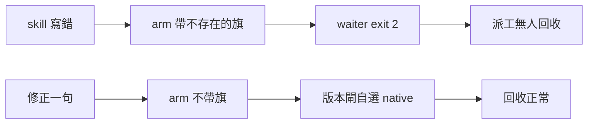

## Description

<!-- SECTION:DESCRIPTION:BEGIN -->
一句話：bridge-dispatch skill 教人下的 waiter 啟動指令帶了不存在的參數，照做會失敗、派工無人回收；這卡修正那句話。

**做什麼**
- 改 skills/bridge-dispatch/SKILL.md 第 62 行半句：arm 命令不帶 wake 參數，bridge ≥2.0.23 由 waiter 內部版本閘自選 native wake
- 走控制面 boundary 完整儀式（card WT＋fresh/intent/跨家族三腿＋回執）後合併

**不做什麼**
- 不改 bridge_waiter.py 腳本（它是對的）
- 不改 bridge 本體
- 不動其他 skill 條文

**狀態**
- unattended 自擬 Description，未經 user 點卡確認，晨間優先複核

<!-- SECTION:DESCRIPTION:END -->

## Acceptance Criteria
<!-- AC:BEGIN -->
- [ ] #1 SKILL.md 第 62 行改後句與 waiter 實作一致：新句命令可執行收 receipt（驗收＝本 session 活體 GREEN＋三腿複驗引用行號）
- [ ] #2 fresh／intent／跨家族三腿 evidence 入卡 notes（含 verdict id）
- [ ] #3 四欄回執（classification／review／session-freshness／deployment-surfaces）入卡 notes
- [ ] #4 main 上的 skill 檔含修正且 runtime 對帳 healthy（~/.agents 同步驗收）
<!-- AC:END -->

## Implementation Plan

<!-- SECTION:PLAN:BEGIN -->
〔baseline：ai-guide 12ec67b3〕〔已決策勿重辯：①修正面唯一＝skills/bridge-dispatch/SKILL.md:62 半句（single-source 已掃：rules/＋delegate-bridge repo 無同句）②分類 boundary（review-engine 控制面 instruction 實質語義編輯正典；static-only 豁免不入場＝觸及 code token）③落徑完整儀式（user 已選）④ RED/GREEN 活體證據已取得（舊命令 exit 2／新命令 exit 0＋CollectionReceipt，同 session delegate-bridge 派工）⑤ instruction-testing 判面＝output 面（recipe 觸及），活體對照收斂免另造 scenario〕範圍：改一句＋三腿（fresh/intent/跨家族）＋四欄回執＋ff-merge 回 main＋runtime 對帳；不碰 waiter/bridge/他 skill；不 commit ai-guide 現有 ref-docs 髒檔（他人變更）；push 恆停。
<!-- SECTION:PLAN:END -->
