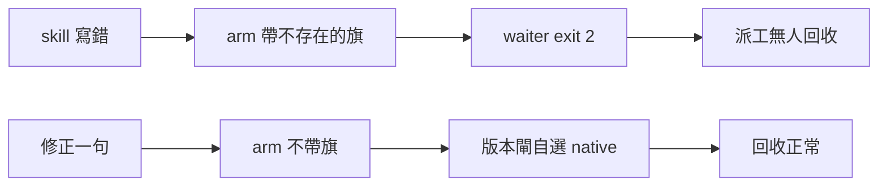
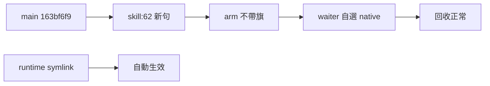

## Description

<!-- SECTION:DESCRIPTION:BEGIN -->
一句話：bridge-dispatch skill 教人下的 waiter 啟動指令帶了不存在的參數，照做會失敗、派工無人回收；這卡修正那句話。

**做什麼**
- 改 skills/bridge-dispatch/SKILL.md 第 62 行半句：arm 命令不帶 wake 參數，bridge ≥2.0.23 由 waiter 內部版本閘自選 native wake
- 走控制面 boundary 完整儀式（card WT＋fresh/intent/跨家族三腿＋回執）後合併

**不做什麼**
- 不改 bridge_waiter.py 腳本（它是對的）
- 不改 bridge 本體
- 不動其他 skill 條文

**狀態**
- unattended 自擬 Description，未經 user 點卡確認，晨間優先複核

<!-- SECTION:DESCRIPTION:END -->

## Acceptance Criteria
<!-- AC:BEGIN -->
- [x] #1 SKILL.md 第 62 行改後句與 waiter 實作一致：新句命令可執行收 receipt（驗收＝本 session 活體 GREEN＋三腿複驗引用行號）
- [x] #2 fresh／intent／跨家族三腿 evidence 入卡 notes（含 verdict id）
- [x] #3 四欄回執（classification／review／session-freshness／deployment-surfaces）入卡 notes
- [x] #4 main 上的 skill 檔含修正且 runtime 對帳 healthy（~/.agents 同步驗收）
<!-- AC:END -->

## Implementation Plan

<!-- SECTION:PLAN:BEGIN -->
〔baseline：ai-guide 12ec67b3〕〔已決策勿重辯：①修正面唯一＝skills/bridge-dispatch/SKILL.md:62 半句（single-source 已掃：rules/＋delegate-bridge repo 無同句）②分類 boundary（review-engine 控制面 instruction 實質語義編輯正典；static-only 豁免不入場＝觸及 code token）③落徑完整儀式（user 已選）④ RED/GREEN 活體證據已取得（舊命令 exit 2／新命令 exit 0＋CollectionReceipt，同 session delegate-bridge 派工）⑤ instruction-testing 判面＝output 面（recipe 觸及），活體對照收斂免另造 scenario〕範圍：改一句＋三腿（fresh/intent/跨家族）＋四欄回執＋ff-merge 回 main＋runtime 對帳；不碰 waiter/bridge/他 skill；不 commit ai-guide 現有 ref-docs 髒檔（他人變更）；push 恆停。
<!-- SECTION:PLAN:END -->

## Implementation Notes

<!-- SECTION:NOTES:BEGIN -->
【deep-work checkpoint 15:52（cap-stop 前）】目標：卡 AC1-4＋B：visibility verdict 落檔綜合。現行階段：A patch 在 WT（1 行未提交）＋三腿 2.5/3（fresh APPROVE、intent APPROVE、muse 同家族 APPROVE；跨家族 PENDING 額度）＋本 interim 回執；B：WO 就緒未派。scope：ai-guide main@8604848e（WT owning；卡 baseline 12ec67b3）＋WT branch air-211 dirty 1 行；delegate-bridge：WO .agent-tmp/visibility/wo-codex-visibility.md＋ledger jobs。已決策：卡 Plan①-⑤凍結；另：x-family 改道 codex-native（額度止 16:41，job-muky20yt-copml9 failed-usage）→glm（額度止 17:00，job-muky41vb-jdunz2 failed-usage）→muse 同家族（job-muky5r0o-vhvfnb completed APPROVE，記 explicit_same_family_degradation，非跨家族）；web-codex 排除（讀不到本地檔，job-mukxidce-kongim 實證＋09-16 先例）。已驗：舊命令 exit2／新命令 exit0＋receipt（活體）；fresh session.jsonl subagent/01a0e6fb-00be…／intent subagent/01a0e6fb-0215…；未驗：x-family 腿、merge、runtime hardlink 重對帳、B verdict。open findings：muse finding-5 無效（grep 缺 -E 誤判零命中；dispatcher rg 糾正：唯一站點 SKILL.md:62）；intent AC-2/3/4 屬 landing 儀式待辦非 patch 缺陷。背景 job：全 terminal 已收，無 running；B 未派。授權：user 原話完整儀式＋/deep-work；outward（commit/merge）PENDING 待 resume 卷重建（conditional delegation 重估），push never。下一動（16:46 resume）：①重派 x-family codex-native 同 brief＋waiter（anchor VERDICT:）②APPROVE→final receipt→merge/commit gate ③派 B visibility codex-native 腿（WO 路徑上）＋收＋落檔綜合。read-set：本卡 notes、WT diff、所列 job ids；未恢復：B 綜合、runtime sync。interim 回執：classification=boundary／review=fresh APPROVE＋intent APPROVE＋muse同家族APPROVE＋x-family deferred:pending-reset-1641（landing-ineligible 至外審腿落地）／session-freshness=fresh／deployment-surfaces=pending

【gate 前置分析 15:57】commit skill 研讀結論（resume 卷執行）：① patch commit（SKILL.md）屬 boundary→AIR-183 ⑥排除委任，須 user 親確認；② merge ff-only 可 marshal 自主（AIR-200 四件：fresh receipt＋ff-only＋landing 四欄＋merge 後 probe）；③ 2.95 閘 exempt（純 .md diff）；④ commit 前須跑 2.5 引用掃（rg bridge-dispatch 於 rules/ skills/）＋consistency 單檔閘；⑤ runtime 重對帳無機械 sync（sync_agents.py 不管 skills），merge 後手動 ln -f 重建 hardlink＋byte-identical 驗收＝deployment-surfaces healthy 判準；⑥結案 metadata commit 走特赦③（precheck 綠）。resume 序：x-family 收→final receipt→2.5＋consistency→（user 在場才 commit patch）→merge＋probe＋relink→結案兩步。B 腿獨立於 A3 commit gate 可先行。

【final receipt 16:50】classification=boundary／review=fresh APPROVE（subagent 01a0e6fb-008c／session.jsonl）＋intent APPROVE（subagent 01a0e6fb-01ed／session.jsonl，AC-1 MET）＋xfamily codex-native APPROVE（job-mul07bgx-wo5hwc，gpt-6-astra，5 項 confirmed：argparse 無此旗／版本閘自選／wait 內部傳遞／wait --help 實查／single-source 唯一站點）＋muse 同家族 APPROVE（job-muky5r0o-vhvfnb，degradation 已記；其 finding-5 誤判已糾正）／session-freshness=fresh（main@8604848e 自 WT 切出無新 commit，16:46 驗）／deployment-surfaces=pending（merge 前；判準＝merge 後 ln -f 重建 hardlink＋byte-identical）。2.5 引用掃：7 引用檔＋rules source＋2 部署 bundle 皆無舊句殘留（xfamily 腿指正 rules 面後補掃）。landing verdict：blocked（pre-merge，待 commit→merge＋probe＋relink 後轉 eligible）。

【consistency 單檔閘 16:55】目標 WT 內 skills/bridge-dispatch/SKILL.md（全文 93 行已讀＋encoder-philosophy 已讀）：六維全過 100/100——自洽（waiter/wait 術語沿檔內既有分工）、矛盾（新句與 L58 waiter CLI 形一致，舊句反與之矛盾，修正消除之）、順序（零結構變動）、自包含（無新增引用）、精準（三子句皆有三腿＋活體雙證）、S/N（慣例映射 signal，零新增 noise 構件）。

【precheck 綠 17:05】merge 163bf6f9（ff-only，1 檔 1 行）／runtime healthy（dir-symlink 自動生效＋cmp BYTE_IDENTICAL）／AC1-4 逐項已驗／memory 池 AIR-211 零命中（免蒸餾）／canonical 脏檔僅本卡＋他人 ref-docs×2（後者排除）。deployment-surfaces=healthy；landing verdict=eligible→landed。
<!-- SECTION:NOTES:END -->

## Final Summary

<!-- SECTION:FINAL_SUMMARY:BEGIN -->
一句修正經 boundary 完整儀式落地：SKILL.md:62 改述 waiter arm 不帶 wake 參數（版本閘自選 native）。審查 fresh／intent／xfamily-codex-native 三 APPROVE＋muse 追加；consistency 100；2.5 零殘留。ff-merge 163bf6f9 進 main，runtime 經 dir-symlink 自動生效（BYTE_IDENTICAL）。

<!-- SECTION:FINAL_SUMMARY:END -->
