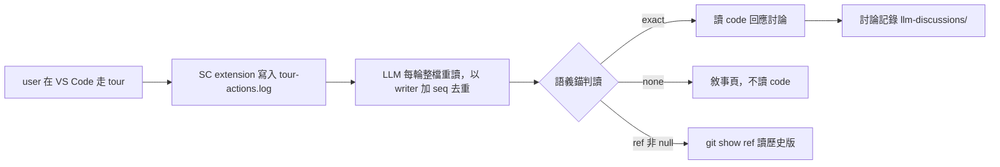

## Description

<!-- SECTION:DESCRIPTION:BEGIN -->
接續 muse session 調查（09-28）：mosaic 的 UI-LLM 協同做法有兩層——通用哲學（ui-collab）＋工作台接線（annotate-collab，mosaic 專屬）。其中「跟隨 user 走 SC tour」的行為目前以 ~8 行摘要嵌在 mosaic annotate-collab Phase 2，但它其實與 mosaic 無關：任一 repo＋South Chariot extension＋tour-actions.log 都能用。本卡把這塊抽成 ai-guide 全域薄 skill `tour-collab`。

**做什麼**：LLM 輪詢 workspace 根 `.agent-tmp/tour-actions.log`，被動得知 user 在 SC extension 走讀的 tour／步／語義位置，邊走邊上下文感知討論；討論記錄走 llm-discussions/ 慣例。

**不做什麼**：tour corpus 製作（歸 tour-bootstrap）；mosaic 工作台操作協同（歸 annotate-collab）；位置契約本身——line schema／anchor 語義／rotation 單一源＝southchariot 契約文檔，本 skill 只寫消費端紀律＋指針，不重抄。

**本卡不做**：mosaic 端 annotate-collab Phase 2 第二事件源縮為指針＝跨 repo 連動，mosaic 側另動手，本卡只報。

**規矩**：位置判讀只信語義錨（step_file＋anchor_status＋resolved_line＋ref）；ref 非 null 一律 git show 讀歷史版，禁拿 HEAD 回答 historical tour。

<!-- SECTION:DESCRIPTION:END -->

## Acceptance Criteria
<!-- AC:BEGIN -->
- [ ] #1 skills/tour-collab/SKILL.md 存在，frontmatter 過 desc gate（uv run python scripts/scan_skills_desc.py 零 fail，desc 值含引號 ≤1024 chars）
- [ ] #2 skills/AGENTS.md 索引含 tour-collab 行（工作流 skills 區，desc 語義與 SKILL.md 一致）
- [ ] #3 SKILL.md 涵蓋五塊：前置偵測（tour-actions.log 在場檢查＋不在場零成本跳過）／輪詢紀律（整檔重讀禁 offset、(writer_id, seq) 去重、tour_stop 會話邊界、CC Monitor／ZCode 每輪 rg 雙形態）／語義錨判讀紅線（display_* 僅 UI context、none＝敘事頁、ref 非 null 禁 HEAD）／討論記錄（ui-collab 哲學＋llm-discussions/）／單一源指針（southchariot 契約＋tour-bootstrap 分工）
- [ ] #4 五維檢查通過：引用目標存在、無元資訊、術語一致、無矛盾、格式正確
- [ ] #5 落地前審查閘回執四欄齊（classification／review／session-freshness／deployment-surfaces）——landing 前補齊，authoring 期可 pending
<!-- AC:END -->

## Implementation Plan

<!-- SECTION:PLAN:BEGIN -->
〔baseline：ai-guide 48b85e70b562b80163a6d9dffbb9f9dd2c79ecef〕
〔已決策勿重辯：①載體＝skill 非 rule（on-demand、多階段程序、有觸發語、harness 雙形態——muse 01a0e6ad 調查裁定）②位置＝ai-guide 全域 skills/tour-collab/（走讀消費與 mosaic 無關，非 repo-local）③thin 單一源——line schema／source enum／anchor 語義／rotation／多 writer 邊界一律指針 ~/Github/southchariot/docs/tour-action-log.md（sc-281），本 skill 不重抄④行為哲學繼承 ui-collab（觀察→等待→上下文感知→記錄），記錄走 llm-discussions/ 慣例⑤corpus 生產歸 tour-bootstrap、工作台操作歸 annotate-collab，本 skill 不跨界⑥控制面 authoring 走 persistent card WT（AIR-106 隔離閘），landing（merge/deploy）前須審查分類＋審查腿回執〕
範圍：新增 skills/tour-collab/SKILL.md＋skills/AGENTS.md 索引行＋desc gate（scripts/scan_skills_desc.py）；mosaic annotate-collab Phase 2 縮指針＝跨 repo 連動另辦（mosaic 側動手，本卡只報）
<!-- SECTION:PLAN:END -->

## Implementation Notes

<!-- SECTION:NOTES:BEGIN -->
09-28 接續 muse 01a0e6ad（其結案建議＝立薄 tour-collab skill，本卡承接其起草）。authoring WT＝ai-guide-air-212（branch air-212，base 6f816e28）。已起草 skills/tour-collab/SKILL.md（WT 內未 commit）＋skills/AGENTS.md UI/協作節索引行；desc gate FAIL=0（282 chars）；引用四目標存在（tour-bootstrap/ui-collab/annotate-collab/southchariot 契約文檔）。checkpoint 下一步：①user 點卡確認 desc＋draft ②WT 內 commit skill 檔（走 commit skill receipt-gate）③落地前審查閘——分類＋審查腿回執，landing（merge/deploy）前補齊 ④ff-only 收線＋結案兩步。mosaic 連動（annotate-collab Phase 2 第二事件源縮為指針）＝跨 repo 另辦，mosaic 側動手。

09-28 晚 user 設計挑戰：走讀協同＝session 內一次性 context 傳遞（讓 LLM 知道 user 在看哪），不需永久化載體；質疑形態＝類 stdout 流＋ui-collab 泛用模式已足。已派 panel=bi 跨家族討論（muse job-mulak9hd-ekf5o9＋codex job-mulak9in-z4guia，brief＝.agent-tmp/air212-design-brief.md，材料全內聯含 A-E 方案空間）。skill 草稿凍結於 card WT ai-guide-air-212（未 commit）；裁定前不推進 commit/審查腿。裁定後處置：E=撤卡／B=SC ext 加 log header（southchariot 側）／C=併 ui-collab／A=續原案。

user 釐清（裁定約束，蓋過 brief 的存在性問題）：skill 留在 guide（方法論面可重複＝永久化合理）；trajectory（走讀軌跡）＝一次性 LLM 消耗、不需永久化——log 已是 .agent-tmp 暫存天然 ephemeral，設計不得把軌跡入檔。草稿待修：討論記錄段改為「僅實質討論才記 llm-discussions，走讀本身零記錄」。SC 側顯示強化（移動時顯示 repo/檔案/tour/行）＝southchariot 連動回報項。bi 兩腿（job-mulak9hd/job-mulak9in）回來後以此為準繩綜合，草稿一次改到位。
<!-- SECTION:NOTES:END -->
