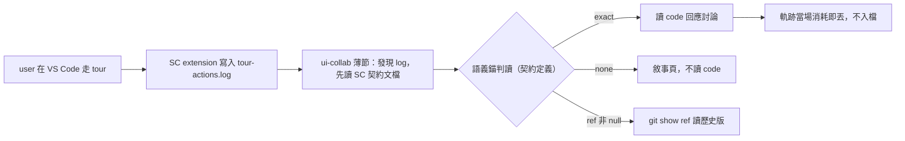

## Description

<!-- SECTION:DESCRIPTION:BEGIN -->
接續 muse session 調查＋bi panel（muse＋codex 獨立裁定）後**縮卡**：不立獨立 skill——草稿內容與 SC 契約文檔 §5-6 重疊（第二真相源，drift 風險真實），真正缺口只有 discovery（「跟著我走 tour」如何路由到消費程序）。本卡改為在既有全域 skill **ui-collab 加一個薄的 Tour 走讀流節**。

**做什麼**：user 說「跟著我走 tour／邊走讀邊討論」時，LLM 經 ui-collab 發現 `.agent-tmp/tour-actions.log`、先讀 SC 契約文檔（單一源）、按語義錨跟隨走讀位置討論。

**不做什麼**：不建 tour-collab skill 檔（panel 兩家否決、user 同意契約跟流走）；不重述契約內容；**不把走讀軌跡入檔**——trajectory 是一次性暫存流（user 拍板「暫存檔／像 stdout print」），當場消耗即丟，僅實質討論才記 llm-discussions。

**本卡不做（連動回報）**：mosaic annotate-collab 那 8 行契約重述縮為指針（mosaic 側動手）；SC log header 自描述（muse 提的 B 案——southchariot 生產側契約變更，未排程，未來多流自描述需求出現再議）。

<!-- SECTION:DESCRIPTION:END -->

## Acceptance Criteria
<!-- AC:BEGIN -->
- [ ] #1 skills/ui-collab/SKILL.md 含「Tour 走讀流（SC CodeTour）」節：零契約重述（schema/anchor/rotation 一律指針 SC 契約文檔）、trajectory 一次性聲明在場、harness 輪詢形態兩行
- [ ] #2 ui-collab desc 含 tour 觸發詞（跟著我走 tour／邊走讀邊討論），desc gate FAIL=0
- [ ] #3 repo 無新增 skill 檔——tour-collab 草稿撤除不落地
- [ ] #4 五維檢查通過（引用目標存在、無元資訊、術語一致、無矛盾）
- [ ] #5 落地前審查閘回執四欄（classification/review/session-freshness/deployment-surfaces）landing 前補齊
<!-- AC:END -->

## Implementation Plan

<!-- SECTION:PLAN:BEGIN -->
〔baseline：ai-guide 48b85e70b562b80163a6d9dffbb9f9dd2c79ecef〕
〔已決策勿重辯：①原案（立全域 skill tour-collab）經 bi panel 否決（muse job-mulak9hd＝B log header；codex job-mulak9in＝E+ 極薄指針；兩家收斂：草稿與 SC 契約文檔 §5-6 重疊＝第二 operational truth，缺口僅 discovery）＋user 約束（skill 留 guide／trajectory 一次性不入檔／暫存 stdout 形態）→ 縮卡：ui-collab 加 Tour 走讀流薄節，零重述契約②消費契約單一源＝~/Github/southchariot/docs/tour-action-log.md，drift 以彼為準③tour-collab 草稿撤除不落地（WT 內已 rm）④連動回報不施工：mosaic annotate-collab 8 行縮指針（mosaic 側）、SC log header（southchariot 側，未排程）⑤authoring 走 card WT ai-guide-air-212；landing 前審查閘回執四欄〕
範圍：skills/ui-collab/SKILL.md 一檔（desc 觸發詞＋Tour 走讀流節）＋desc gate；不新增檔案
<!-- SECTION:PLAN:END -->

## Implementation Notes

<!-- SECTION:NOTES:BEGIN -->
09-28 接續 muse 01a0e6ad（其結案建議＝立薄 tour-collab skill，本卡承接其起草）。authoring WT＝ai-guide-air-212（branch air-212，base 6f816e28）。已起草 skills/tour-collab/SKILL.md（WT 內未 commit）＋skills/AGENTS.md UI/協作節索引行；desc gate FAIL=0（282 chars）；引用四目標存在（tour-bootstrap/ui-collab/annotate-collab/southchariot 契約文檔）。checkpoint 下一步：①user 點卡確認 desc＋draft ②WT 內 commit skill 檔（走 commit skill receipt-gate）③落地前審查閘——分類＋審查腿回執，landing（merge/deploy）前補齊 ④ff-only 收線＋結案兩步。mosaic 連動（annotate-collab Phase 2 第二事件源縮為指針）＝跨 repo 另辦，mosaic 側動手。

09-28 晚 user 設計挑戰：走讀協同＝session 內一次性 context 傳遞（讓 LLM 知道 user 在看哪），不需永久化載體；質疑形態＝類 stdout 流＋ui-collab 泛用模式已足。已派 panel=bi 跨家族討論（muse job-mulak9hd-ekf5o9＋codex job-mulak9in-z4guia，brief＝.agent-tmp/air212-design-brief.md，材料全內聯含 A-E 方案空間）。skill 草稿凍結於 card WT ai-guide-air-212（未 commit）；裁定前不推進 commit/審查腿。裁定後處置：E=撤卡／B=SC ext 加 log header（southchariot 側）／C=併 ui-collab／A=續原案。

user 釐清（裁定約束，蓋過 brief 的存在性問題）：skill 留在 guide（方法論面可重複＝永久化合理）；trajectory（走讀軌跡）＝一次性 LLM 消耗、不需永久化——log 已是 .agent-tmp 暫存天然 ephemeral，設計不得把軌跡入檔。草稿待修：討論記錄段改為「僅實質討論才記 llm-discussions，走讀本身零記錄」。SC 側顯示強化（移動時顯示 repo/檔案/tour/行）＝southchariot 連動回報項。bi 兩腿（job-mulak9hd/job-mulak9in）回來後以此為準繩綜合，草稿一次改到位。

bi panel verdict 收線（muse job-mulak9hd＝B 自描述 header；codex job-mulak9in＝E+ ui-collab 極薄指針）。收斂：A（新全域 skill）兩家皆否——草稿內容與 SC 契約文檔 §5-6 重疊＝第二 operational truth；缺口僅 discovery；annotate-collab 8 行＝既有重複該縮指針（mosaic 側）。分歧：muse 推 B（log header，生產側改動）、codex 反 B（producer 契約+rotation+parser 三驗證面，現階段成本高）。user 釐清約束（skill 留 guide＋trajectory 一次性）與 panel 收斂的張力點＝『有 skill』指獨立檔還是 guide 承載能力——待 user 裁決後縮卡/續卡。verdict 全文在 .delegate-bridge/jobs/ 兩 jobId jsonl。

縮卡執行（WT ai-guide-air-212，未 commit 待 user 過目）：ui-collab 加 Tour 走讀流節（觸發＋單一源指針＋trajectory 一次性＋輪詢兩行，共 7 行）＋desc 補觸發詞（142 chars）；tour-collab 草稿已 rm、skills/AGENTS.md 已還原；desc gate FAIL=0。desc 已 semantic 修改——待 user 點卡確認。

【SC 生產側交接 packet（待 AUTH 直送 southchariot-marshal）】主題：tour-actions.log 自描述 header（bi panel B 案歸生產側）。目標：log 自描述——任何 LLM 撿到檔即自服消費，ai-guide 側零 SC 特定耦合。規格草案（SC 側裁定細節）：①header 寫檔首（建檔＋每次 rotation rewrite 重建），建議形為 # 註解行（不合 ui_action: 文法）：用途行（一次性暫存、rotation 截頭留尾）＋契約指針（southchariot/docs/tour-action-log.md §5/§6）＋紅線五條內嵌（只信語義錨 step_file+anchor_status+resolved_line+ref、display_* 僅 UI context、none=敘事頁非 code、ref 非 null 一律 git show 禁 HEAD、整檔重讀禁 offset＋identity=(writer_id,seq)＋tour_stop=會話邊界）。②既有消費者零破壞＝驗收硬條件：rg 'ui_action.*seq=' 工具鏈與 §6 演算法零改動可用——header 行禁含 ui_action 前綴、禁含 seq= kv 對。③同 change 同步契約文檔 §2/§4/§6（header 例外段＋rotation 重建語義）——文檔自稱改契約三處同步，此次加第四處。④驗收建議：rotation 單元測試含 header 保留斷言、seq bootstrap 不受 header 影響、既有 547 tests 綠。⑤卡歸屬＝SC repo 自己的卡（SC-28x，照該 repo 治理）；ai-guide AIR-212 只留指針。對帳注記：ai-guide ui-collab 薄節現以契約文檔為單一源——header 出貨後是否加「檔頭說明優先」一句，待 SC 結案 receipt 後再決。回信慣例：semantic ACK（in_reply_to）＋completed＋result_pointer。
<!-- SECTION:NOTES:END -->
