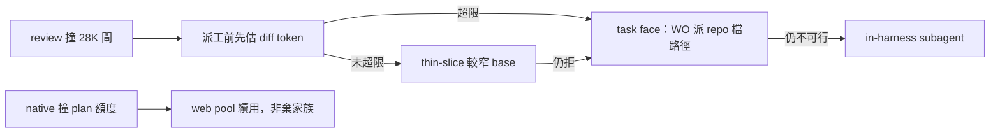
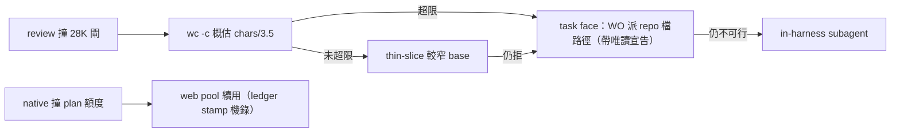

## Description

<!-- SECTION:DESCRIPTION:BEGIN -->
delegate-bridge db-69 弧實證（D-005 correction，scbus 信 2de711db）：codex webgpt review 撞 28K payload 閘時，正確反應是**換承載形**——不是換 model，更不是把 codex 全家判死。本卡把這條收編進 bridge-dispatch skill 的「webgpt 大內容」節。

**做什麼**：①補 review-face 28K 承載形階梯——(a) thin-slice 較窄 --base、(b) 改 task face＋工單派 repo 檔路徑（reviewer 自跑 git diff；db-69 實證 62K-token diff 完全可用）、(c) in-harness subagent ②加派工前 diff token 估量句（超限直接走 (b)，不試錯燒次數）③補 transport 池判讀半句（native plan 額度 ≠ web payload 閘；native 掛→web 續用非棄家族）。

**不做什麼**：不動 availability 機械面；不加 automation；model-routing 昨日新判準已指到本節（指針不變、零 drift）。

**規矩**：boundary 條文（dispatch policy）——三腿審查閘照走。

<!-- SECTION:DESCRIPTION:END -->

## Acceptance Criteria
<!-- AC:BEGIN -->
- [x] #1 bridge-dispatch「webgpt 大內容」節含 review-face 28K 承載形階梯：(a) thin-slice 較窄 --base／(b) task-face WO 檔案承載（db-69 實證錨 job-mulsjljd-q71eco）／(c) in-harness——換承載形不是換 model
- [x] #2 派工前 review diff token 估量句在場（超限直接 WO 形，不試錯）
- [x] #3 transport 池判讀（native plan 額度 ≠ web payload 閘，判讀面＝ledger stamp＋錯誤文案）＋native 掛→web WO 續用非棄家族 半句在場
- [x] #4 desc gate FAIL=0＋五維檢查通過
- [x] #5 落地前審查閘回執四欄 landing 前補齊
<!-- AC:END -->

## Implementation Plan

<!-- SECTION:PLAN:BEGIN -->
〔baseline：ai-guide 9644e2a5〕
〔已決策勿重辯：①載體＝bridge-dispatch「webgpt 大內容」節（D-005 附信點名＋scbus 信 2de711db 值星評估裁定收編；user 拍板「修」）②S1 承載形階梯＋S4 派工前估量全收，S2 transport 判讀＋S3 降級最小以半句併入③boundary 條文（dispatch policy）——三腿閘照走（fresh＋intent＋跨家族 muse）④model-routing 9644e2a5 新判準指針指本節，本卡修完指針更準、禁動 model-routing⑤ACK 回信（in_reply_to=2de711db）待 user AUTH，不在本卡範圍⑥authoring 走 card WT；landing 前審查閘回執四欄〕
範圍：skills/bridge-dispatch/SKILL.md 一節（webgpt 大內容）；不新增檔案
<!-- SECTION:PLAN:END -->

## Implementation Notes

<!-- SECTION:NOTES:BEGIN -->
【receipt 四欄（landing 前）】classification=boundary（dispatch policy 條文新增——review-engine 判定表 skills 條文正典行）。review=三腿：fresh 3I+3S（內部張力 :94 no git vs (b)、跨檔 drift model-routing:220、估量無機械法——全採納修復 a80017df）＋intent 1I+4 零 intent-drift（(b) 缺唯讀 WO 掛鉤——db-69 WO 實帶唯讀宣告，採納；跨 repo AGENTS.md 張力記卡交 delegate-bridge 側 follow-up）＋跨家族 muse approve（job-muluebk1-1d8059）。CR N/A（純 markdown）。session-freshness=fresh。deployment-surfaces=healthy（merge 即 live，desc gate FAIL=0 911/1007 chars）。【scope 偏離記錄】Plan 原範圍 bridge-dispatch 一節——fresh F2 跨檔 drift（model-routing:220 材料必須內聯未同步 task face 例外）依單一源 drift 防護條強制同步，擴為兩檔；已回寫本記錄。【跨 repo follow-up】delegate-bridge AGENTS.md:515 big-reviews-go-in-harness 表述與 task-face WO 形的調和補寫＝該 repo 側事項（intent F2）。
<!-- SECTION:NOTES:END -->

## Final Summary

<!-- SECTION:FINAL_SUMMARY:BEGIN -->
D-005 四條收編落地：bridge-dispatch webgpt 節新增 review-face 28K 承載形階梯（(a) thin-slice→(b) task face WO 檔案承載→(c) in-harness——換承載形不是換 model）＋派工前 wc -c 概估（chars÷3.5 保守）＋額度牆 transport 池判讀獨立段；:94 動詞紀律 no git 限 mutation 面；model-routing:220 補 task face 例外（drift-sync）。三腿（fresh 3I+3S／intent 1I+4 零 drift／muse approve）全裁決採納。終態圖：

<!-- SECTION:FINAL_SUMMARY:END -->
