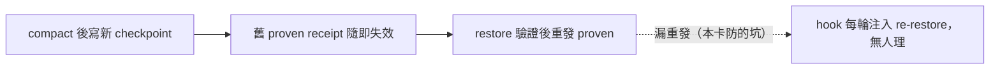
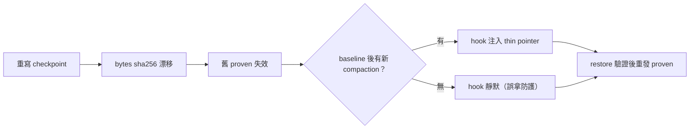

## Description

<!-- SECTION:DESCRIPTION:BEGIN -->
southchariot 值星線實證（scbus 信 c7c571ea）：同一 session 兩次 compact，第二次寫新 checkpoint 後漏重發 proven——receipt 仍綁舊 sha，hook 每輪 UserPromptSubmit 注入 re-restore thin pointer（設計內行為），session 連續多日忽略。發信端已自修（write_restore_proven 綁新 sha）。

**做什麼**：compact-prep skill 的 checkpoint 落盤面加一句——「若 proven receipt 已在場，本檔寫入即失效舊 receipt：restore 驗證後必須重發 proven」。hook 無 bug（thin pointer 文案已明示），補的是消費端紀律的可見性。

**不做什麼**：不動 hook 注入面；不做 write_checkpoint 自動 invalidate（發信端建議的選項之二，先取最便宜形——一句話）。

**來源**：sess_d6e3e495 流程強化建議（2026-09-29 06:53 receipt），本線值星裁決採納。

<!-- SECTION:DESCRIPTION:END -->

## Acceptance Criteria
<!-- AC:BEGIN -->
- [x] #1 compact-prep「checkpoint 檔」段含「再落盤即失效舊 proven」句：bytes sha256 漂移→proven 失效→restore 驗證後必須重發 write_restore_proven——與源碼 grounding 一致
- [x] #2 真實案例 marker 在場（southchariot 兩次 compact 漏重發）
- [x] #3 零重述：不重抄 hook truth table／script 判準（指針式指涉）
- [x] #4 desc gate FAIL=0＋五維檢查通過
- [x] #5 落地前審查閘回執四欄 landing 前補齊
<!-- AC:END -->

## Implementation Plan

<!-- SECTION:PLAN:BEGIN -->
〔baseline：ai-guide f80ffd9f〕
〔已決策勿重辯：①最便宜形——skill 一句話（checkpoint 落盤面），不動 hook、不做 write_checkpoint 自動 invalidate（c7c571ea 發信端兩選項，值星裁決＋user 點卡確認）②位置＝compact-prep「checkpoint 檔」段——失效發生在寫入時，消費端在落盤當下即須知道③句子已源碼 grounding：scripts/compact_checkpoint.py `_checkpoint_digest`＝bytes sha256（:143）、`verify_restore_proven` 比對 sha（:209）、hook truth table「hash 漂移→proven 失效→re-restore 注入」（hooks/compact-restore-inject.py :26/37-38）④boundary 條文——三腿閘照走（fresh＋intent＋跨家族 muse）⑤ACK 已回（3662d915）⑥authoring card WT；landing 前回執四欄〕
範圍：skills/compact-prep/SKILL.md「checkpoint 檔」段一句；不新增檔案
<!-- SECTION:PLAN:END -->

## Implementation Notes

<!-- SECTION:NOTES:BEGIN -->
【ACK 回執】採納回信已送 sess_d6e3e495（message_id=3662d915，in_reply_to=c7c571ea）。另 SC-288 鏈閉環 ACK 同發（message_id=3db51604，in_reply_to=4c952eca，記 AIR-212 弧）。

【receipt 四欄（landing 前）】classification=boundary（skill 條文新增）。review=三腿：fresh 2I+2S（F-1 compaction 閘省略——源碼逐行證實；F-2 re-restore 標籤與 hook 定義衝突——三方收斂含 muse）＋intent 1Minor+3Info 零 intent-drift（F2 規模擴張＝AC 忠實，judge 追認）＋跨家族 muse needs-attention（compaction 閘同收斂＋案例錨建議採納）。修復 81b63ede。CR N/A（純 markdown）。session-freshness=fresh。deployment-surfaces=healthy（merge 即 live；desc gate FAIL=0 256 chars）。【Plan 註③更正】fresh 腿發現原註③轉述壓縮失真——hook truth table 原文是「baseline 後又有新 compaction」條件式，非無條件注入；已於落地文修正。
<!-- SECTION:NOTES:END -->

## Final Summary

<!-- SECTION:FINAL_SUMMARY:BEGIN -->
compact-prep「checkpoint 檔」段後新增獨立段「再落盤即失效舊 proven」：重寫 checkpoint→bytes sha256 漂移→proven 失效（verify_restore_proven 另核路徑）→restore 驗證後必須重發 write_restore_proven；hook 注入有 compaction 閘（誤拿防護）但重發義務不變；真實案例 southchariot（錨 AIR-214）。三腿全裁決採納。終態圖：

<!-- SECTION:FINAL_SUMMARY:END -->
