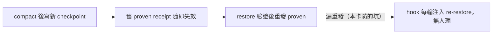

## Description

<!-- SECTION:DESCRIPTION:BEGIN -->
southchariot 值星線實證（scbus 信 c7c571ea）：同一 session 兩次 compact，第二次寫新 checkpoint 後漏重發 proven——receipt 仍綁舊 sha，hook 每輪 UserPromptSubmit 注入 re-restore thin pointer（設計內行為），session 連續多日忽略。發信端已自修（write_restore_proven 綁新 sha）。

**做什麼**：compact-prep skill 的 checkpoint 落盤面加一句——「若 proven receipt 已在場，本檔寫入即失效舊 receipt：restore 驗證後必須重發 proven」。hook 無 bug（thin pointer 文案已明示），補的是消費端紀律的可見性。

**不做什麼**：不動 hook 注入面；不做 write_checkpoint 自動 invalidate（發信端建議的選項之二，先取最便宜形——一句話）。

**來源**：sess_d6e3e495 流程強化建議（2026-09-29 06:53 receipt），本線值星裁決採納。

<!-- SECTION:DESCRIPTION:END -->

## Implementation Notes

<!-- SECTION:NOTES:BEGIN -->
【ACK 回執】採納回信已送 sess_d6e3e495（message_id=3662d915，in_reply_to=c7c571ea）。另 SC-288 鏈閉環 ACK 同發（message_id=3db51604，in_reply_to=4c952eca，記 AIR-212 弧）。
<!-- SECTION:NOTES:END -->
