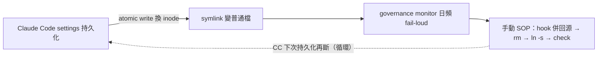

## Description

<!-- SECTION:DESCRIPTION:BEGIN -->
**做什麼**：追蹤一個會反覆發生的機器狀態循環——Claude Code 對 settings 檔做 atomic write（temp+rename）時把 symlink 整個換成普通檔，governance 同步鏈就這樣斷（0929 實證，governance monitor 日頻 fail-loud 抓到）。monitor 是底網（exit 1＝真 drift），修復目前是手動 SOP。

**不做什麼**：installer 不自動改是設計（P0-3 斷鏈形「user 處置（不自動改）」）；本卡不改 CC 本體行為。

**規矩／現況**：0929 修復 SOP 已驗證——①先把 live 檔多出的 hooks.UserPromptSubmit（scbus 回信鉤）併回 repo 源 settings.json（直接換 symlink 會掉鉤）②rm 普通檔 ③ln -s 重建 ④install.py --surface hooks 驗 merge（五面 parity 綠）。復發時照此 SOP。

**等 user 什麼**：裁決要不要機械自癒腿——選項：launchd 每日 reconcile／installer 補 fix face／接受手動 SOP＋monitor 底網。

<!-- SECTION:DESCRIPTION:END -->

## Acceptance Criteria
<!-- AC:BEGIN -->
- [ ] #1 0929 修復 SOP 完整記錄於卡 notes（hook 併回源→rm→ln -s→check 綠，含證據行）
- [ ] #2 復發偵測底網確認：governance monitor 日頻 exit 1 抓斷鏈（已運轉）——復發時本卡 notes 記日期與觸發前動作
- [ ] #3 自癒裁決記 notes：launchd 每日 reconcile／installer fix face／維持手動 SOP——三選一（或組合）經 user 拍板
<!-- AC:END -->

## Implementation Plan

<!-- SECTION:PLAN:BEGIN -->
〔baseline：ai-guide efd66d11〕
〔已決策勿重辯：①載體＝追蹤卡非 hook——自癒與否是語義裁決非機械 predicate ②修復正道＝手動 reconcile→rm→ln -s→install.py --surface hooks 驗 merge；installer check 對斷鏈形不自動改是設計（P0-3）③hooks.UserPromptSubmit（scbus 回信鉤）現佔 repo 源 settings.json（gitignored，機器本地）——是否應上移 governance/registrations/cc.json 模板成安裝面＝本卡調查項 ④L3 codex exec canary 在 codex 額度窗耗盡期 exit 1 屬預期（fail-closed；0929 實證 usage limit 至 10-04 06:17），非本卡修復範圍 ⑤CC 寫入者定證＝.last-cleanup 時戳與 settings.json birth 同分鐘＋atomic write 換 inode 機制〕
<!-- SECTION:PLAN:END -->

## Implementation Notes

<!-- SECTION:NOTES:BEGIN -->
【0929 修復 SOP 已執行（AC#1 證據）】①對時：live 普通檔 16189B vs repo 源 15976B——diff 唯一 delta＝hooks.UserPromptSubmit（scbus hook --harness claude --event user-prompt-submit，跨 session 回信鉤，repo 源與 cc.json 模板皆無）。②先併回源：Edit repo settings.json 補 UserPromptSubmit 子樹（json.load 驗證 ✓；gitignored 故機器本地不入版控）。③rm ~/.claude/settings.json（普通檔）→ ln -s /Users/ctai/Github/ai-guide/settings.json 重建。④驗證：diff live==src ✓；install.py --check——cc drift 消失。⑤codex 面：config.toml PreToolUse/apply_patch group 與模板漂移（trust 針對舊內容）→ install.py --surface hooks 實跑（cc/zcode noop、codex written）→ --check 五面 parity 綠（exit 0）。⑥monitor 重跑：L2 Trusted ✓、check 綠 ✓；僅 L3 codex exec exit 1＝額度窗耗盡（usage limit 至 10-04 06:17）——窗恢復後重跑 monitor 應全綠。⑦寫入者定證：CC atomic write（.last-cleanup 07:34:17 與 settings.json birth 07:34:11 同分鐘＋同分鐘 CC session 檔活躍）——復發為循環，非一次性事故。
<!-- SECTION:NOTES:END -->
