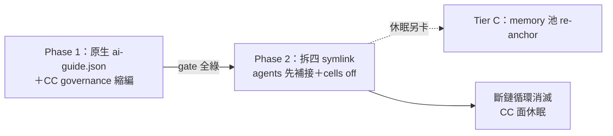
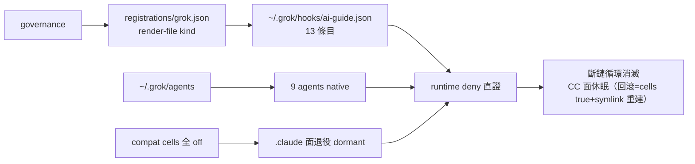

## Description

<!-- SECTION:DESCRIPTION:BEGIN -->
**做什麼**：CC 不再使用（coding plan 不划算），把 grok 的治理接線從「搭 CC 便車」搬到自己的原生面，CC 在治理體系的註冊同步退役——原本的 symlink 斷鏈循環不是修好，是被消滅。

**兩階段**：Phase 1＝governance 學會生成 grok 原生 hooks 檔（~/.grok/hooks/ai-guide.json，13 支 guard 直達）＋CC 註冊/probe/審批刪除式退役＋切斷 CC 通道；全綠後才開 Phase 2＝拆 ~/.claude 四 symlink（agents 先補接到 ~/.grok/agents 再拆——實證 9 支 agents 走未文檔的 native 掃描）＋關 skills/mcps cells。

**不做什麼**：memory 池錨（Tier C 休眠另卡）；第三方 plugin 生態（delegate/muse 等經 ~/.claude/plugins 進 grok——殘留容忍，不宣稱 zero-read）；scbus claude 註冊 dormant；mosaic 跨 repo 不動。

**等 user 什麼**：無（方向已拍板；復原隨時可退——compat hooks=true 即回滾）。

<!-- SECTION:DESCRIPTION:END -->

## Acceptance Criteria
<!-- AC:BEGIN -->
- [x] #1 P1-1 registrations/grok.json 新 face（merge=file 整檔寫 ~/.grok/hooks/ai-guide.json，timeout 顯式 10s；SessionStart compact dormant 註釋；FileChanged/watch-seed 省略）＋manifest registrations.cc/approve.claude/probes.claude 刪除＋probes.grok（pipe-payload 複用）＋install.py harness tuple/check/probe 同步——install --check 綠
- [x] #2 P1-2 --source grok 註冊形態（zcode 先例）＋memory-write-sensor.py allowlist 加 grok＋check_single_source 同步
- [x] #3 P1-3 切斷：~/.grok/config.toml [compat.claude] hooks=false；grok inspect 斷言——hooks ≥11 且 source=~/.grok/hooks/ai-guide.json（.claude source ai-guide 條目=0）；config 終態雙條件（inspect＋rg config）
- [x] #4 P1-4 L0 deny 行為：air-219 rig 重跑（MEMORY.md 攔截 exit 2，grok 形 payload）——quota 阻斷則 pipe-test 直證附揭露
- [x] #5 P2-1 agents 補接：新建 ~/.grok/agents symlink→agents/claude→grok inspect 9 agents source 切新路徑→拆 ~/.claude/agents→複驗 .claude source agents=0
- [x] #6 P2-2 cells off＋回歸：compat skills/mcps=false＋移除 inert extra_skill_dirs；inspect 斷言 72 skills 仍經 .agents 根；codebase-memory-mcp 棄用記錄（不遷移不刪）
- [x] #7 P1+2 文檔：check_single_source/bootstrap/governance README/root+hooks+rules AGENTS/matrix 同步；rg 殘留掃（cc tuple/probe/approve 鍵）零命中；第三方 plugin cache 殘留明示（禁宣稱 zero-read）
<!-- AC:END -->

## Implementation Plan

<!-- SECTION:PLAN:BEGIN -->
〔Planning Contract——AIR-215 pivot（standard；user 拍板 design-retired）〕
**Baseline**：main @ dded63ac＋cc-retire-investigation.md（五面錨點）。關鍵：install.py:913 tuple/:1940 check/:2233-2258 對帳閘（fail-loud）；manifest.toml:56-59 四 symlink/:86-91 registrations.cc/:110 approve/:120-122 probes；grok hooks 原生形態＝cc.json 外包 hooks 鍵、全域個人層免 trust（10-hooks.md:66,79）；agents 發現＝未文檔 native 硬掃 ~/.claude/agents（inspect type=user 實證）。
**已決策（勿重辯——雙腿＋5.3）**：①scope＝第一方原生化；plugin cache 殘留容忍、禁宣稱 zero-read②雙 phase gate（P1 全綠才開 P2）③agents 先補接（~/.grok/agents symlink→agents/claude→inspect 斷言→才拆 ~/.claude/agents）④刪除式縮編（無 skip 機制；--uninstall 面不再碰 settings.json，殘留 dormant）⑤registrations/grok＝merge="file" 新 kind（整檔 render；check 走語義比對非 byte）＋timeout 統一顯式 10s（兩面 precedent）＋--source grok（memory-write-sensor.py:47 allowlist 加）＋approve 不加 grok 鍵（全域免 trust；EP 確認缺鍵不 fail-loud）⑥codebase-memory-mcp 明示棄用（零 live 引用 rg 證）⑦memory 池三件組/scbus/mosaic/settings.json 本體/Tier C＝不動⑧回滾＝compat hooks=true＋symlink 重建（備份與程序）。
**Scope**：動＝manifest（＋grok registrations/probes；−cc 三節）、install.py、registrations/grok.json 新、memory-write-sensor.py:47、check_single_source.py、bootstrap wording、governance README、root/hooks/rules AGENTS.md、matrix、~/.grok config cells＋~/.grok/agents symlink、拆四 ~/.claude symlink（P2）。不動＝zcode/codex 面、rules bundle、memory 三件組、~/.claude settings.json 本體、scbus、mosaic、agents/claude 生成物、cc-allowlist.json（退役留歷史）、第三方 plugin cache。
**Scenarios**：P1 inspect 斷言（hooks 原生 source）；agents 補接前後 source 切換；skills 72 支 .agents 根回歸；deny rig（quota 阻斷→pipe 代位）。
**Integration**：下游＝governance monitor（cc probe 退場後檢查面）、AIR-218 既有 runbook（§compat hooks 段隨切斷更新）。
**驗證式**：AC 七項（P1×4＋P2×2＋文檔×1）。
<!-- SECTION:PLAN:END -->

## Implementation Notes

<!-- SECTION:NOTES:BEGIN -->
【0929 修復 SOP 已執行（AC#1 證據）】①對時：live 普通檔 16189B vs repo 源 15976B——diff 唯一 delta＝hooks.UserPromptSubmit（scbus hook --harness claude --event user-prompt-submit，跨 session 回信鉤，repo 源與 cc.json 模板皆無）。②先併回源：Edit repo settings.json 補 UserPromptSubmit 子樹（json.load 驗證 ✓；gitignored 故機器本地不入版控）。③rm ~/.claude/settings.json（普通檔）→ ln -s /Users/ctai/Github/ai-guide/settings.json 重建。④驗證：diff live==src ✓；install.py --check——cc drift 消失。⑤codex 面：config.toml PreToolUse/apply_patch group 與模板漂移（trust 針對舊內容）→ install.py --surface hooks 實跑（cc/zcode noop、codex written）→ --check 五面 parity 綠（exit 0）。⑥monitor 重跑：L2 Trusted ✓、check 綠 ✓；僅 L3 codex exec exit 1＝額度窗耗盡（usage limit 至 10-04 06:17）——窗恢復後重跑 monitor 應全綠。⑦寫入者定證：CC atomic write（.last-cleanup 07:34:17 與 settings.json birth 07:34:11 同分鐘＋同分鐘 CC session 檔活躍）——復發為循環，非一次性事故。

【1001 pivot 開工】user 裁定走 design-retired（CC 不硬綁——第一方原生化；plugin cache 殘留容忍）。收斂依據＝flash 五面盤點＋muse/codex 雙腿 verdict（.agent-tmp/air-215/）；5.3 三裁定：①zero-read 範圍＝第一方 only（codex 問答、user 原話裁定）②雙 phase gate（muse）③agents 先補接後拆（muse Q2 實證——9 支走未文檔 native 掃描）。

【1001 pivot 結算——B1-B6 receipt＋回執四欄】實作＝flash 六塊（B1 governance 手術：grok.json 新 face＋merge=file/render-file kind＋probes.grok＋cc 三節刪除式退役＋測試同步 2664 passed；B2 部署切斷：~/.grok/hooks/ai-guide.json 13 條目＋compat hooks=false→inspect native 13/.claude 0；B3 deny：**runtime 直證**（事件流 Hook denied 先於 quota error）＋pipe 雙形 exit 2，control 發 BLOCKED-QUOTA 附揭露；B4 agents 先補接後拆（9 支切 ~/.grok/agents）；B5 cells 全 off＋skills 72 回歸＋codebase-memory-mcp 棄用〔intentional non-migration：零 live 引用 rg 證、binary 不刪〕；B6 文檔六處＋殘留掃零 live-code 命中＋plugin cache 殘留明示〔11 skills+2 hooks 經 ~/.claude/plugins——非 zero-read〕）。審查＝fresh（F1-F7：獨立重跑 320 tests＋live/WT byte-equal；runtime deny 順序直證 confirmed）＋muse（Minor1-3+Info1-3）→judge 7 採 4 留（F3 bootstrap gating/F5 post-hash/F6 SessionEnd 佇列/F7 PostToolUse exit2 語義→後續弧）→flash 修復 7/7 綠（含 P1-gate receipt 補檔 p1-gate-receipt.txt）。回執四欄：classification=boundary（governance 結構手術＋跨 harness 拓撲翻轉）／review=fresh+muse 雙腿 GO-WITH-FIXES 全採（evidence：.agent-tmp/air-215/review-*.md＋p1-gate-receipt）／session-freshness=fresh／deployment-surfaces=healthy-pending-canonical-receipt。**承諾**：merge 後從 canonical 補跑 install --surface hooks＋--check 取 journal receipt（偏差③ install 曾走 module 繞 guard——F2 閉環）。
<!-- SECTION:NOTES:END -->

## Final Summary

<!-- SECTION:FINAL_SUMMARY:BEGIN -->
CC settings.json symlink 斷鏈循環以設計消滅收案（user 拍板 design-retired——CC coding plan 不划算）：grok 控制面全面原生化（~/.grok/hooks/ai-guide.json 13 條目 governance 生成＋agents 補接 ~/.grok/agents＋cells 全 off＋四 ~/.claude symlink 拆除），CC 第一方治理刪除式退役（manifest/probe/approve 三節），codebase-memory-mcp 明示棄用。runtime deny 直證（事件流 Hook denied）。落地 main e3e45f3f（全量 2664 passed＋fresh/muse 雙腿 7 項修復＋canonical install receipt 兌現）。殘留：plugin cache（11 skills+2 hooks 經 ~/.claude/plugins——容忍非 zero-read）；Tier C memory 池 re-anchor 休眠另卡；F3/F5/F6/F7 後續弧認知。終態圖：

<!-- SECTION:FINAL_SUMMARY:END -->
