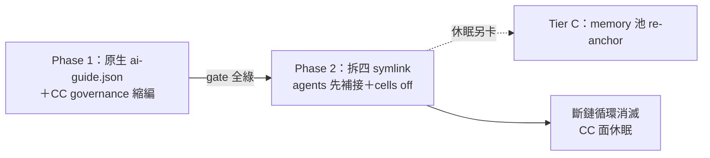

## Description

<!-- SECTION:DESCRIPTION:BEGIN -->
**做什麼**：CC 不再使用（coding plan 不划算），把 grok 的治理接線從「搭 CC 便車」搬到自己的原生面，CC 在治理體系的註冊同步退役——原本的 symlink 斷鏈循環不是修好，是被消滅。

**兩階段**：Phase 1＝governance 學會生成 grok 原生 hooks 檔（~/.grok/hooks/ai-guide.json，13 支 guard 直達）＋CC 註冊/probe/審批刪除式退役＋切斷 CC 通道；全綠後才開 Phase 2＝拆 ~/.claude 四 symlink（agents 先補接到 ~/.grok/agents 再拆——實證 9 支 agents 走未文檔的 native 掃描）＋關 skills/mcps cells。

**不做什麼**：memory 池錨（Tier C 休眠另卡）；第三方 plugin 生態（delegate/muse 等經 ~/.claude/plugins 進 grok——殘留容忍，不宣稱 zero-read）；scbus claude 註冊 dormant；mosaic 跨 repo 不動。

**等 user 什麼**：無（方向已拍板；復原隨時可退——compat hooks=true 即回滾）。

<!-- SECTION:DESCRIPTION:END -->

## Acceptance Criteria
<!-- AC:BEGIN -->
- [ ] #1 P1-1 registrations/grok.json 新 face（merge=file 整檔寫 ~/.grok/hooks/ai-guide.json，timeout 顯式 10s；SessionStart compact dormant 註釋；FileChanged/watch-seed 省略）＋manifest registrations.cc/approve.claude/probes.claude 刪除＋probes.grok（pipe-payload 複用）＋install.py harness tuple/check/probe 同步——install --check 綠
- [ ] #2 P1-2 --source grok 註冊形態（zcode 先例）＋memory-write-sensor.py allowlist 加 grok＋check_single_source 同步
- [ ] #3 P1-3 切斷：~/.grok/config.toml [compat.claude] hooks=false；grok inspect 斷言——hooks ≥11 且 source=~/.grok/hooks/ai-guide.json（.claude source ai-guide 條目=0）；config 終態雙條件（inspect＋rg config）
- [ ] #4 P1-4 L0 deny 行為：air-219 rig 重跑（MEMORY.md 攔截 exit 2，grok 形 payload）——quota 阻斷則 pipe-test 直證附揭露
- [ ] #5 P2-1 agents 補接：新建 ~/.grok/agents symlink→agents/claude→grok inspect 9 agents source 切新路徑→拆 ~/.claude/agents→複驗 .claude source agents=0
- [ ] #6 P2-2 cells off＋回歸：compat skills/mcps=false＋移除 inert extra_skill_dirs；inspect 斷言 72 skills 仍經 .agents 根；codebase-memory-mcp 棄用記錄（不遷移不刪）
- [ ] #7 P1+2 文檔：check_single_source/bootstrap/governance README/root+hooks+rules AGENTS/matrix 同步；rg 殘留掃（cc tuple/probe/approve 鍵）零命中；第三方 plugin cache 殘留明示（禁宣稱 zero-read）
<!-- AC:END -->

## Implementation Plan

<!-- SECTION:PLAN:BEGIN -->
〔baseline：ai-guide efd66d11〕
〔已決策勿重辯：①載體＝追蹤卡非 hook——自癒與否是語義裁決非機械 predicate ②修復正道＝手動 reconcile→rm→ln -s→install.py --surface hooks 驗 merge；installer check 對斷鏈形不自動改是設計（P0-3）③hooks.UserPromptSubmit（scbus 回信鉤）現佔 repo 源 settings.json（gitignored，機器本地）——是否應上移 governance/registrations/cc.json 模板成安裝面＝本卡調查項 ④L3 codex exec canary 在 codex 額度窗耗盡期 exit 1 屬預期（fail-closed；0929 實證 usage limit 至 10-04 06:17），非本卡修復範圍 ⑤CC 寫入者定證＝.last-cleanup 時戳與 settings.json birth 同分鐘＋atomic write 換 inode 機制〕
<!-- SECTION:PLAN:END -->

## Implementation Notes

<!-- SECTION:NOTES:BEGIN -->
【0929 修復 SOP 已執行（AC#1 證據）】①對時：live 普通檔 16189B vs repo 源 15976B——diff 唯一 delta＝hooks.UserPromptSubmit（scbus hook --harness claude --event user-prompt-submit，跨 session 回信鉤，repo 源與 cc.json 模板皆無）。②先併回源：Edit repo settings.json 補 UserPromptSubmit 子樹（json.load 驗證 ✓；gitignored 故機器本地不入版控）。③rm ~/.claude/settings.json（普通檔）→ ln -s /Users/ctai/Github/ai-guide/settings.json 重建。④驗證：diff live==src ✓；install.py --check——cc drift 消失。⑤codex 面：config.toml PreToolUse/apply_patch group 與模板漂移（trust 針對舊內容）→ install.py --surface hooks 實跑（cc/zcode noop、codex written）→ --check 五面 parity 綠（exit 0）。⑥monitor 重跑：L2 Trusted ✓、check 綠 ✓；僅 L3 codex exec exit 1＝額度窗耗盡（usage limit 至 10-04 06:17）——窗恢復後重跑 monitor 應全綠。⑦寫入者定證：CC atomic write（.last-cleanup 07:34:17 與 settings.json birth 07:34:11 同分鐘＋同分鐘 CC session 檔活躍）——復發為循環，非一次性事故。

【1001 pivot 開工】user 裁定走 design-retired（CC 不硬綁——第一方原生化；plugin cache 殘留容忍）。收斂依據＝flash 五面盤點＋muse/codex 雙腿 verdict（.agent-tmp/air-215/）；5.3 三裁定：①zero-read 範圍＝第一方 only（codex 問答、user 原話裁定）②雙 phase gate（muse）③agents 先補接後拆（muse Q2 實證——9 支走未文檔 native 掃描）。
<!-- SECTION:NOTES:END -->
