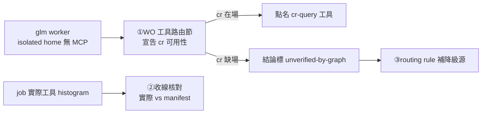
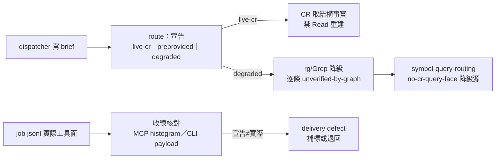

## Description

<!-- SECTION:DESCRIPTION:BEGIN -->
**做什麼**：修「派出去的審查 worker 沒用 code-reality 結構工具、用 Read 逐行重建」的消費端防護。起因＝mosaic 通報一件架構審查委派：glm worker 讀檔一萬六千多次、code-reality 工具零次——bridge 2.8.0 後 glm 腿預設 isolated home，MCP 不隨行，所有 glm worker 都在無工具形態。

**分工**：root cause（isolated home 注入 MCP）在 delegate-bridge repo 另行承接；本卡只做 ai-guide 側三層消費防護。

**三層**：①WO/範本必填「工具路由＋cr 可用性宣告」節——cr 在場點名 cr-query 工具、禁 Read 重建結構事實；缺場則結論必標 unverified-by-graph（未經結構圖驗證，消費端知道降級）②bridge-dispatch 收線核對——收線時核 job 實際工具面 vs brief capability manifest（mosaic 本次實證有效的抓法，收編為常設）③symbol-query-routing 補 isolated-worker 降級源條文。

**等 user 什麼**：無（三層已裁決收編；root cause 層已轉介 bridge 線）。

<!-- SECTION:DESCRIPTION:END -->

## Acceptance Criteria
<!-- AC:BEGIN -->
- [x] #1 bridge-dispatch skill：WO/範本含必填「工具路由＋cr 可用性宣告」節（在場點名 cr-query／缺場標 unverified-by-graph 兩分支條文）＋收線核對節（jsonl tool histogram vs manifest）
- [x] #2 symbol-query-routing（rule 或 skill）：isolated-worker／bridge 無 MCP 形態列為降級源，降級產出標記義務（未 index 驗證同款語義）
- [x] #3 三腿審查照走（fresh＋intent＋跨家族 muse）；落地前審查閘回執四欄齊
- [x] #4 L1 轉介蹤跡：mosaic 信 ACK（d2c0d056）＋本卡 plan 記分工裁定——bridge 線承接後本卡 notes 補指針
<!-- AC:END -->

## Implementation Plan

<!-- SECTION:PLAN:BEGIN -->
〔baseline：ai-guide 67c28c16〕
〔已決策勿重辯：①分工裁定——L1（isolated home MCP 注入）＝delegate-bridge repo 主權另行承接（跨 repo 主權：mutation 歸 repo 主權、acceptance 歸 consumer）；本卡＝L2-L4 ai-guide 消費端三層 ②L3 原案修正（mosaic 信＋值星裁決 d2c0d056）——L1 未落地前 WO 點名 cr 工具是空話（工具不在場）；有效形態＝WO 必填「工具路由＋cr 可用性宣告」節，缺場標 unverified-by-graph ③L2 不依賴 bridge——做成 collection 端核對（job jsonl tool histogram vs brief capability manifest；mosaic job-munnl6dr 實證：Read 16,428 events、cr 0 命中）④blast radius＝db-69/2.8.0 後 glm 腿預設 DARK/isolated——全部 glm worker 受影響非孤例 ⑤載體判準——三層都是語義條文（instruction 變更），非機械 predicate 可獨斷，落地前審查閘照走（fresh＋intent＋跨家族 muse 三腿）〕
範圍：skills/bridge-dispatch/SKILL.md（WO 範本＋收線核對節）、rules/symbol-query-routing.md＋skills/symbol-query-routing/SKILL.md（降級源）、mosaic 信證據檔引用（mosaic .agent-tmp/flowlab2/wo-cr-gap.md）。禁動 delegate-bridge repo。
<!-- SECTION:PLAN:END -->

## Implementation Notes

<!-- SECTION:NOTES:BEGIN -->
證據指針：mosaic MOS-157 通報信（message f4667717，scbus；ACK 回執 d2c0d056）；job jsonl＝mosaic .delegate-bridge/jobs/job-munnl6dr-0rg8rh.jsonl（Read tool events 16,428、code-reality 0 命中——值星獨立複核）；WO 缺口工作單＝mosaic .agent-tmp/flowlab2/wo-cr-gap.md；bridge 側 isolated staged home 無 MCP 注入記載＝delegate-bridge AGENTS.md:232-251。

【L1 轉介】提案已投 delegate-bridge-marshal 位址（scbus message 5ab32561，queue/inform；user 原話「bridge scbus傳給他，我叫他處理」）——含症狀複核證據、root cause 定位（AGENTS.md:232-251 isolated staged home 無 MCP 注入）、blast radius（glm 預設 DARK）、L2-L4 分工互補說明。bridge 線承接後本 notes 補承接指針。

【開工】①mosaic 補充已收（1ca57596）：雙計數口徑 tool events 16,428／tool.updated 7,304＝Read 3,650 呼叫+TodoWrite 2；MOS-158 起工單帶「結構事實查證」節（無 cr 時 rg+LSP 降級路徑明示）＝L3 有效形態 field 實作，本卡以其範本為輸入參照（wo-cr-gap.md）②開工流程＝muse+codex 雙家族討論（user 指示）→ persistent card WT 實作（控制面弧）→ 三腿審查（AC#3）→ 落地前審查閘回執四欄 → merge。

【0930 結算——post-build 收斂＋回執四欄】實作＝flash（impl-lite）七編輯落地；審查＝fresh 腿 GO-WITH-FIXES（F1-F9，最高價值 F1：toolName 僅 glm ledger 形——muse/codex 為 payload_type，防收線誤判）＋跨家族 muse 腿 GO-WITH-FIXES（job-muo002xs，F1-F6）；judge＝5.3 marshal 裁決 9 採納/2 摺結案/0 否決；修復驗證腿九項全 PASS 零修正。回執四欄：classification=boundary／review=fresh+muse+intent+設計雙腿（evidence refs .agent-tmp/air-216/）／session-freshness=fresh／deployment-surfaces=healthy（deploy 3/3，unverified-by-graph 三 bundle 在場）。judge 裁決記錄：①AC#1 措辭『必填節』vs landed 條件節——與討論輪雙腿裁決一致（條件節＋要素 1 指針），AC 以條件節表述勾稽（muse-F6/fresh-F8）②既有 [WARN] graph-not-available 變體與 cr_usage regex 不匹配——後續弧收编（fresh-F9）③muse bundle 96%/30KiB gate 既有壓力上報（非本弧引入）。收線：merge 425ebf3c（wt-close full，WT+branch 已清）；CR telemetry 基線＝call-evidence 2 jobs/4 calls、evidence-bearing 25 jobs（src=11/unverified=22/degraded=3）；correction mining 0 候選；improvement admission=0（全跨弧歷史）；tour corpus no-op；post-build receipt＝.agent-tmp/post-build-receipts/air-216.json。
<!-- SECTION:NOTES:END -->

## Final Summary

<!-- SECTION:FINAL_SUMMARY:BEGIN -->
消費端三層防護落地 main（425ebf3c，部署 3/3）：brief 結構查證腿必帶 structural-evidence route 宣告（live-cr[:MCP|:CLI]／preprovided-cr／degraded 三態，機械可掃 literal）、收線工具面核對（family schema 判讀——toolName 僅 glm 形、muse/codex 為 payload_type；MCP histogram＋CLI payload 例；0 命中 fail-loud floor 以 schema 確認後為準）、symbol-query-routing 新增 no-cr-query-face 降級源＋unverified-by-graph 標記（結構 finding 級逐條，負存在結論不得憑降級證據收敛）。審查鏈：flash 實作＋fresh/muse 雙腿 GO-WITH-FIXES 九項修復全採＋5.3 judge 裁決；root cause 層（L1 isolated home MCP 注入）歸 delegate-bridge 線另案。終態圖：

<!-- SECTION:FINAL_SUMMARY:END -->
