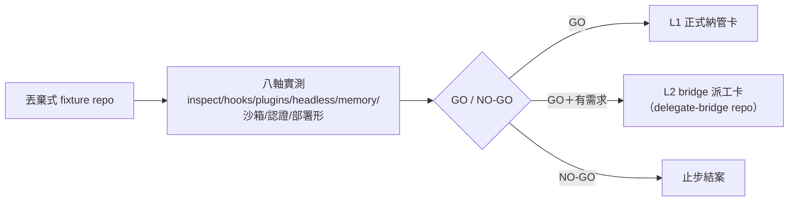

## Description

<!-- SECTION:DESCRIPTION:BEGIN -->
**做什麼**：在丟棄式測試 repo 實測 grok build（xAI 的 coding agent）跟現有治理面的真實相容度——文檔宣稱≠實際行為，先驗再談導入。L0＝本卡（試用驗證）；L1＝後續「正式納管」卡；L2＝後續「bridge 派工支援」卡（歸 delegate-bridge repo）。

八軸（前置：首次 project hooks 要 /hooks-trust 授權，未授權＝靜默不跑）：
- ①規則載入——grok inspect 盤點載入來源＋token 數（規則可能被 AGENTS.md／CLAUDE.md／.claude/rules／.grok/rules 多路重複疊載）
- ②hooks 真的擋得住嗎——兩種「看起來載入實際空轉」分開驗：欄位名不一致（我們讀 tool_name、grok 送 toolName＝腳本自己空轉）／腳本出錯時 grok 不擋（runtime fail-open）；重點閘（進場守衛 marshal_admission_guard／記憶池寫入擋 block-memory-index-write／看板守衛 kanban-skill-gate）正向擋＋放行各測一發
- ③plugins 市集——delegate-bridge 讀得到嗎＋辨識成哪個版本來源（只驗讀）
- ④headless——streaming-json 三種樣本（成功／工具呼叫／失敗）凍結存證＋model/effort 值域實測
- ⑤記憶面——grok 自己的 session 存檔（~/.grok/，允許）跟我們的 memory 池（禁污染）分開驗；跨 session 記憶預設關
- ⑥寫入防護——read-only 沙箱下寫檔負向測試（注意 read-only 仍允許寫 ~/.grok 與 temp——這屬正常）
- ⑦認證與計費——API key 會不會靜默翻轉計費路徑；自動更新關閉（schema 漂移源）；grok version 快照
- ⑧部署最小形（user 假說「只要 AGENTS.md」）——三形對照：a 現況零新增（搭 Claude 相容面）／b grok 全域單檔（若實測 ~/.grok/AGENTS.md 成立——須完整打包 guide＋rules，非只 symlink guide）／c 兩者同開對照組（量重複）；repo 面零改動為基線

**不做什麼**：不動正式治理檔（manifest／catalog／skills 零改動）；不在本 repo 直接跑（hooks 未驗證就生效是風險）。

**等 user 什麼**：GO/NO-GO——NO-GO 止步結案（無消費需求不硬接線）；GO 才開 L1（規則部署面可能零新增，但 hooks 轉接未驗——不預設整體趨近零）與 L2。

<!-- SECTION:DESCRIPTION:END -->

## Acceptance Criteria
<!-- AC:BEGIN -->
- [x] #1 八軸逐項 receipt（命令＋輸出指針）——hooks 兩類空轉源（欄位名不一致／runtime fail-open）分開各有負向測試
- [x] #2 streaming-json 三形 fixture（成功／工具呼叫／失敗）＋--model/--effort 值域表凍結存證
- [x] #3 四支重點 hooks（marshal_admission_guard／block-memory-index-write／kanban-skill-gate／memory-write-sensor）camelCase 判定——需 adapter 清單或確認 grok 轉譯
- [x] #4 部署最小形三形對照結論（token 數／重複載入 receipt）
- [x] #5 GO/NO-GO＋L1/L2 開卡建議（NO-GO 附理由止步）
- [x] #6 零正式治理面新增改動——before/after baseline delta 證明（開跑前 status 快照；結束後無新增治理面 diff，既存 dirty 不計）
<!-- AC:END -->

## Implementation Plan

<!-- SECTION:PLAN:BEGIN -->
〔Planning Contract——AIR-217 L0 試用驗證（standard tier；規劃載體＝本欄，不寫 standalone EP）〕
**Baseline**：ai-guide main @ 2ef4065c。研究材料＝ref-docs/harness/grok-build/ 鏡像 24 頁（manifest 09-30 增量零 drift）。治理網現況＝四 harness／bridge 三 family／catalog.toml:41 families 含 xai 未定案。關鍵契約 mismatch 錨點：我方 hooks 讀 snake_case（marshal_admission_guard.py:132、block-memory-index-write.py:148、kanban-skill-gate.py:133、memory-write-sensor.py:49）vs grok 逐 camelCase＋crash/timeout/malformed fail-open（鏡像 features/hooks.md:42-52）。
**已決策（勿重辯——muse/codex 兩輪 verdict＋marshal 裁決，evidence＝.agent-tmp/grok-intro/）**：①只開 L0；L1/L2 開卡建議＝本卡產出②場地＝disposable fixture repo（.agent-tmp/air-217/fixture/），禁 canonical checkout——hooks fail-open＋/hooks-trust gate 未驗③部署最小形＝三形對照：a 現況零新增（CC 相容搭車）／b grok 全域單檔（~/.grok/AGENTS.md 形態待 inspect 實證——須完整 bundle guide＋rules，非 symlink guide 單形）／c 兩者同開 control（量重複）④hooks 兩類空轉源分開 receipt：schema no-op（camelCase mismatch→腳本自己 exit 0）vs runtime fail-open（腳本 crash/timeout→grok 放行）⑤memory 軸分離：grok 自身 ~/.grok/ session persistence（允許）vs 我方 memory 池污染（禁止）；跨 session 記憶預設 off（GROK_MEMORY=0）⑥零治理改動＝before/after baseline delta（非 clean-tree）⑦streaming-json fixture 先凍結再談 parser（AIR-216 F1 教訓）⑧版本快照正典＝grok version（--version alias 可附測）⑨read-only 沙箱仍允許寫 ~/.grok/ 與 temp——屬正常，非防護失效⑩NO-GO 即止步結案（YAGNI：無消費需求不接線）。
**Scope**：動＝fixture repo（丟棄式 git init）＋證據產物（.agent-tmp/air-217/evidence/）＋卡 notes。不動＝正式治理面全部（governance/、skills/、rules/、agents/、model-routing catalog、ref-docs 四處登記面、~/.claude 與 ~/.grok 全域配置——b 形對照用臨時 GROK_HOME 隔離，不動真 home）；instruction 面（AGENTS.md 家族）零觸＝免同步（post-build coverage gate 對帳用）。
**Scenarios**：八軸各 happy/fail 兩形——①inspect 多路載入（fail＝重複>2 份或 token 超載）②hook 正向 deny＋allow（fail＝protected path 被寫＝閘空轉）③marketplace 辨識版本來源（fail＝pin 不可達）④三形 fixture 擷取（fail＝事件 schema 漂移）⑤池零污染（fail＝.agents/memory 有 grok 寫入）⑥read-only 下寫 fixture repo 檔被擋（fail＝寫入成功）⑦version 快照＋auto-update 可關（fail＝無法停用）⑧三形 token 對照（fail＝b 形不被載入→部署結論退化二形）。
**Integration**：下游＝L1 卡（部署形結論輸入）、L2 卡（fixtures＋值域表輸入，歸 delegate-bridge repo）、model-routing xai binding 草案（--model/--effort 值域）。上游＝雙腿 verdict 檔。
**驗證式**：卡 AC#1-6（機械可判——receipt 指針、baseline delta、GO/NO-GO）。
<!-- SECTION:PLAN:END -->

## Implementation Notes

<!-- SECTION:NOTES:BEGIN -->
【開工】①流程＝L0 評估弧（無 repo 檔編輯→不開 card WT；實作工作單照 spawn flash）②前置查核：grok CLI 在場性＋auth 形態——開跑前由實作腿回報，未安裝即停卡回報 user（安裝＋login 屬 user 動作）③baseline delta 快照：git status --porcelain > .agent-tmp/air-217/baseline-status.txt（AC#6 用）。

【L0 完成結算——八軸全收證＋judge 裁決】契約面（muse/codex 兩輪）＋行為面（flash 兩段）＋證據審計（lite-verify 9/9 VERIFIED）齊。環境註記：行為面在 grok 1.0.44＋登入態收證（1.0.13 契約面仍有效——flag/事件形態一致）。
**八軸終表**：①規則載入 PASS（CC 相容完整：22 檔 13,360 tok）②hooks 直證 PASS——no-op 行為閉環（保護路徑寫入成功＋零 deny 事件＋hooks 在場 trusted）；致命層＝外層 toolName/toolInput camelCase 鍵；read_file 映射 target_file ③marketplace PARTIAL——github 型辨識、delegate-market directory 型不匯入（補救=add local path）④headless PASS——三形 NDJSON 凍結；事件型別 7 種；tool 事件全 camelCase（L2 schema 輸入）；default model=grok-4.7；effort=xhigh/high/medium/low ⑤記憶 PASS——池零污染（行為面覆核）⑥sandbox BLOCKED-ENV——read-only 在本機起不來（docker.sock symlink→socket-deny resolution fail→fail-closed 拒啟動；設計正向但本機不可用）⑦認證 PASS——grok.com 訂閱 session（OAuth/free tier）非 API key；autoUpdate 可關；**headless 單發 ~46.5k input tok（規則全量注入）＝6 發觸頂 free tier** ⑧部署三形 PASS——b 形（$GROK_HOME/AGENTS.md 單檔）成立且最精簡：1,652 vs 13,360（a 形）/15,004（c 形）tok。
**意外發現**：import marker 二元組（json+config flag）；nested git checkout 不承襲 trust；跨源同命令 hooks dedup。
**judge（5.3）裁決：GO——分階段三閘**。Gate A 量產前置＝free tier 限額/user 裁決 SuperGrok＋b 形 bundle（token 成本 8 倍省）；Gate B hooks 適配＝ai-guide 側 hooks 雙讀 adapter（camelCase+snake_case 相容 CC/grok 單源）＋本機 grok import 修復（13 條零載入/4 條 dangling）；Gate C read-only 環境修（docker.sock symlink）——L2 review 腿依賴它。
**L1/L2 開卡建議**：L1=治理納管卡（b 形 bundle target＋hooks adapter＋import 修復＋ref-docs 四處登記＋catalog xai binding——grok-4.7/effort 值域已實測）；L2=bridge family 卡（歸 delegate-bridge；NDJSON schema 已凍結可直供）——YAGNI gate 維持：等 L1 落地＋真實消費需求＋訂閱裁決。
**AC 勾稽**：#1✓#2✓#3✓#4✓#5✓（本 notes 即 GO/NO-GO＋建議）#6✓（全程 tracked clean）。安全註記：B5 一次 jq 誤印 token 進 agent 終端（未落地任何 evidence 檔，B6 精確值複掃零命中）；temp homes 已清。
<!-- SECTION:NOTES:END -->
