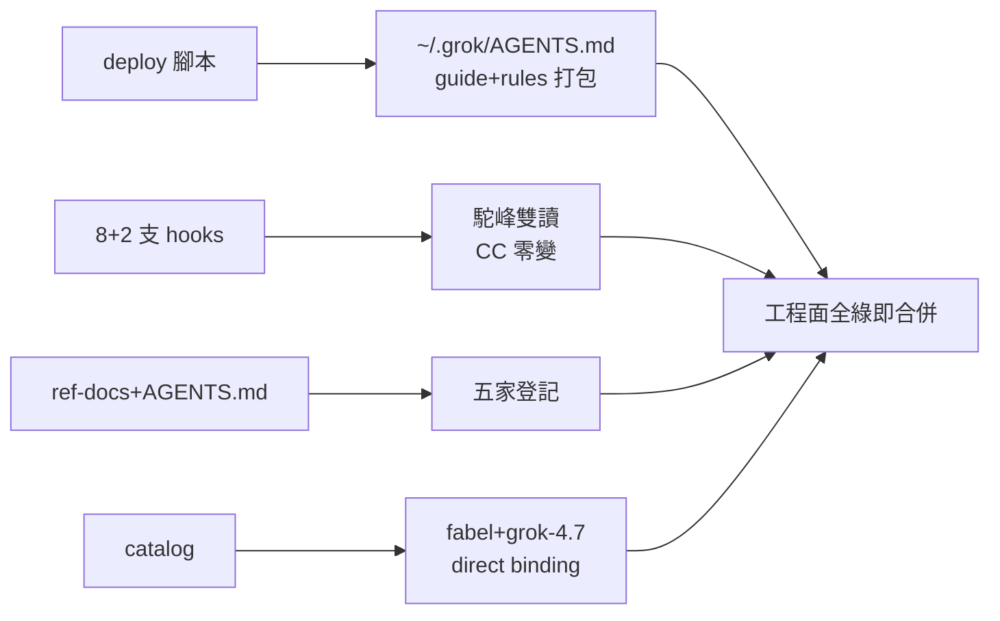

## Description

<!-- SECTION:DESCRIPTION:BEGIN -->
**做什麼**：讓 grok build 正式讀得到我們的治理、hooks 不再空轉、routing 認得它——純工程面，全部機械可驗收，不需要 user 先做任何事。

四件事：
①規則單一來源——部署腳本加第四個目標（~/.grok/AGENTS.md＝guide＋中性 rules 的打包檔），配獨立 30KiB 治理預算（grok 本身無上限，這是我們自己的注意力預算——現 bundle 29.5KB 起跳 96%，刻意形成瘦身壓力）
②hooks 雙讀——8 支讀 snake_case 的 hook 加駝峰相容（grok 送 toolName/toolInput），另 2 支補 sessionId；共用一個薄的 payload 相容層（新檔，不塞進 memory 領域 helper）；CC/ZCode 行為零變（雙讀第二項在 CC 下是死碼）＋既有測試全綠
③文檔登記——ref-docs 四檔＋AGENTS.md 把 grok 從「隱形」補進五家清單；對照矩陣 grok 欄 15 維如實填（沒有的標 n/a、未驗的標 unknown，不湊綠）
④routing——catalog 加 direct binding（fabel 身分不變、grok-4.7 是 wire token、effort 四值實測）；既有 fabel 資格範圍收窄到 direct（不讓 direct 證據自動替未來 bridge 背書）

**不做什麼**：不動 ~/.grok 與 ~/.claude（本機修復只寫 runbook——user 執行面在下一張卡）；不新增 grok registration／agent projection（CC 相容面搭車）；compact-tail-inject 標 partial 不硬修（payload 契約 UNKNOWN）。

**等 user 什麼**：無——這張收斂即可合併；行為驗收（user 點 TUI＋部署形拍板）在 L1b 卡。

<!-- SECTION:DESCRIPTION:END -->

## Acceptance Criteria
<!-- AC:BEGIN -->
- [ ] #1 deploy：grok target 進 resolve_targets＋manifest 同步；GROK_ATTENTION_BUDGET=30KiB 獨立常數超限 fail、≥85% WARN；tmp HOME oracle 驗 bundle 內容＋尾 sentinel；既有三處 target-count 測試更新後全綠
- [ ] #2 hooks：hook_payload_compat.py 薄層正規化容器鍵/event 值/tool 名/read_file.target_file；block-memory-index-write 與 kanban-skill-gate dual-shape（CC snake＋grok camel）pipe-test 各觸預期行為（deny exit 2/事件分流）；既有 hook 相關測試零回歸；13 支 guard 狀態分類齊（wired/unchanged/n-a/partial——compact-tail-inject=partial）
- [ ] #3 catalog：grok-cli-grok-4.7 direct binding（identity=fabel、token=grok-4.7、effort 四值）；fabel qualification scope 收窄 direct；loader/sync_agents --check 過；availability snapshot xai 轉 direct candidate；無 bridge binding
- [ ] #4 ref-docs：README/LIFECYCLE/contracts/control-plane-matrix＋AGENTS.md 五處登記；matrix grok 欄 15 維（unknown 附查證依賴）；freshness 軸=binary version 明載
- [ ] #5 runbook：machine-local activation 三連（rules=false＋agents=false＋extra_rule_dirs 移除）＋hooks=true 保留＋import 修復程序＋rollback；含 user 執行後可判斷言
- [ ] #6 無冗餘投影：零新 registration、零 grok agent projection、sync_agents 生成行為不變、memory 雙鉤 n-a、通用相容層不進 memory helper
- [ ] #7 工程收斂：全量 pytest 綠＋ruff 綠＋本卡 AC 全勾即可合併（不等 L1b/user 動作）
<!-- AC:END -->

## Implementation Plan

<!-- SECTION:PLAN:BEGIN -->
〔Planning Contract——AIR-218 L1a（standard→工程面；user 授權流程：flash 調查（l1-investigation.md）→muse/codex 討論（l1-verdict-*.md）→5.3 裁決→本卡）〕
**Baseline**：ai-guide main @ bef47342＋AIR-217 L0 證據（.agent-tmp/air-217/evidence/）。關鍵錨點：deploy_agents.py:117-141 resolve_targets、manifest.toml:47、hooks 讀取面（marshal_admission_guard:134、block-memory-index-write:155-156、kanban-skill-gate:139-161、memory-write-sensor:58-74 等 14 支盤點＝l1-investigation 面 2）、catalog.toml:43 identity doctrine/:72 fabel/:268-280 qualification、既有測試假設（test_deploy_agents.py:292、test_air85_projection_oracle.py:293、test_check_single_source.py:608 三 target 語義）。
**已決策（勿重辯——雙腿共識＋5.3 三裁定）**：①fabel 維持 identity、grok-4.7=wire token（catalog doctrine 自答）＋qualification binding_scope 收窄至 direct（5.3 裁 codex）②gate＝新獨立常數 GROK_ATTENTION_BUDGET=30*1024（非 alias muse；96% 起跳＝刻意治理壓力；文檔明言非 runtime cap）③部署形預設（runbook 承載、L1b user 執行）：compat.claude rules=false＋agents=false＋extra_rule_dirs 移除 ~/.claude/rules＋hooks=true——rules=false 單獨不夠（agents cell 仍載 CLAUDE.md；extra_rule_dirs 是第二 bypass）④共用相容層＝新薄檔 hooks/hook_payload_compat.py（禁塞 memory_hook_common——領域污染）⑤測試住 top-level tests/（不建 hooks/tests/——不存在且勿新建目錄慣例）；既有三處 target-count 測試假設同步④'compact-tail-inject 標 partial/unknown 不硬修（payload UNKNOWN）⑤'c 形成本引用規範：舊 +3,273 tok 作廢——寫「語義重複已證、full-c 精確 token 未量」⑥記憶體雙鉤（dirty-sensor/watch-seed）n/a 零改碼⑦registrations/sync_agents 零新增（CC 相容搭車）⑧~/.grok/~/.claude 零碰（runbook only）。
**Scope**：動＝deploy_agents.py（grok target＋常數＋docstring）、manifest.toml、AGENTS.md:106/:110、hooks 6 支容器鍵雙讀＋2 支 sessionId＋hook_payload_compat.py 新檔、tests/（deploy 4-target＋dual-shape regression＋三處既有假設更新）、ref-docs 四檔＋matrix grok 欄 15 維、catalog.toml（binding＋scope 收窄）＋model-routing SKILL.md surface 詞彙登記、runbook（ref-docs/harness/ 或 hooks/ 落點自定）。不動＝registrations、presets、sync_agents 生成面、delegate-bridge、memory-dirty-sensor/watch-seed、compact-tail-inject、~/.grok＆~/.claude、sc-router。
**Scenarios**：deploy 4/4＋85% WARN 即期觸發（預期態）；dual-shape pipe-test（snake=CC 形/camel=grok 形各觸 deny exit 2）；kanban 兩形事件分流；既有測試零回歸；catalog loader 過＋snapshot xai 轉 direct candidate。
**Integration**：下游＝L1b 卡（runbook 執行＋行為驗收）；model-routing resolver（binding 消費）；週日 bundle 看照（第 4 target 入監）。
**驗證式**：AC 七項（機械可判）。
<!-- SECTION:PLAN:END -->
