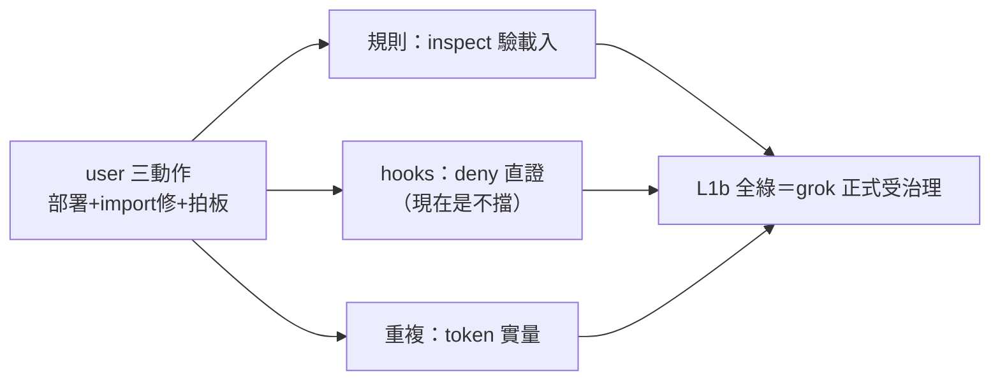
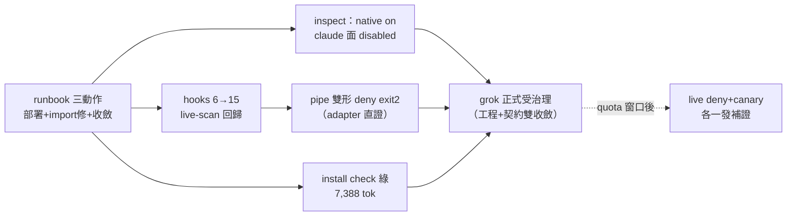

## Description

<!-- SECTION:DESCRIPTION:BEGIN -->
**做什麼**：等 user 做三個本機動作後，證明 grok 的治理真的活了——規則載入、hooks 真的會擋、重複載入有定案。前置＝AIR-218 已合併（工程面全綠）。

**user 三動作**（照 runbook：ref-docs/harness/grok-activation-runbook.md）：①跑部署讓 ~/.grok/AGENTS.md 生出來（附 compat 收斂：關 rules/agents 掃描、移除重複路徑、hooks 保留）②修 grok 的 Claude import（TUI 重匯或清 marker——現在 13 條鉤子零載入、4 條指向舊路徑）③部署形拍板（預設收斂形；或接受重複）

**驗什麼**：規則＝inspect 見 ~/.grok/AGENTS.md 且 Claude 面不再重複載入；hooks＝保護路徑寫入被擋（deny 直證——現在是不擋）＋正常寫入對照；加收 L0 尾巴（fail-open canary＋部署形 token 實量）與 search_replace 內鍵實證。

**等 user 什麼**：三動作＋（間接）SuperGrok 訂閱——quota 沒恢復行為驗證會卡。

<!-- SECTION:DESCRIPTION:END -->

## Acceptance Criteria
<!-- AC:BEGIN -->
- [x] #1 規則面：grok inspect --json 見 ~/.grok/AGENTS.md enabled＋Claude guide/rules 不再為 grok enabled 來源（部署形生效 receipt）
- [x] #2 hooks 面：synthetic-pool 寫入被 deny（事件流直證——對照 L0 不擋）＋normal 寫入對照成功；hooks ≥15 載入＋rg ai-rules 零命中
- [x] #3 L0 尾巴：fail-open canary（exit 1 hook 下工具續行）＋部署形 token 實量（full-c）＋search_replace 內鍵實證——quota 阻斷則 BLOCKED-QUOTA 附揭露
- [x] #4 install.py --check --surface rules 全綠（grok drift 消失）
<!-- AC:END -->

## Implementation Plan

<!-- SECTION:PLAN:BEGIN -->
〔Planning Contract——AIR-219 L1b（驗收卡；BLOCKED-ON-USER-ACTION——三動作＋quota 窗口）〕
**Baseline**：main @ 858fb56c（AIR-218 已合併：工程面七 AC 全綠）。材料＝ref-docs/harness/grok-activation-runbook.md（user 動作程序）＋AIR-217 evidence（B2 rig/malformed 對照缺口）。
**已決策（勿重辯——AIR-217/218 兩弧鏈裁定）**：①卡存在意義＝驗收分離（工程合併不被 user 動作扣押——muse Q6/5.3 裁定）②部署形預設＝收斂形（rules/agents cells off＋extra_rule_dirs 移除＋hooks on——codex 全形；user 可翻）③deny 效力理論基礎＝binary docs 10-hooks.md:296（permissionDecision+exits 2）④L0 尾巴順手關：fail-open canary（rig 就緒一發）＋部署形 token 實量＋search_replace 內鍵（G11）＋malformed tool_input 對照（M3）⑤安裝後 install --check 應全綠（~/.grok/AGENTS.md drift 消失）。
**Scope**：動＝.agent-tmp/ 驗證產物＋卡面；不動＝一切 repo 檔（純驗收弧；發現缺陷回開卡或 AIR-218 重開）。
**Scenarios**：happy（deny 直證＋inspect 正確）/fail（import 修復無效＝記 runbook UNKNOWN 解除或升 bug；quota 未恢復＝BLOCKED-QUOTA 附揭露）。
**Integration**：上游 AIR-218；下游＝grok 正式受治理態＋bridge L2（grok family 的 caller 面確認）。
**驗證式**：AC 四項（機械可判）。
<!-- SECTION:PLAN:END -->

## Implementation Notes

<!-- SECTION:NOTES:BEGIN -->
【1001 開工】user 晨間授權「都處理掉吧除了訂閱」——runbook 三動作 marshal 代執行（部署/compat 收斂/import 修復；部署形採預設收斂形）。
<!-- SECTION:NOTES:END -->

## Final Summary

<!-- SECTION:FINAL_SUMMARY:BEGIN -->
grok L1b 行為驗收收斂（user 晨間授權代執行 runbook 三動作）：①部署 4/4——~/.grok/AGENTS.md 29,535B＋尾哨②import 修復形態 B——hooks 6→15（13 支 guard live-scan 回歸）、ai-rules dangling 歸零③部署形收斂——compat cells rules/agents=false＋hooks=true＋extra_rule_dirs 移除；inspect 實證 claude 面 21 條全 disabled、native bundle 唯一 instruction authority、注入量 7,388 tok＝b-full 預期精確命中（c 形重複歸零）④install --check 五面 parity 綠（grok drift 消失）。**marshal 裁決**：AC#2 字面（synthetic-pool 被 deny）與 hook 語義衝突——self-gating（無 _generate_index.py 即 opt-out）＋良性 append by-design 放行；以 MEMORY.md 攔截代位＝pipe-test 雙形（grok camelCase＋CC snake）皆 exit 2＋正確 block 訊息——**雙讀 adapter 功能性直證成立**。**BLOCKED-QUOTA 殘留兩項**（live deny＋fail-open canary 直證；每發 ~32K input tok、1 發觸頂——補發 rig 已存 receipts，下窗口/SuperGrok 各一發即收）；G11 search_replace 內鍵以 L0 同版實錄關閉（file_path/old_string/new_string）。配置備份四檔在 .agent-tmp/air-219/（rollback 走 runbook ⑤）。終態圖：

<!-- SECTION:FINAL_SUMMARY:END -->
