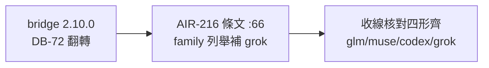

## Description

<!-- SECTION:DESCRIPTION:BEGIN -->
**做什麼**：bridge 出了 2.10.0，grok 家族的串流收斂語義翻了（沒錨的串流從「完成＋註記」改成「大聲失敗 output-token-limit」）——把我們收線核對條文的家族清單補上 grok（目前只列 glm/muse/codex 三形），並記一句 grok 的事件錨定規則（串流內工具失敗永非終局）。

**等 user 什麼**：無——上游已凍結事實的同步修（一行級）。

<!-- SECTION:DESCRIPTION:END -->

## Acceptance Criteria
<!-- AC:BEGIN -->
- [ ] #1 bridge-dispatch SKILL.md :66 family-split 句補 grok 形（NDJSON camelCase tool events＋事件錨定 status：in-stream tool failure 永非終局、anchor-less text 串流＝output-token-limit 大聲失敗——bridge 2.10.0 docs/ep.md S1 honest-completion 條款為源）；as-of 標記更新 2026-10-01
- [ ] #2 muse 單腿複核條文（minor drift-sync 軌——比照 as-of 翻正先例）無語義面 finding
<!-- AC:END -->
