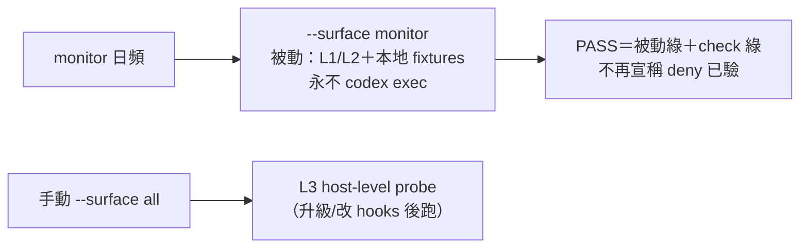
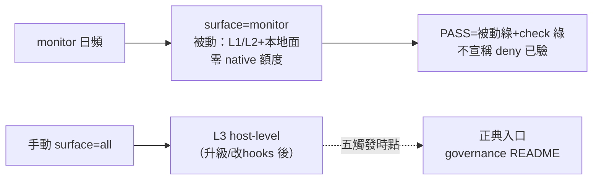

## Description

<!-- SECTION:DESCRIPTION:BEGIN -->
**做什麼**：治理日檢裡那個「每天真跑一次 codex 驗防護」的深層探針（L3）改成純手動——它每天吃一口稀缺的 native 額度，但守的性質一年變不了幾次；monitor 改走被動驗證路徑（本地零額度），真正昂貴的深驗留給「codex 升級/改 hooks 後手動跑一次」。

**事實底盤**：bridge 派工全走 webgpt（無本地檔案系統——寫不到記憶池，deny 對它空集合）；native 只剩 user 手動用 codex app；L3 上線以來紅兩次全是環境因（CLI 缺、額度盡），deny 本身零故障；0929 事故是 check 面抓的。

**殘餘風險（誠實記）**：純行為級失效（配置在、trust 在、但 runtime 不 fire）只有 L3 抓得到——退役後這類失效會在下個手動觸發點才發現。以 L1+L2（零成本擋配置漂移）＋低 base rate 接受。

**等 user 什麼**：無。

<!-- SECTION:DESCRIPTION:END -->

## Acceptance Criteria
<!-- AC:BEGIN -->
- [x] #1 monitor 路徑：governance_health_monitor.py 調 --verify --surface monitor；install.py stub 實作（scheduled passive 永不呼叫 codex_host_level_fixture；CLI 缺席該模式非 GUARD）；monitor log 含可見 manual-only 行
- [x] #2 手動能力保留：rg gov-probe-fixture governance/install.py 命中不變；--surface all 語義含 L3（文件＋代碼分支）；PASS/尾行措辭照決策②
- [x] #3 文檔：README probe 表/三層節/排程節/manual 正典入口＋觸發時點；hooks/AGENTS.md pointer；manifest/plist/schedule-registry 語義同步
- [x] #4 路由政策句：model-routing SKILL codex 行 webgpt-only＋native 手動保留 rg 命中；catalog.toml 零政策句
- [x] #5 消解句：air-215/air-220 notes 各一句（superseded 語義）
- [x] #6 驗證：monitor 實跑綠（被動+check）；相關 pytest 同步全綠；--check --surface all 綠
<!-- AC:END -->

## Implementation Plan

<!-- SECTION:PLAN:BEGIN -->
〔Planning Contract——AIR-221（standard；muse/codex 討論收斂＋5.3 機制裁定）〕
**Baseline**：main @ 5a6dc123＋verdicts（.agent-tmp/l3-reform/）。錨點：install.py:2176-2240 codex_host_level_fixture、:2349 monitor stub（未實作）、:2308-2312 GUARD 分支、:2377-2381 verify 尾行；monitor.py:25-28/57；README:46/:56/:65。
**已決策（勿重辯）**：①機制＝codex 版：--surface monitor＝scheduled passive（L1/L2＋grok/zcode/muse 本地面；**永不 codex exec；CLI 缺席非 GUARD**）；--surface all＝manual full（含 L3——預設不變，fail-closed 方向 muse 原則由此外）；②monitor PASS 行改「scheduled passive verify＋check 全綠；Codex L3＝手動 acceptance」；③手動 L3 正典＝governance README probe 節（不另 runbook）；hooks/AGENTS.md 一行 pointer＋明示「scheduled PASS≠host-level deny acceptance」；④手動觸發時點文件化：codex 升級／hook source／registration／trust 契約／L3 fixture 變更後——無保底無戳記無 mtime；⑤路由政策句入 model-routing SKILL dispatch 預設 codex 行（webgpt-only＋native 手動保留）——catalog.toml 零政策句（supply facts 單一源）；⑥10-04 pending 以 superseded 語義消解入 air-215/220 notes（禁記 L3 PASS）；⑦plist 日頻 86400 不動；schedule-registry:28 該行同步；⑧殘餘風險（behavior-only 失效延遲發現）卡面 desc 已載，接受。
**Scope**：動＝scripts/governance_health_monitor.py、governance/install.py（stub 實作＋GUARD 分支調整＋尾行）、governance/README.md、manifest.toml [probes] 註記、deploy plist 註解、schedule-registry:28、model-routing SKILL codex 行、air-215/220 卡 notes 消解句、對應 governance tests。不動＝deny hook 本體、bridge 側、catalog.toml、launchd cadence、新 runbook 檔。
**Scenarios**：monitor 跑動＝被動綠＋check 綠＋log 可見「L3 manual-only」行；手動 all＝L3 照跑（quota 消費僅此路徑）；CLI 缺席下 monitor 不紅。
**Integration**：下游=monitor 日常（10-04 噪音源消失）；README 運維單一源。
**驗證式**：AC 六項。
<!-- SECTION:PLAN:END -->

## Implementation Notes

<!-- SECTION:NOTES:BEGIN -->
【1001 結算】實作＝flash（stub 轉正＋monitor 被動化＋文檔六處＋政策句＋消解句＋9 新測）；審查＝fresh（六軸全 PASS＋live 實跑被動綠；必修 F1＝政策句張力）＋muse（五題對照全合＋Minor/Info 三條）→judge 6 採＋F5 記帳→flash 修復 6/6 綠（含 L4 monitor 真跑 exit 0）。回執四欄：classification=boundary（monitor 契約＋探針政策面）／review=fresh+muse GO-WITH-FIXES 全採（evidence .agent-tmp/l3-reform/）／session-freshness=fresh／deployment-surfaces=healthy（monitor L4 真跑綠＋--check 雙面綠）。記帳：F5（hooks/AGENTS.md＋matrix row 15 正當但未列 Plan Scope——drift 防護課責）；後續弧候選：真 L1 缺席測試補案、family 表 :185 rescue 列同步。全量 2672 passed。
<!-- SECTION:NOTES:END -->

## Final Summary

<!-- SECTION:FINAL_SUMMARY:BEGIN -->
L3 探針退役手動 acceptance 落地（main 2c7fb477）：monitor 日頻改走 --surface monitor 排程被動路徑（L1/L2＋本地面、永不 codex exec——native 額度零咬痕；CLI 缺席不再 GUARD＝環境噪音源消滅）；手動 --verify --surface all 完整含 L3（fail-closed 不變）；正典入口＋五觸發時點（codex 升級/改 hooks/registration/trust/L3 fixture 變更後）住 governance README；webgpt-only 路由政策入 model-routing SKILL（native passthrough 標退役；catalog 純供給事實零政策句）；10-04 pending 以 superseded 語義消解（air-215/220 notes）。殘餘風險（行為級失效延遲到下個手動觸發點）誠實入卡與 README。終態圖：

<!-- SECTION:FINAL_SUMMARY:END -->
