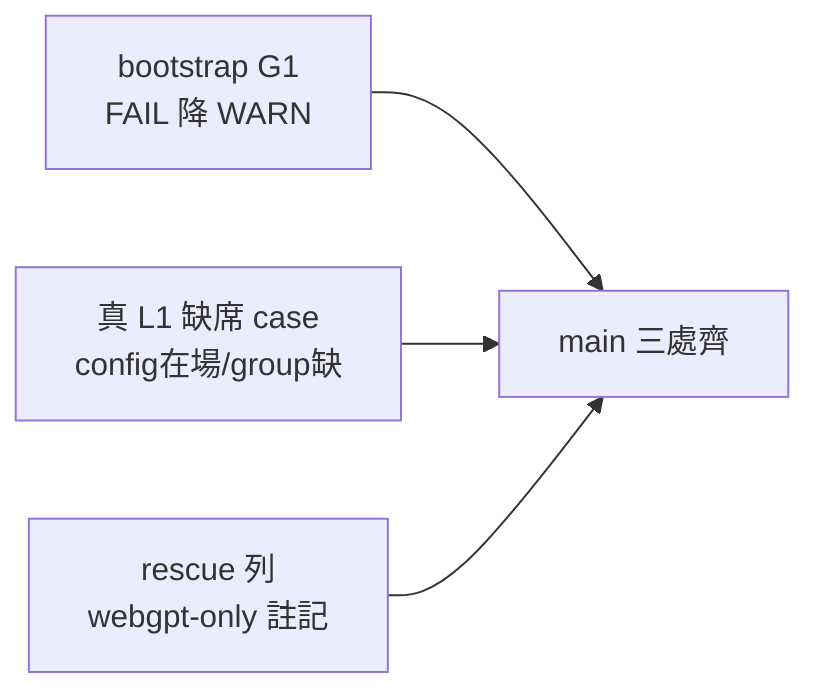
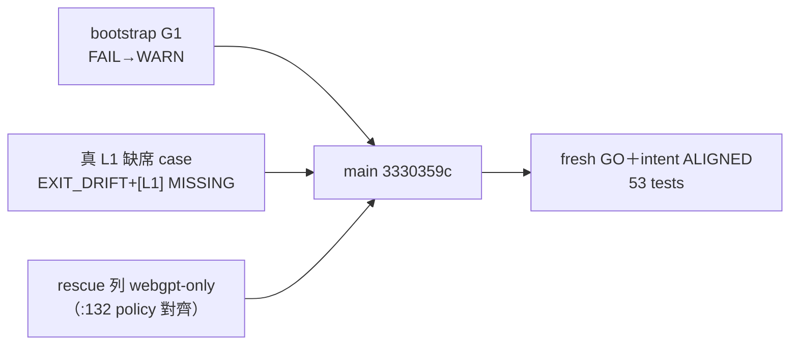

## Description

<!-- SECTION:DESCRIPTION:BEGIN -->
**做什麼**：CC 退役後的三處殘留整理——①新機器 bootstrap 不再被 dormant 的 CC settings 檔卡住（缺席降為警告、有則照驗）②補一個「真的 L1 缺席」測試（現在的測試只測了 config 檔整個不存在的情況）③routing 表的 codex 診斷救援列補上 webgpt-only 限制（跟 221 的總政策對齊）。

**不做什麼**：不動 deny hook 本體、manifest、live settings、memory 拓撲、grok 接線。

**等 user 什麼**：無。

<!-- SECTION:DESCRIPTION:END -->

## Acceptance Criteria
<!-- AC:BEGIN -->
- [x] #1 G1：fixture 其他 prerequisite 全綠＋settings 缺席→bootstrap 不因 G1 非零退出＋輸出 WARN G1-secrets；在場→PASS；既有 fail-loud test :69 改 warning oracle 綠；bootstrap.py 說明/Phase 5 列印/MULTI-MACHINE.md/:253 清單行同步（rg preflight-已擋缺席 零殘留）
- [x] #2 L1：config 在場且合法＋刪一個 owned hook group→probe_codex/monitor 路徑得 FAIL/EXIT_DRIFT＋[L1] MISSING；與 :361 既有 target-缺席測試分離並存
- [x] #3 routing：:185 rescue 列載具註記與 :132 standing policy 一致（bridge-dispatch 複驗紀錄在場）；同檔 consistency scan 無相反語義
<!-- AC:END -->

## Implementation Plan

<!-- SECTION:PLAN:BEGIN -->
〔Planning Contract——AIR-222 家事卡（simple 級三改；muse/codex 批次討論收斂）〕
**Baseline**：main @ f7850c10。錨點：bootstrap.py:160-171（G1-secrets FAIL）＋:253（面外清單行「preflight 已擋缺席」）＋MULTI-MACHINE.md:21（fail-loud 明文）＋test_bootstrap fail-loud test:69；test_governance_verify.py:361（target-缺席分支）vs install.py:2295-2299（真 L1 group 缺席＝[L1] MISSING＋EXIT_DRIFT）；model-routing SKILL:185 rescue 列。
**已決策（勿重辯——雙腿收斂）**：①F3＝FAIL→WARN（缺席不擋、有則照驗；hard-FAIL 前提已死——dormant 資產非新機必需；移除則丟 readiness 訊號）②對象＝repo 內 settings.json（bootstrap.py:160-171——**非** ~/.claude/settings.json，muse 糾正）③同步面＝bootstrap.py:253＋MULTI-MACHINE.md:21（codex 補）＋既有 fail-loud test:69 改 warning oracle（codex 補）④真 L1 case＝config 在場但 owned group 刪除→斷言 EXIT_DRIFT＋[L1] MISSING 行（與 :361 target-缺席分支分離）⑤:185 rescue 列加載具註記前先複驗 bridge-dispatch codex 腿載具（muse 誠實條款——禁寫未經證實約束；預期形＝僅 chatgpt-web/webgpt、native 不作 fallback，對齊 :132 standing policy）⑥按 control-plane review profile 走審查（model-routing 為 instruction semantic sync）。
**Scope**：動＝scripts/bootstrap.py、tests/test_bootstrap.py、hooks/MULTI-MACHINE.md、tests/test_governance_verify.py、skills/model-routing/SKILL.md。不動＝governance/install.py 行為本體、manifest、live settings、memory 拓撲、grok 接線。
**Scenarios**：settings 缺席→preflight exit 0＋WARN 行；在場→PASS 照舊；真 L1 缺席→FAIL/EXIT_DRIFT＋[L1] MISSING。
**Integration**：bootstrap 新機流程、monitor 日檢語義（221 後）。
**驗證式**：AC 三組。
<!-- SECTION:PLAN:END -->

## Implementation Notes

<!-- SECTION:NOTES:BEGIN -->
【1001 收線結算】實作＝flash 三改（RED→GREEN：G1 fail-loud test 改 warning oracle 1 failed→20 passed；真 L1 group 缺席 case 斷言集僅 MISSING 分支可產出非恆綠；rescue 列經 bridge-dispatch 複驗後寫入）；審查＝fresh **GO**（零 Critical——獨立複跑 53 tests＋intact-config 判別力直證＋ loud→silent lens 認定安全〔零機械消費端＋訊號保留〕）＋intent 腿 ALIGNED-WITH-NOTES（四軸全對齊）→judge 採 F-1/F-2 兩行 polish＋F-3 結案 notes，F4-F6 放生。回執四欄：classification=boundary（bootstrap gate 語義＋model-routing instruction sync）／review=fresh GO＋intent ALIGNED（evidence .agent-tmp/air-222/landed.diff＋review 紀錄）／session-freshness=fresh／deployment-surfaces=N-A（本地腳本與文檔；bootstrap 非 deploy 面）。
<!-- SECTION:NOTES:END -->

## Final Summary

<!-- SECTION:FINAL_SUMMARY:BEGIN -->
CC 退役家事三小改落地（main 3330359c）：①bootstrap G1-secrets FAIL→WARN（dormant CC 資產缺席不擋新機 bootstrap、有則照驗； loud→silent 轉換經 fresh 審查 lens 認定安全——零機械消費端＋訊號保留）②真 L1 group 缺席 case（config 在場刪 owned group→EXIT_DRIFT＋[L1] MISSING——與 target-缺席分支分離）③model-routing rescue 列 webgpt-only 註記（經 bridge-dispatch 複驗）。審查：fresh GO＋intent ALIGNED-WITH-NOTES；53 tests 綠。終態圖：

<!-- SECTION:FINAL_SUMMARY:END -->
