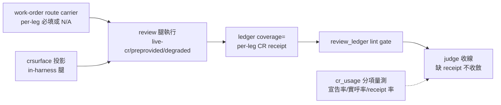

## Description

<!-- SECTION:DESCRIPTION:BEGIN -->
**做什麼**：讓每條需要結構查證的 review 腿都留下三段可機械對帳的證據——route 宣告（用什麼查的）→ 實際 evidence（查到了什麼）→ judge 收線（核過沒有）。兩份審計（我方 job-level＋mosaic 對話紀錄級）交叉證實：契約條文都在，但從未有腿走完全鏈——worker 零使用被 dispatcher 預跑掩蓋、judge 的 marker 驗收零實例。收口目標＝**沒有 per-leg receipt 就不能宣稱 review chain 收斂**。

**四個機制面**：①producer——external work-order review variant 加 per-leg route carrier（漏欄＝contract-incomplete；無結構查證 trigger 的腿顯式 N/A）；in-harness 用既有 crsurface= 投影成 route（mcp→live-cr:MCP、cli→live-cr:CLI、attach→preprovided-cr、absent→degraded）②receipt——ledger coverage= 欄擴 per-leg CR receipt 子格式（route/evidence ref/degraded reason/judge state；route 是腿級非 finding 級）③consumer——review_ledger.py lint 真驗（缺 receipt fail、eligible 無 route fail、degraded 無 reason fail、N/A 有 reason pass）＋judge 收線前跑 gate④telemetry——cr_usage 拆量（route 宣告率/實呼率/receipt 率/closure 率分開，防 dispatcher 預跑洗白）。

**不做什麼**：GLM supply 修繕（degraded 合規）；不動 code-reality 查詢語義/freshness 機制；bridge producer 側；mosaic 自有 workflow。

**等 user 什麼**：無（full tier——下一步 standalone EP，EP review 後實作）。

<!-- SECTION:DESCRIPTION:END -->

## Implementation Plan

<!-- SECTION:PLAN:BEGIN -->
〔Planning Contract——AIR-224（**full tier**——跨 context machine contract：ledger coverage= 欄升級＋lint gate；codex 裁定單卡 full-tier EP 不拆 schema 卡；EP 為下一步 standalone 產物）〕
**Baseline**：main @ 5a6dc123＋兩份審計（.agent-tmp/cr-review-audit/report.md＋merged-brief.md＋verdict-codex.md）。錨點：review-engine:190-198（spawn 注入＋bridge marker 消費）、bridge-dispatch:66/:94-102（AIR-216 route 三態＋收線核對）、agent-workflow:45（crsurface=）、judge-review:124（negative verdict CR 複核）、workflow-review-pattern:185（ledger identity——review_ledger.py:306 lint）、install.py PROBE 無關。
**已決策（勿重辯——5.3 合併裁定＋codex verdict）**：①問題面全收、機制合併三＋telemetry 一（不重寫既有 MUST——(ii) 只做 owner 接線修正兩處：external WO route carrier＋in-harness materialization gate）②route 是 review-leg 級事實——ledger 用既有 coverage= 欄承載 per-leg CR receipt 子格式（route/evidence ref/degraded reason/judge state），**不在 finding table 加 route 欄**；[cr:*] 保留 material-evidence 語義正交③in-harness＝crsurface→route canonical projection（不發明 crroute=）④N/A applicability sentinel（無 trigger 腿顯式留 N/A receipt 非無欄位）⑤glm degraded 合規、supply 緩辦⑥telemetry instrumentation 同卡（凍結 baseline 分母/分子）；一週 observation 另開 follow-up 卡⑦收口順序：凍結 receipt 語義＋telemetry baseline→producer carrier→ledger/linter＋judge consumer→instrumentation→mosaic dogfood⑧review-engine:190 只做 owner/pointer 對齊不做重複強化；MOS-158 路徑＝acceptance fixture 非新 single source。
**Scope**：動＝skills/_common/work-order.md、skills/agent-workflow/SKILL.md、skills/review-engine/SKILL.md（owner/pointer）、skills/_common/workflow-review-pattern.md、skills/judge-review/SKILL.md、skills/post-build/scripts/review_ledger.py＋測試、skills/corrections-weekly CR telemetry 面、（post-build 直建 ledger 的 producer 若查得隨 consumer 同步）。不動＝code-reality 查詢語義/freshness、delegate-bridge producer、GLM supply、mosaic workflow、finding schema/severity、非 CR telemetry。
**Scenarios**：eligible leg 缺 receipt＝lint fail；eligible 無 route＝fail；degraded 無 reason＝fail；N/A 有 reason＝pass；live/preprovided 有 evidence ref＝pass；宣告 route 與實際 channel 不符＝不得收斂。
**Integration**：下游＝judge-review 收線 gate、AIR-216 收線核對（bridge 面已先行）、mosaic dogfood；上游＝兩份審計。
**驗證式**：codex AC 八項（EP 凍結時細化 grammar）。
<!-- SECTION:PLAN:END -->
