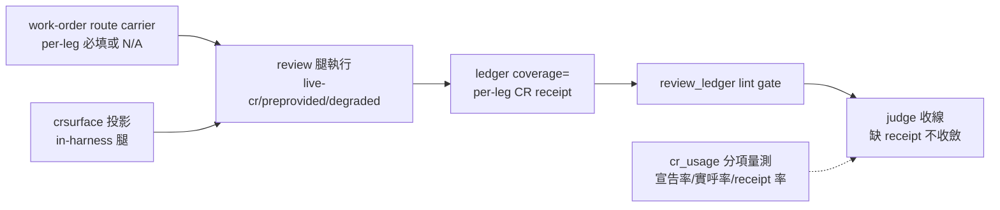
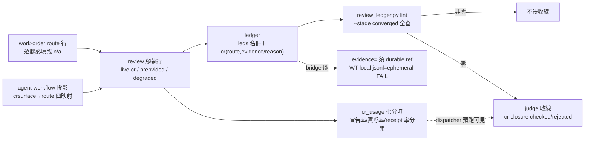

## Description

<!-- SECTION:DESCRIPTION:BEGIN -->
**做什麼**：讓每條需要結構查證的 review 腿都留下三段可機械對帳的證據——route 宣告（用什麼查的）→ 實際 evidence（查到了什麼）→ judge 收線（核過沒有）。兩份審計（我方 job-level＋mosaic 對話紀錄級）交叉證實：契約條文都在，但從未有腿走完全鏈——worker 零使用被 dispatcher 預跑掩蓋、judge 的 marker 驗收零實例。收口目標＝**沒有 per-leg receipt 就不能宣稱 review chain 收斂**。

**四個機制面**：①producer——external work-order review variant 加 per-leg route carrier（漏欄＝contract-incomplete；無結構查證 trigger 的腿顯式 N/A）；in-harness 用既有 crsurface= 投影成 route（mcp→live-cr:MCP、cli→live-cr:CLI、attach→preprovided-cr、absent→degraded）②receipt——ledger coverage= 欄擴 per-leg CR receipt 子格式（route/evidence ref/degraded reason/judge state；route 是腿級非 finding 級）③consumer——review_ledger.py lint 真驗（缺 receipt fail、eligible 無 route fail、degraded 無 reason fail、N/A 有 reason pass）＋judge 收線前跑 gate④telemetry——cr_usage 拆量（route 宣告率/實呼率/receipt 率/closure 率分開，防 dispatcher 預跑洗白）。

**不做什麼**：GLM supply 修繕（degraded 合規）；不動 code-reality 查詢語義/freshness 機制；bridge producer 側；mosaic 自有 workflow。

**等 user 什麼**：無（full tier——下一步 standalone EP，EP review 後實作）。

<!-- SECTION:DESCRIPTION:END -->

## Implementation Plan

<!-- SECTION:PLAN:BEGIN -->
〔Planning Contract——AIR-224（**full tier**——跨 context machine contract：ledger coverage= 欄升級＋lint gate；codex 裁定單卡 full-tier EP 不拆 schema 卡；EP 為下一步 standalone 產物）〕
**Baseline**：main @ 5a6dc123＋兩份審計（.agent-tmp/cr-review-audit/report.md＋merged-brief.md＋verdict-codex.md）。錨點：review-engine:190-198（spawn 注入＋bridge marker 消費）、bridge-dispatch:66/:94-102（AIR-216 route 三態＋收線核對）、agent-workflow:45（crsurface=）、judge-review:124（negative verdict CR 複核）、workflow-review-pattern:185（ledger identity——review_ledger.py:306 lint）、install.py PROBE 無關。
**已決策（勿重辯——5.3 合併裁定＋codex verdict）**：①問題面全收、機制合併三＋telemetry 一（不重寫既有 MUST——(ii) 只做 owner 接線修正兩處：external WO route carrier＋in-harness materialization gate）②route 是 review-leg 級事實——ledger 用既有 coverage= 欄承載 per-leg CR receipt 子格式（route/evidence ref/degraded reason/judge state），**不在 finding table 加 route 欄**；[cr:*] 保留 material-evidence 語義正交③in-harness＝crsurface→route canonical projection（不發明 crroute=）④N/A applicability sentinel（無 trigger 腿顯式留 N/A receipt 非無欄位）⑤glm degraded 合規、supply 緩辦⑥telemetry instrumentation 同卡（凍結 baseline 分母/分子）；一週 observation 另開 follow-up 卡⑦收口順序：凍結 receipt 語義＋telemetry baseline→producer carrier→ledger/linter＋judge consumer→instrumentation→mosaic dogfood⑧review-engine:190 只做 owner/pointer 對齊不做重複強化；MOS-158 路徑＝acceptance fixture 非新 single source。
**Scope**：動＝skills/_common/work-order.md、skills/agent-workflow/SKILL.md、skills/review-engine/SKILL.md（owner/pointer）、skills/_common/workflow-review-pattern.md、skills/judge-review/SKILL.md、skills/post-build/scripts/review_ledger.py＋測試、skills/corrections-weekly CR telemetry 面、（post-build 直建 ledger 的 producer 若查得隨 consumer 同步）。不動＝code-reality 查詢語義/freshness、delegate-bridge producer、GLM supply、mosaic workflow、finding schema/severity、非 CR telemetry。
**Scenarios**：eligible leg 缺 receipt＝lint fail；eligible 無 route＝fail；degraded 無 reason＝fail；N/A 有 reason＝pass；live/preprovided 有 evidence ref＝pass；宣告 route 與實際 channel 不符＝不得收斂。
**Integration**：下游＝judge-review 收線 gate、AIR-216 收線核對（bridge 面已先行）、mosaic dogfood；上游＝兩份審計。
**驗證式**：codex AC 八項（EP 凍結時細化 grammar）。
<!-- SECTION:PLAN:END -->

## Acceptance Criteria

- [x] per-leg CR receipt schema 凍結於 workflow-review-pattern（legs 名冊強制行＋coverage 子格式＋cr-closure 兩段式＋applicability/route 二分＋legacy-exempt 錨＋durable/ephemeral 分野）——S1＋Amendment 落地（f067906d）
- [x] producer carrier：WO review variant 逐腿 route 行（漏欄＝contract-incomplete）＋agent-workflow crsurface→route 四映射＋review-engine 兩 enforcement points owner 接線——S1b 落地
- [x] review_ledger.py converged lint gate：命中 trigger 缺 receipt FAIL／degraded 無 reason FAIL／N-A 有 reason PASS／有 evidence PASS／ephemeral bridge ref FAIL／exempt 章形限縮（三類豁免）——TDD 63 測綠＋真實九檔矩陣實證（7 檔 cr.receipt violation、air-66/75 stale exit=3）
- [x] judge-review 收線 receipt gate（宣告≠實際不收斂＋N/A 豁免主張複核 fresh-F9 checklist）——S3 落地
- [x] cr_usage.py 七分項（eligible/declared/observed-evidence/receipt/degraded/N-A/silent fallback）＋exempt 率＋golden test 鎖口徑——S4 落地（silent 名冊 join 防孤兒稀釋、phantom 行首錨定）
- [x] SM-1~7 場景矩陣全覆蓋（TC-1~5 oracle 對帳 5/5：S×5/H×1/I×1）＋EP Amendment ephemeral/durable lint fixture
- [x] 三腿審查（fresh＋muse 跨家族＋audit-test）18 findings 全採、修復兩輪落地（4bd05e4f/72269032）；回執四欄入卡；九檔 legacy-exempt 決策記錄（cutoff=b41b4ed1）
- [x] follow-up 觀察卡 AIR-224.1 開立（EP 收尾段 4）＋mosaic dogfood 通報記錄（卡 notes 載體）

<!-- SECTION:AC:BEGIN -->
<!-- SECTION:AC:END -->

## Implementation Notes

<!-- SECTION:NOTES:BEGIN -->
【1001 狀態翻正】EP accepted（61dae017＋amendment e6a76f12）——實作（S1 語義凍結/S1b producer carrier/S2 lint gate/S3 judge consumer/S4 telemetry）待下 session（EP 自含，fresh context 接手）。precheck ③ 反向檢查命中＝EP commits 在線而卡未翻——翻 In Progress 解除。

值星 dispatch（sess_04e54db8 續杯後）：卡 WT air-224 已開（baseline main=b41b4ed1）；flash 實作 agent 已派背景跑——五段照 EP 收口順序（S0 telemetry baseline 凍結→S1 schema→S1b producer carrier→S2 lint TDD→S3 judge gate→S4 telemetry+dogfood 草稿）；bridge durable-evidence producer 卡 bridge 側尚無回音，EP amendment 語義已涵蓋（不阻塞）；後續：fresh+muse 審查→judge→commit→wt-close merge。

雙腿審查收齊（fresh GO-WITH-FIXES 1Major+2Imp+2Min+2Info／muse GO-WITH-FIXES 3Imp+6Min+3Info；互相印證 F5≡F1、F3≡F7、F6≡F9 零衝突）；judge 裁決 13 項全採（F1 模板 legs 冒號形／slash leg key／Amendment 測試撥正／exempt 章形+豁免面雙收緊／air-91 先例措辭／cr 檢查收斂 converged／空 reason／n/a judge 複核註記／bare live-cr 註記＋pin／phantom 錨定／tmp_path／degraded 獨立行／S4 golden test）；flash 修復腿跑中。verdict 存檔：.agent-tmp/air-224/verdict-{fresh,muse}.md。

audit-test 腿（EP 收尾段 3）收齊：PASS-WITH-NOTES（gate_blocking=false；60 passed 自跑；9/9 快照獨立復驗 SAME）。AT-1~5 全修（孤兒 receipt 稀釋 silent／cr_usage 鏡像錨定未同步 phantom／exempt 測 vacuous-green 守衛／missing_na+no_evidence 補測／tuple 非空守衛）；AT-6 不追補（後續弧 RED provenance 慣例）；AT-7 記錄（cutoff re-baseline 五處同步：review_ledger.py:92＋cr-exempt-legacy.md:8＋三 inline replace）。flash 修復輪 2 跑中。verdict-audit.md 存檔。

【收線結算——merge 完成 main@72269032】三 commit 落地（f067906d 實作／4bd05e4f 雙腿修復／72269032 audit 修復）；main 上 66 tests 親驗；WT+branch 已拆。

回執四欄：classification=boundary（EP 執行紀律）｜review=fresh GO-WITH-FIXES（verdict-fresh.md）＋muse 跨家族 GO-WITH-FIXES（job-mup2mdn5-dvhzx5；verdict-muse.md）＋audit-test PASS-WITH-NOTES（verdict-audit.md）——13+5 findings 全採，修復輪 4bd05e4f/72269032｜session-freshness=fresh（開場重讀 EP/卡/bridge-dispatch；governing bundle session 內零變更）｜deployment-surfaces=healthy（post-merge live face：~/.agents/skills symlink 端 workflow-review-pattern 語法節＋work-order route 行 rg 命中；main 66 passed）。

九檔 legacy-exempt 決策記錄（EP 收尾段 1）：舊檔於新 converged gate 的 FAIL 全屬缺 receipt 語義類（air-91 另含 roster_malformed 舊形——E 項措辭已釐清 backfill 須改寫名冊）；豁免候選蓋章弧歸各卡結案兩步，cutoff=b41b4ed1；AT-7 五處同步清單（review_ledger.py:92＋cr-exempt-legacy.md:8＋test 三 inline）——re-baseline 時照單同步。

mosaic dogfood 通報（EP 收尾段 4）：通報主旨＋契約三要點＋觀察面已備（.agent-tmp/air-224/mosaic-dogfood-draft.md）；載體＝本卡 notes 記錄（EP 原文）；註：mosaic_alpha 尚無註冊 marshal 門牌（scbus 清單僅 southchariot/workspace 等），直接投遞待其依 AIR-225 convention 建牌或由 user 轉知。

殘留：bridge durable-evidence producer 卡（bridge 側開卡中）——producer 落地前 bridge CR 腿不得 durable-complete 收線（lint 已擋 ephemeral）；F-8 五處家族枚舉 drift＋四家/五家詞彙 5 檔（值星批次）；AIR-224.1 觀察窗指標承載 muse-F3/F7/F10/F11。

Done 翻牌待 user 拍板。

【結案】user 拍板 Done（『２２４ ＤＯＮＥ可以』，2026-10-01）。final refs：merge main@72269032＋follow-up AIR-224.1（觀察窗）＋verdict 存檔 .agent-tmp/air-224/＋bridge 跟催信 0668eea5。弧蒸餾結論：零新增 memory 候選——審計方法論（job histogram＋ledger 對帳）已固化於 cr_usage.py 源4 分項＋EP 段落 0，repo 可推導不重複入池。
<!-- SECTION:NOTES:END -->

## Final Summary

<!-- SECTION:FINAL_SUMMARY:BEGIN -->
**as-built 終態**（main@72269032；三 commit f067906d／4bd05e4f／72269032）：CR 查證閉環全鏈機械化——producer（WO route 行＋crsurface 投影）→ receipt（legs 名冊＋coverage per-leg 子格式＋cr-closure 兩段式）→ consumer（review_ledger.py converged lint gate＋judge 收線 gate）→ telemetry（cr_usage 七分項＋exempt 率）。三腿審查 18 findings 全採；回執四欄齊；九檔 legacy-exempt 候選（cutoff=b41b4ed1）。

<!-- SECTION:FINAL_SUMMARY:END -->
