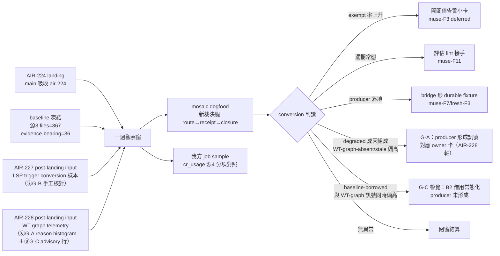

## Description

<!-- SECTION:DESCRIPTION:BEGIN -->
post-landing inputs：AIR-227（LSP live type/signature 接線）＋AIR-228（card-WT current-tree producer）——LSP 規格化後觀察面增補

AIR-224 EP 收尾段 4 開立。契約 landing（main 吸收 air-224）起一週觀察窗：①conversion 驗證——mosaic dogfood 新裁決腿（route 宣告→receipt→judge closure）＋我方 job sample，量測＝cr_usage.py 源4 分項（eligible/declared/observed-evidence/receipt/degraded/N-A/silent fallback＋exempt 率），baseline 已凍結（ai-guide .agent-tmp/air-224/baseline-cr-usage.txt：源3 files=367/evidence-bearing=36/markers src=7）；②closure 缺場率納入觀察（muse-F10——closure 行無 gate，全靠 judge 手工）；③exempt-rate 無閾值（muse-F3 deferred 面）——若觀察窗內 exempt 率顯著上升，開閾值告警小卡；④WO route carrier 機械可掃正則目前條文-only 無 owner（muse-F11）——若 dogfood 顯示漏欄常態，評估 lint 接手；⑤durable bridge evidence 正樣本測試——等 delegate-bridge producer 卡落地後補 bridge 形 durable fixture（muse-F7/fresh-F3 殘留面）。

增補觀察項（LSP 規格化後；AIR-224.1 增補弧 2026-10-02，設計權威＝verdict-muse＋verdict-codex 雙腿共識）：⑥degraded 成因組成判讀（G-A）——接 cr_usage 源4 既有 reason histogram 四行（WT-graph-absent／WT-graph-stale／no-cr-query-face／其他）：WT-graph-absent/stale 出現率＝WT graph producer 是否形成的訊號；與 WT-graph 同時偏高者對應 owner 卡。⑦trigger-conditioned LSP 樣本轉換（G-B）——手工核對：type/signature trigger 真實出現時，核 job/tool evidence 是否 hover/check_file 或明示 fallback；第一筆樣本＝AIR-227 live spawn 收據；非 KPI 無閾值，數字貼 notes；樣本量大到人工成本明顯才議腳本化——屆時另卡面對 AIR-216 normalization 門檻。⑧baseline-borrowed 計數（G-C）——cr_usage 源4 advisory 行（currently-borrowed legs＋distinct ledgers）；currently-borrowed 語義＝當前帳本借用狀態非累積事件（升級 current-tree 後舊標註剝離，見 cr-query SKILL「升級語義」）；診斷訊號非 KPI 無閾值——與 WT-graph-absent/stale 同時偏高才警覺。

非目標：lint 語義本窗不擴；禁腳本化 histogram 核對（AIR-216 條款）；G-B 腳本化不做（AIR-216 normalization／分母／基線三門檻未過——樣本量大到人工成本明顯才另卡議）；父卡 AIR-224（Done）不回改——本卡為唯一活載體；workflow-review-pattern grammar／lint 凍結——route 值域不含 lsp，lsp-bridge 命中忽略計 route（AIR-228 C 決議）。

<!-- SECTION:DESCRIPTION:END -->

## Acceptance Criteria

<!-- AC:BEGIN -->
- [x] #1 CR 機制存活與消費驗證（lint gate 對真實帳本 FAIL loud 生效；telemetry 重跑）
- [x] #2 producer 合規缺口現形並處置（四弧帳本缺 reviewed= 錨行——身份錨行併入 work-order 標配段 3407fe37）
- [x] #3 收線條件＝第一個新弧帳本過 lint（觀察窗轉常態監測）
<!-- AC:END -->

## Final Summary

<!-- SECTION:FINAL_SUMMARY:BEGIN -->
CR 機制健康（lint 會咬人、telemetry 活躍、grammar 進真實 work-order）；觀察窗抓到 producer 格式合規缺口——身份錨行已併入 work-order 標配段（3407fe37），收線條件＝第一個新弧帳本過 lint。user 裁決翻 Done（處置落地後）。

<!-- SECTION:FINAL_SUMMARY:END -->

## Implementation Notes

<!-- SECTION:NOTES:BEGIN -->
【G-B 第一筆樣本入帳】AIR-227 live spawn 收據 PASS（2026-10-02）：spawned code-reviewer 型別/簽名疑點場景實呼 hover（取得 CR_MCP_PREFIXES 簽名）＋check_file（count=0）——trigger→hover/check_file 轉換成立；face 缺席 fallback 路徑本樣本不覆蓋（face 在場）。樣本計數=1，貼 notes 不進判讀門（⑦條款）。

【G-B 樣本 #2】fresh session（user 自跑）code-reviewer hover＋check_file 實呼雙 PASS——trigger→live face 轉換跨 session 成立。樣本計數=2。

【值星回填 2026-10-02】registry 刷新語義修正落地（STATE 起手點③）：agents/AGENTS.md :121 啟動快照語義→延遲刷新（三數據點全列：同 session 立即＝舊面／經時延後＝新面／事後 fresh session＝新面；機制觸發點未究；「換 session 即時刷新」未單獨實證；官方文檔仍載快照制＝文檔與 runtime 不一致註記）＋同檔 :26 生效時機行＋:86 角色表 cell 殘留同步＋skills/memory-audit:70 蒸餾載體句「須新建 session」撤回同步。三審查腿獨立交叉命中同組殘留（fresh＋intent in-harness＋codex external job-muqenwmx-qfem4u），findings 全採全驗。Receipt: classification=boundary（review-engine 判定表——控制面 instruction 實質語義編輯）／review=fresh GO-WITH-FIXES＋intent GO-WITH-FIXES＋external codex GO-WITH-FIXES（三腿 findings 收斂同組、全數修復，rg 廣化掃描零殘留）／session-freshness=fresh／deployment-surfaces=pending（merge 後 probe 補 healthy）。機械閘：test_check_single_source 85 passed＋sync_agents --check exit 0。

【mosaic tri 觀察一行（954adbd6 請求②）】freshness receipt 核提案——stale graph＋全套 live-cr 綠燈＝洗白負存在斷言（最大假陽性不在供給在驗收）；已開 AIR-232 draft 卡承接（freshness receipt 核進 collection＋義務線綁定表＋availability lint＋persistence 真偽確認四項）。

【觀察窗查證（flash 2026-10-09）】verdict＝使用中：①producer grammar 進真實 work-order（air-235/240 wo-review.md CR route 注入段，air-240 實用 cr(route=degraded) 語法）②telemetry 被後續卡增補（air-228 cr_usage degraded 四分項 b0406b2e＋224.1 增補弧 36661e5f）③測試現況 69 passed 實跑。觀察窗收尾核對項：①review_ledger lint 對真實非 fixture 帳本的 post-landing 實跑實例未見（landing 九檔之後僅測試驅動）②cr_usage baseline 後無重跑對照。證據詳 flash 報告（agent_fc59bc83）。

【收尾核對項實跑（2026-10-09）】①review_ledger lint 對真實帳本（air-288/289 .review）＝**FAIL loud 生效**——finding：今日弧帳本缺 reviewed= 身份錨行（producer 合規缺口：CR route 語法有進 work-order 派工面，但 ledger 格式紀律未達 author 端）②cr_usage 重跑＝窗口內 rates n/a（零 receipt）、degraded/borrowed 全 0、histogram 待收線手工貼卡。結論：機制活著且會咬人；缺口在 ledger 格式紀律的觸達——歸後續（work-order 模板補 ledger schema 段或 author 工單注入擴充）。

【處置落地（2026-10-09）】ledger 身份錨行已併入 work-order.md CR-first 標配段（3407fe37——author 工單注入面同一處，新弧 author 會讀到）；觀察窗續開到第一個新弧帳本過 lint 後收線翻 Done。
<!-- SECTION:NOTES:END -->
