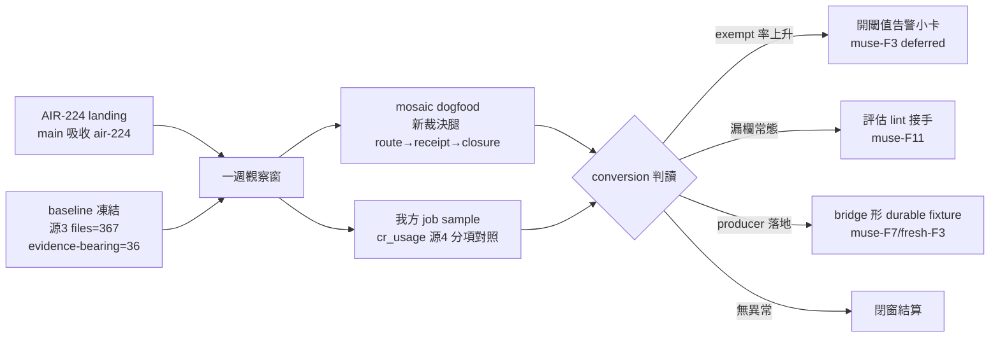

## Description

<!-- SECTION:DESCRIPTION:BEGIN -->
AIR-224 EP 收尾段 4 開立。契約 landing（main 吸收 air-224）起一週觀察窗：①conversion 驗證——mosaic dogfood 新裁決腿（route 宣告→receipt→judge closure）＋我方 job sample，量測＝cr_usage.py 源4 分項（eligible/declared/observed-evidence/receipt/degraded/N-A/silent fallback＋exempt 率），baseline 已凍結（ai-guide .agent-tmp/air-224/baseline-cr-usage.txt：源3 files=367/evidence-bearing=36/markers src=7）；②closure 缺場率納入觀察（muse-F10——closure 行無 gate，全靠 judge 手工）；③exempt-rate 無閾值（muse-F3 deferred 面）——若觀察窗內 exempt 率顯著上升，開閾值告警小卡；④WO route carrier 機械可掃正則目前條文-only 無 owner（muse-F11）——若 dogfood 顯示漏欄常態，評估 lint 接手；⑤durable bridge evidence 正樣本測試——等 delegate-bridge producer 卡落地後補 bridge 形 durable fixture（muse-F7/fresh-F3 殘留面）。不動面：lint 語義本窗不擴；禁腳本化 histogram 核對（AIR-216 條款）。

<!-- SECTION:DESCRIPTION:END -->
