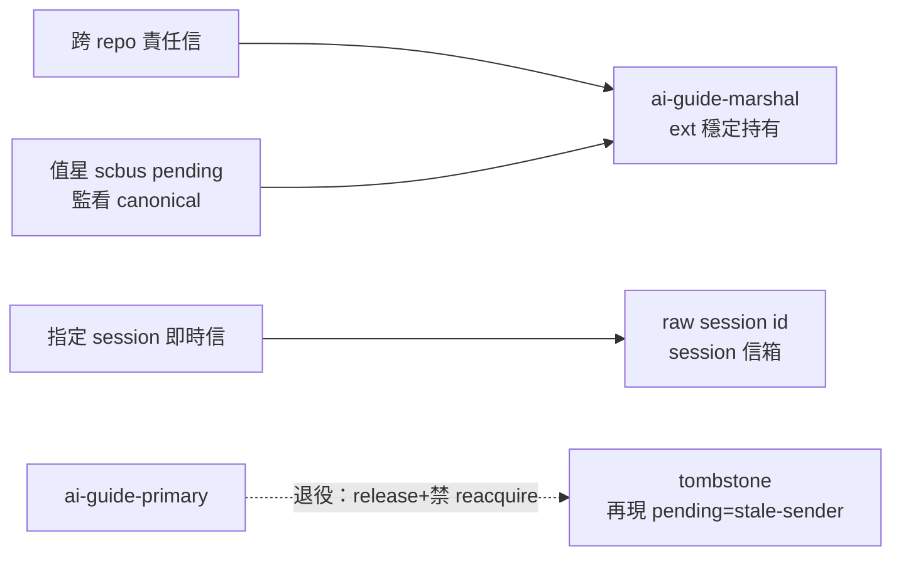

## Description

<!-- SECTION:DESCRIPTION:BEGIN -->
**做什麼**：ai-guide 有兩個收件門牌（marshal 給 ext 持有、primary 給 session 持有），結果 bridge 三封信寄 marshal、值星只掃 primary——漏接。把模型收斂成「一 repo 一個 durable 門牌＋每 session 自己的信箱」：ai-guide-marshal 為唯一 canonical（workspace ext 穩定持有，不轉手），ai-guide-primary 退役不再 acquire；值星改用 scbus pending 監看（免身分、session 換手不動搖 ownership）。規則寫進 governance/scbus-address-ownership.md 新節（通用 convention：每 repo 預設一個 <repo>-marshal，第二個位址必須證明獨立 consumer UC）。

**不做什麼**：marshal pin 不 transfer 給 session；不新增 sc-router alias/multi-drop 功能；不動 schedule-registry/STATE/bridge-dispatch（各非此契約的承載面）；跨 repo 搬遷。

**等 user 什麼**：無。

<!-- SECTION:DESCRIPTION:END -->

## Acceptance Criteria
<!-- AC:BEGIN -->
- [ ] #1 ownership doc 新節：cardinality=1 per repo＋<repo>-marshal 預設名＋第二位址例外 predicate＋sender 二分 oracle＋holder≠monitor＋retirement 程序（停止使用→drain/ack→release/expiry→禁 reacquire；再現 pending=stale-sender violation）＋exception contract 五要件
- [ ] #2 值星/Marshal consumer instruction（authoring source）：scbus pending mailbox discovery＋own session inbox pointer；情境 own=0/primary=0/marshal>0 仍 actionable
- [ ] #3 active policy：rg 掃現役 acquire/renew/sender recipe——ai-guide-primary 零命中（僅歷史/退役說明形態）
- [ ] #4 三封 marshal read-unacked envelope 全 ack（ext operator path 實證；無 path＝holder-operation gap 如實揭露）＋canonical mailbox pending 歸零機驗
- [ ] #5 primary release 實作（本 session holder 在場）＋退役聲明；此後 pending 出現 ai-guide-primary>0＝stale-sender violation 語義登記
- [ ] #6 退役通知信寄已知 sender（bridge duty＋mosaic）——primary retired、改寄 marshal
- [ ] #7 無 alias/multi-drop 宣告記錄（不新增 sc-router transport feature）
- [ ] #8 active-source 掃描：無現役 sender guidance 把 ai-guide-primary 當 target（歷史文檔豁免）
- [ ] #9 ownership doc 通用 convention 段（他 repo 現況已符合不發動搬遷）——與 AC#1 同段
<!-- AC:END -->

## Implementation Plan

<!-- SECTION:PLAN:BEGIN -->
〔Planning Contract——AIR-225（standard；muse/codex 討論收斂＋5.3 裁定——holder≠monitor 模型採 codex、SCR-6 reversal 誠實聲明採 muse）〕
**Baseline**：main @ 9423850a＋雙腿 verdicts（.agent-tmp/addr-unify/）。錨點：governance/scbus-address-ownership.md（正典——現無 cardinality/sender/monitor 節）、registry 實況（marshal ext-held gen 不變；primary 本 session持有 gen 3 可 release）、scbus pending（唯讀 badge face 免身分）。
**已決策（勿重辯——雙腿共識＋5.3）**：①單位址制留 marshal（ext per-workspace 決定論 holder＋生態系已投票＋sender 零遷移）；primary 為 AIR-206 SCR-6 誤診產物（SCR-6 已否證該診斷）——退役＝部分反轉，卡面明寫 reversal 理由②holder≠monitor：marshal pin 不轉 session；值星監看＝scbus pending 免身分 discovery③sender 二分：repo/workspace 責任→--to-address <repo>-marshal；精準指定 live session→--to <session_id>；訊息種類用 mode/intent 表達不以多位址分類④三封 read-unacked＝ext holder operator path ack（先驗路徑；無 path＝holder-operation gap 揭露，禁搶 pin）⑤primary release（holder 在場正常 release）＋退役後 pending 出現 primary>0＝stale-sender violation⑥退役通知信給已知 sender（bridge duty sess_66251fad＋mosaic sess_8e15d9db）⑦bridge-dispatch/schedule-registry/STATE 零觸（非此契約承載面）⑧通用 convention 進 ownership doc 新節（其他 repo 現況已符合，不發動搬遷）。
**Scope**：動＝governance/scbus-address-ownership.md（新節「Repo well-known address 與收件責任」五事：cardinality/sender selection/holder≠monitor/retirement/exception contract）、值星開場面 pointer（ownership doc 為單一源）、live migration receipts。不動＝bridge-dispatch、schedule-registry、STATE 模板、sc-router feature、他 repo 位址。
**Scenarios**：own=0/primary=0/marshal>0 情境仍 actionable（今日 regression 鎖）；ext-path ack 驗證；primary release 後 pending 歸零。
**Integration**：下游＝值星掃描慣例（pending discovery）；mosaic/bridge sender 指引。
**驗證式**：AC 九項。
<!-- SECTION:PLAN:END -->
