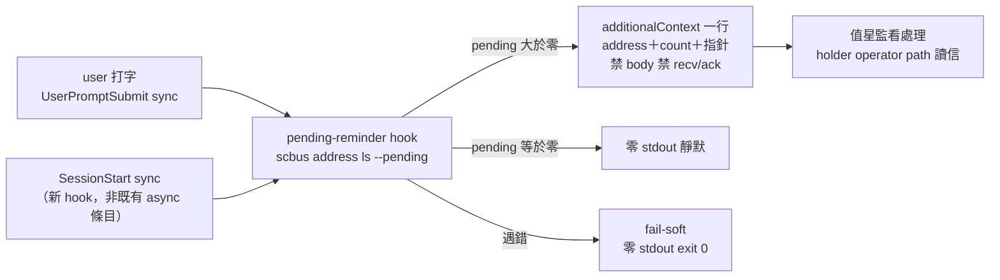

## Description

<!-- SECTION:DESCRIPTION:BEGIN -->
實證缺口：mosaic 責任信寄 ai-guide-marshal（門牌面正確寄法）後數小時未見——L2 hook 自動收信只 drain session 收件匣，門牌信躺 ext holder 地址信箱；值星人工輪詢是點快照無 liveness。雙腿討論收斂（muse＋codex；共識：AIR-225 holder 不等於 monitor 設計不變，缺的是 monitor discovery 觸發機制——routing 不漏信已成立，monitor notification 有 interaction-boundary gap）。

**做什麼**：①新 hook script `hooks/scbus-address-pending-reminder.py`（單一 script 服務兩事件——stdin hook_event_name 決定輸出 hookEventName；兩者皆 sync）：執行 scbus address ls --pending、取 --address 指名門牌的計數，pending 大於零才輸出 additionalContext——內容只含 address＋數量＋操作指針（形如「[scbus-monitor] ai-guide-marshal pending=N；監看請用 scbus address ls --pending。此提醒不授權 recv/ack/acquire」），禁注入原始 stdout（holder-less 門牌 lease 過期時上游自帶 body preview——注入即洩信件內容進 context）、禁 recv/ack/改 lease（monitor 不等於 holder 不破）。②governance/registrations/zcode.json＋cc.json 模板：SessionStart＋UserPromptSubmit 各加獨立 group（不與 sc-router canonical hook 或 compact-restore-inject 同 group——sc-router installer 以精確 command equality 認 ownership，包進 wrapper 會與其 repair 機制打架；同源多 hook 按 array 順序執行是正式支援形態）③install.py merge 面驗證＋manifest script inventory＋hook tests（pending 大於零注入／等於零靜默／fail-soft——遇錯零 stdout exit 0 不擋 turn，繼承 L2 fail-soft）④ownership doc monitor 段更新：「開場人工 discovery」改為「interaction-boundary hook discovery」。

**前置驗證兩項**（寫進 AC 不做假設）：zcode 多 UPS 條目各吐 hookSpecificOutput 時 parser 合併行為（live 已有 scbus＋compact-restore-inject 雙條目先例，需一次真機確認）；claude 面 drain 必須純 NDJSON——提醒行走獨立條目純文字 stdout 絕不混 drain 流。

**不做**：launchd 常駐 poller（門牌信持久、session 不在場無接收者——無獨立 UC）；sc-router 上游 address watch/notify face（promotion 條件＝需要 arrival-driven wakeup 或多 repo 重複實作或掃描延遲實測——屆時另開 sc-router 卡）；門牌 body preview 注入；ai-guide-marshal 之外門牌註冊（script 參數化 --address 可重複，monitor subscription 顯式由各 repo 自註冊）。

**臨時面退役閘**：source/test 綠→governance 模板/live install 對帳→開新 zcode session 實證 SessionStart pending 大於零注入→實證 UserPromptSubmit pending 大於零注入／等於零靜默→**加測一項：同 turn 雙注入觀察（session 收件匣與門牌各一封同時在場，釘多 UPS 條目 additionalContext 合併語義為機械證據）**→兩 lane 都通後退役 scbus watch＋bash 輪詢哨（ZCode hook config 是 session-start snapshot——merge 日不退役，live acceptance 後才退）。

<!-- SECTION:DESCRIPTION:END -->
