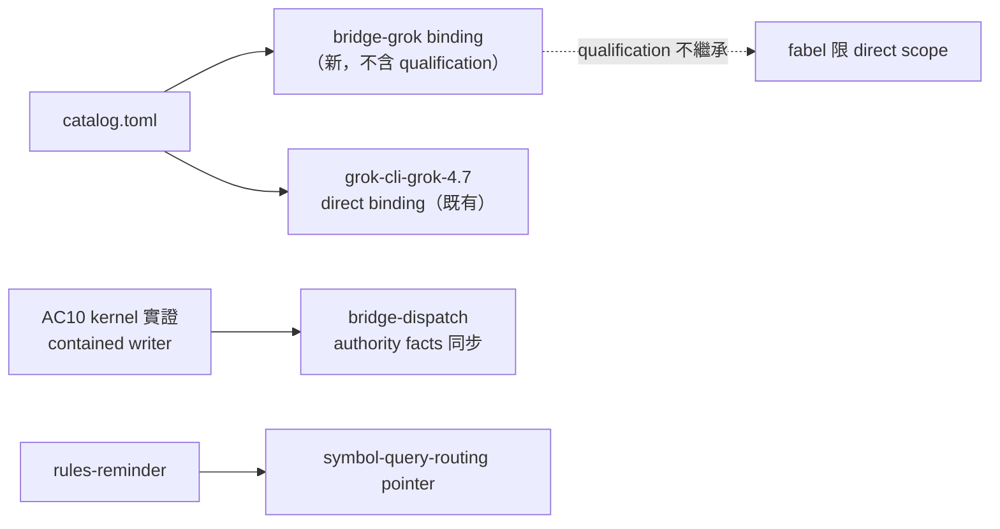

## Description

<!-- SECTION:DESCRIPTION:BEGIN -->
**做什麼**：delegate-bridge 2.9.0 已把 grok 列為正式 family（default contained writer 完成 kernel live 驗證——AC10 兩段翻轉終態），但 catalog 還寫「bridge family 未開」——新增獨立 Grok bridge binding（與 direct CLI binding 並存），同步三處事實：①catalog 新 binding（不繼承 fabel workload qualification——AC10 證明的是 authority/containment 非品質）②model-routing dispatch 描述③bridge-dispatch grok 段 authority facts（default contained writer vs --yolo/--marshal 另 authority profile、/tmp in-bounds 契約面、kernel 證據邊界＝當前 macOS/Seatbelt face）＋rules-reminder 加一行 symbol-query-routing pointer（symbol/ref/caller 查詢不得以 rg/fd 取代；rg/fd 文字搜尋規則保留）。

**不做什麼**：AIR-224 receipt schema 不動（durable amendment 友議）；delegate-bridge code；DB-74（僅 ack）；compaction policy（不升格）；既有 fabel qualification。

**等 user 什麼**：無。

<!-- SECTION:DESCRIPTION:END -->

## Acceptance Criteria
<!-- AC:BEGIN -->
- [ ] #1 catalog 同時存在 grok-cli-grok-4.7 direct 與獨立 Grok bridge binding；active model-routing 內 bridge family 未開 零命中
- [ ] #2 fabel ep_synthesis/adjudication qualification 仍只 scope direct binding；新 bridge binding 零 workload qualification 繼承
- [ ] #3 bridge-dispatch 明確區分 default contained writer 與 --yolo/--marshal；記錄 /tmp in-bounds；以 producer 文件為事實 source 不複刻 sandbox spec
- [ ] #4 rules-reminder 明確指向 symbol-query-routing：symbol/ref/caller/closure 類 query 不得以 rg/fd 取代；原 rg/fd 文字/檔案搜尋規則保留
- [ ] #5 catalog validation 與 instruction consistency gate 通過；無 bridge workload evidence 不新增 qualification
<!-- AC:END -->

## Implementation Plan

<!-- SECTION:PLAN:BEGIN -->
〔Planning Contract——AIR-226（standard；muse/codex 信件跟動討論收斂＋5.3 裁定）〕
**Baseline**：main @ f7850c10 後續（含 221/222/223）。錨點：catalog.toml:72（bridge family 未開 stale）/:188（同款）/:286（fabel qualification scope=grok-cli-grok-4.7）、bridge-dispatch SKILL grok 段、rules-reminder SKILL.md:35（僅 rg/fd 工具偏好）、AC10 證據（bridge duty 三信：1ade5b3e FALSIFIED→3c1d0492 CORRECTION 翻轉＋kernel 證據 sandbox-events.jsonl）。
**已決策（勿重辯——雙腿＋5.3）**：①bridge binding 新增不繼承 fabel qualification（AC10＝authority/containment 證據非品質證據）②catalog :72/:188 stale 句同步③bridge-dispatch grok 段四防 drift（contained≠全模式——--yolo/--marshal 另 profile；/tmp 明寫 in-bounds 契約面；kernel 證據限當前 face；archive 與 prune 分 lifecycle——後兩者歸 bridge producer 卡本卡只寫前三）④rules-reminder 一行 pointer（charter 顧慮記錄：symbol-query-routing 本屬工具選擇 domain——muse 顧慮成立但不阻）⑤DB-74 僅 ack⑥compaction 不升格（quota 鬆≠價值證據）。
**Scope**：動＝skills/model-routing/catalog.toml＋SKILL.md dispatch 描述、skills/bridge-dispatch/SKILL.md grok 段、skills/rules-reminder/SKILL.md 一行。不動＝AIR-224 schema、delegate-bridge code、DB-74、compaction、既有 fabel qualification。
**Scenarios**：catalog 同時存在 direct+bridge binding；新 binding 零 workload qualification；:132/:185/:211 語義一致。
**Integration**：下游＝resolver（bridge grok candidate 出現）；上游＝DB-71 landing＋AC10。
**驗證式**：AC 五項（codex 定稿）。
<!-- SECTION:PLAN:END -->
