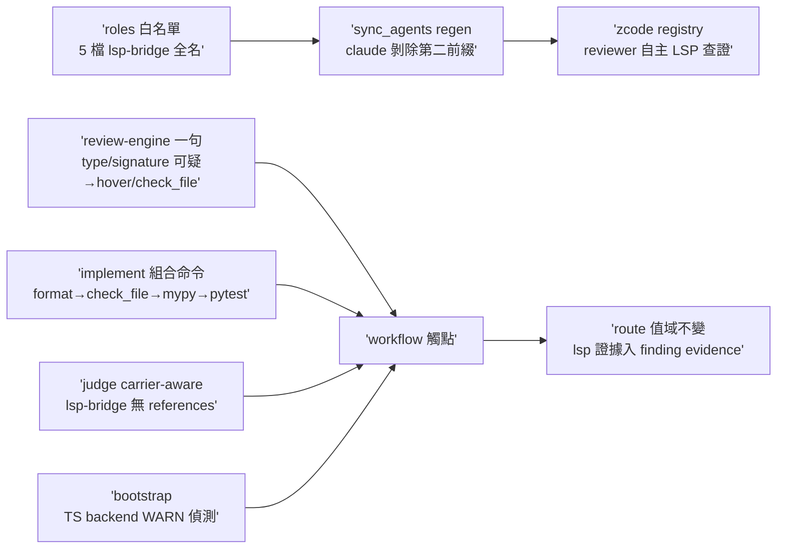

## Description

<!-- SECTION:DESCRIPTION:BEGIN -->
讓 live 型別/簽名查證面（lsp-bridge 的 hover/check_file）真正可及、可觸發：審查與查證 agents 目前工具白名單只有 CR 查詢面四顆，被要求用 LSP 也叫不到；流程條文與驗證組合也沒有這個面；條文裡還留著 lsp-bridge 根本沒有的 references/definition 泛稱。收斂自雙腿討論（muse＋codex；分歧四點 5.3 裁決：卡弧結構供給歸 AIR-228、禁例行 lsp_status、最小權限分層、TS backend 走偵測面）。

做什麼（人話）：①五個 roles 白名單掛 lsp-bridge 唯讀工具全名——code-reviewer／code-reviewer-primed／lite-verify 掛 hover＋check_file；cr-research／spec-miner 只掛 hover（最小權限）；impl-lite 不綁任何 lsp 全名（保持零 MCP 依賴——check_file 由 implement 流程的機械驗證邊界跑，主 session 面）。②sync_agents.py 的 claude 端剝除清單加第二前綴（code-reality-lsp-bridge__），防全名洩進 claude registry 炸 spawn；重生成兩 registry。③review-engine spawn 工具紀律加一句：型別/簽名可疑→直接呼叫 hover/check_file（實際失敗才 fallback；禁例行 lsp_status 探測；指向 symbol-query-routing 不重抄 doctrine）；agent-workflow 相容性前置加半句：lsp-bridge 快照缺席→不派新白名單 role，走既有降級鏈。④implement 載體語義修正：結構面 definition/references 走 CR、live 型別/簽名走 hover/check_file（拔 goToDefinition/findReferences 泛稱——lsp-bridge 無此二操作）；implement 段後驗證組合命令插 check_file（format 後、mypy 前；mypy 仍是權威——這是 symbol-query-routing 既有 doctrine 的 drift 修復）。⑤judge-review 泛稱 LSP fallback 改 carrier-aware：CR 缺場退 references 僅限原生 findReferences surface 的 harness；lsp-bridge 不得冒充。⑥bootstrap 加 TS backend 偵測（WARN＋可操作提示——比照 AIR-222 G1 FAIL→WARN 先例；不安裝不自動補，安裝 ownership 歸 code-reality backend discovery contract）。

本卡 invariant（AIR-224 凍結不動）：route 值域 byte-for-byte 不變；lsp 證據入 finding/validation evidence（如 LSP check_file path: clean）不計 route、收線核對忽略 lsp-bridge 命中。

不做：edit_file 入白名單（任何 role）、impl-lite MCP 綁定、route grammar 值域擴張、wt-open 變更、npm 安裝、卡弧結構供給 producer（歸 AIR-228）。

證據：雙腿 verdicts＝.agent-tmp/lsp-wiring/verdict-{muse,codex}.md；行號錨點（review-engine:184、agent-workflow:45、implement:118/:186、judge-review:108、symbol-query-routing:38、sync_agents.py:34/:813）見 verdicts 內文。

<!-- SECTION:DESCRIPTION:END -->

## Implementation Notes

<!-- SECTION:NOTES:BEGIN -->
G4 去向（muse verdict 點 6 代記）：TS backend 缺口的長期載體＝bootstrap ts-backend WARN 偵測（本卡落地）＋安裝 ownership 歸 code-reality backend discovery contract／TS 消費端 repo；不做一次性 npm -g（machine-local 換機即失）。live spawn 驗證（muse AC5）延後至 merge 後——~/.zcode/agents symlink 指 primary canonical main 面，卡 branch 未 merge 前新白名單不進 spawn 快照；post-merge 補 code-reviewer 試調 hover receipt。

雙腿審查收齊：fresh GO-WITH-FIXES（F1 Important＝agents/AGENTS.md:22 已知刻意分歧條 stale 枚舉未同步雙前綴表＋F2 bootstrap hint 指向自鑄詞＋F4 implement 句首過度宣稱＋F3 pre-existing 泛稱語料五處）／muse GO（AC 兌現全獨立驗證；F4 偏差正確從卡；207 tests 經 log+算術佐證）。judge 裁決：F1/F2/F4 修（flash 修復腿跑中）；F3 記值星批次泛稱語料清理項不擴卡 scope（execution-plan:237/:276、cr-query:47-48/:112、ep-review:74/:86、fix-test:204）。附帶實證：fresh 審查 session 自身＝query face 在場 lsp-bridge 缺席快照——muse 前腿炸彈組合預言成立，agent-workflow 半句緩解面對應正確。verdicts 存檔 .agent-tmp/air-227/。
<!-- SECTION:NOTES:END -->
