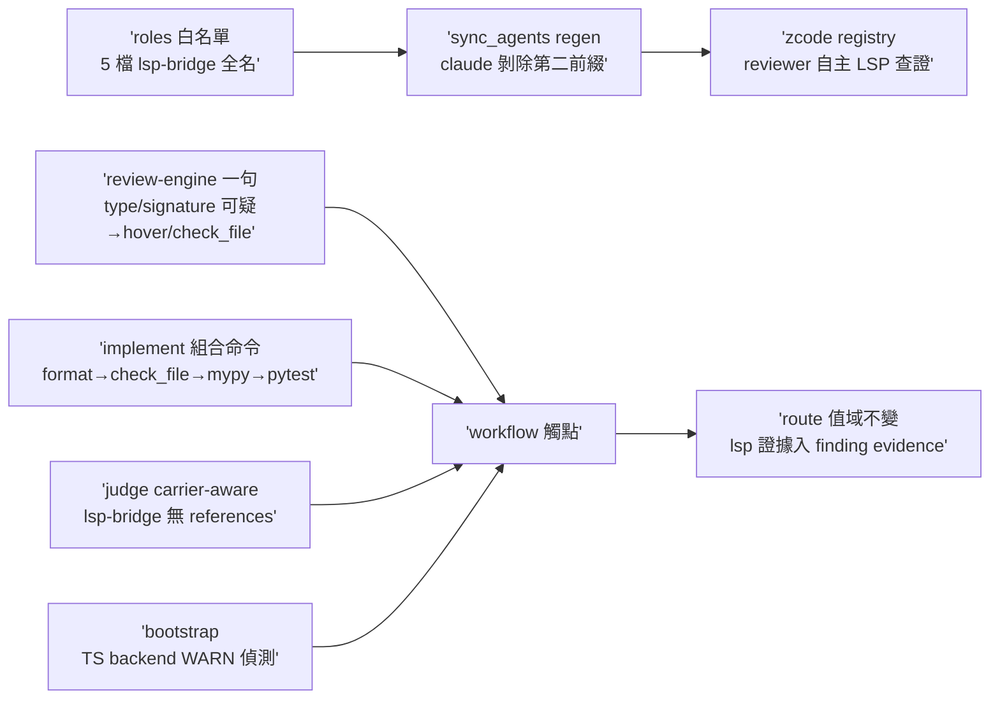
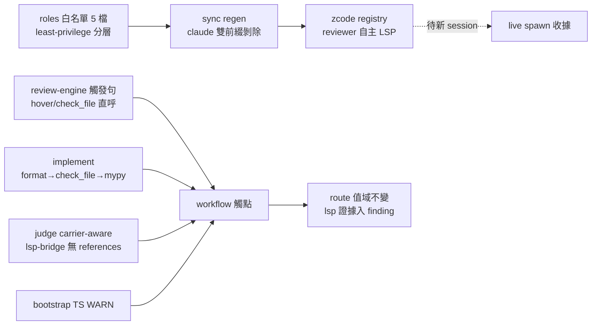

## Description

<!-- SECTION:DESCRIPTION:BEGIN -->
讓 live 型別/簽名查證面（lsp-bridge 的 hover/check_file）真正可及、可觸發：審查與查證 agents 目前工具白名單只有 CR 查詢面四顆，被要求用 LSP 也叫不到；流程條文與驗證組合也沒有這個面；條文裡還留著 lsp-bridge 根本沒有的 references/definition 泛稱。收斂自雙腿討論（muse＋codex；分歧四點 5.3 裁決：卡弧結構供給歸 AIR-228、禁例行 lsp_status、最小權限分層、TS backend 走偵測面）。

做什麼（人話）：①五個 roles 白名單掛 lsp-bridge 唯讀工具全名——code-reviewer／code-reviewer-primed／lite-verify 掛 hover＋check_file；cr-research／spec-miner 只掛 hover（最小權限）；impl-lite 不綁任何 lsp 全名（保持零 MCP 依賴——check_file 由 implement 流程的機械驗證邊界跑，主 session 面）。②sync_agents.py 的 claude 端剝除清單加第二前綴（code-reality-lsp-bridge__），防全名洩進 claude registry 炸 spawn；重生成兩 registry。③review-engine spawn 工具紀律加一句：型別/簽名可疑→直接呼叫 hover/check_file（實際失敗才 fallback；禁例行 lsp_status 探測；指向 symbol-query-routing 不重抄 doctrine）；agent-workflow 相容性前置加半句：lsp-bridge 快照缺席→不派新白名單 role，走既有降級鏈。④implement 載體語義修正：結構面 definition/references 走 CR、live 型別/簽名走 hover/check_file（拔 goToDefinition/findReferences 泛稱——lsp-bridge 無此二操作）；implement 段後驗證組合命令插 check_file（format 後、mypy 前；mypy 仍是權威——這是 symbol-query-routing 既有 doctrine 的 drift 修復）。⑤judge-review 泛稱 LSP fallback 改 carrier-aware：CR 缺場退 references 僅限原生 findReferences surface 的 harness；lsp-bridge 不得冒充。⑥bootstrap 加 TS backend 偵測（WARN＋可操作提示——比照 AIR-222 G1 FAIL→WARN 先例；不安裝不自動補，安裝 ownership 歸 code-reality backend discovery contract）。

本卡 invariant（AIR-224 凍結不動）：route 值域 byte-for-byte 不變；lsp 證據入 finding/validation evidence（如 LSP check_file path: clean）不計 route、收線核對忽略 lsp-bridge 命中。

不做：edit_file 入白名單（任何 role）、impl-lite MCP 綁定、route grammar 值域擴張、wt-open 變更、npm 安裝、卡弧結構供給 producer（歸 AIR-228）。

證據：雙腿 verdicts＝.agent-tmp/lsp-wiring/verdict-{muse,codex}.md；行號錨點（review-engine:184、agent-workflow:45、implement:118/:186、judge-review:108、symbol-query-routing:38、sync_agents.py:34/:813）見 verdicts 內文。

<!-- SECTION:DESCRIPTION:END -->

## Acceptance Criteria

- [x] roles 白名單恰 5 檔 least-privilege 分層（reviewer/primed/lite-verify＝hover+check_file；cr-research/spec-miner＝hover only；impl-lite 零 MCP；全 repo 無 edit_file）
- [x] sync_agents claude 剝除前綴表化（雙前綴）＋regen --check 綠＋claude 面 lsp-bridge 零命中＋新測
- [x] 五處條文錨點（review-engine 觸發句／agent-workflow 降級半句／implement 語義×2＋check_file 入組合／judge carrier-aware 四處）——rg 全命中、無 doctrine 重抄
- [x] bootstrap ts-backend WARN 偵測（AIR-222 G1 先例形態）＋正負兩測
- [x] 負向：route 值域 byte-for-byte 不變＋wt-open.sh 零改動＋無 npm——三面 rg/git 對帳
- [x] 207 tests 三套件綠（fresh 腿獨立重跑重現）
- [x] 雙腿審查（fresh GO-WITH-FIXES＋muse GO）＋judge 裁決 F1/F2/F4 修復落地；converged lint gate dogfood PASS（首次真實弧）
- [x] live spawn 收據（code-reviewer 工具面盤點恰六顆＋實呼 hover/check_file 雙 PASS——registry 延遲刷新後同 session 取得；lsp_status 不在場＝least-privilege 刻意不掛）

（前記「session 啟動快照、需新 session」診斷已由第三數據點證偽修正——registry 變更為延遲刷新傳播，詳見 Implementation Notes 診斷修正段。）

## Implementation Plan

<!-- SECTION:PLAN:BEGIN -->
〔Planning Contract——AIR-227（standard tier——registry＋instruction 接線面，無新架構邊界；設計已由雙腿討論＋5.3 收斂四分歧裁決）〕
**Baseline**：main @ 51cf937d；設計源＝.agent-tmp/lsp-wiring/verdict-{muse,codex}.md。
**已決策（勿重辯）**：①白名單掛 lsp-bridge 全名（同 plugin 同風險面；否決主 session 代理與留空繼承）②least-privilege 分層（cr-research/spec-miner 只 hover）③禁例行 lsp_status（probe 禁令）④impl-lite 零 MCP 綁定（check_file 走 implement 機械驗證邊界＝主 session 面）⑤route grammar 凍結不動（lsp 證據入 finding evidence）⑥G4 折衷偵測面（bootstrap WARN，不安裝）。
**Scope**：動＝agents/roles×5＋agents/zcode regen＋agents/AGENTS.md 分歧條＋scripts/{sync_agents,bootstrap}.py＋skills/{review-engine,agent-workflow,implement,judge-review}/SKILL.md＋tests×2。不動＝bridge-dispatch、workflow-review-pattern、wt-open.sh、impl-lite/vision-review/cross-verify/mem-distill roles。
**驗證式**：AC1-6 rg 錨點＋sync --check＋207 tests 三套件＋live spawn 收據（merge 後新 session）。
<!-- SECTION:PLAN:END -->

## Implementation Notes

<!-- SECTION:NOTES:BEGIN -->
G4 去向（muse verdict 點 6 代記）：TS backend 缺口的長期載體＝bootstrap ts-backend WARN 偵測（本卡落地）＋安裝 ownership 歸 code-reality backend discovery contract／TS 消費端 repo；不做一次性 npm -g（machine-local 換機即失）。live spawn 驗證（muse AC5）延後至 merge 後——~/.zcode/agents symlink 指 primary canonical main 面，卡 branch 未 merge 前新白名單不進 spawn 快照；post-merge 補 code-reviewer 試調 hover receipt。

雙腿審查收齊：fresh GO-WITH-FIXES（F1 Important＝agents/AGENTS.md:22 已知刻意分歧條 stale 枚舉未同步雙前綴表＋F2 bootstrap hint 指向自鑄詞＋F4 implement 句首過度宣稱＋F3 pre-existing 泛稱語料五處）／muse GO（AC 兌現全獨立驗證；F4 偏差正確從卡；207 tests 經 log+算術佐證）。judge 裁決：F1/F2/F4 修（flash 修復腿跑中）；F3 記值星批次泛稱語料清理項不擴卡 scope（execution-plan:237/:276、cr-query:47-48/:112、ep-review:74/:86、fix-test:204）。附帶實證：fresh 審查 session 自身＝query face 在場 lsp-bridge 缺席快照——muse 前腿炸彈組合預言成立，agent-workflow 半句緩解面對應正確。verdicts 存檔 .agent-tmp/air-227/。

【收斂態落卡（AIR-121/224）】[air-227.md] findings=5 tables=1 decisions ✅=4/❌=1/⚠️=0/unknown=0 (source=決策) status resolved=1/verified=3/closed=1/open=0/unknown=0 未決=0 unparsed=0

【live spawn 驗證結果】FAIL＋根因＝session 啟動快照過舊（非接線錯誤）——機械證據：①merged 檔內容正確（agents/zcode/code-reviewer.md 含 lsp-bridge__hover＋__check_file，rg 實證）②live symlink 面 ~/.zcode/agents→primary 讀到新檔（mtime 10-02 06:45）③spawned code-reviewer（本弧收線後派）工具面僅四顆 CR query face——ZCode agent 定義為 session 啟動快照（本 session 開於弧前），app 重啟即載入新定義。**下一 session 一步收據**：spawn code-reviewer 試調 lsp_status/hover → PASS 即翻 deployment-surfaces=healthy。此 FAIL 附帶再證 agent-workflow 快照缺席降級半句是 load-bearing（本 session 內任何型別查證派工都會踩到）。Done 判讀：核心交付（接線+同步+測試+雙腿+新閘 dogfood）全綠；行為面收據待新 session——留 user 拍板。
【結案】user 拍板 Done（「可以翻done」，2026-10-02）。final refs：merge main（09bb4513 實作＋ace8c81b 修復）＋verdicts .agent-tmp/air-227/＋AIR-229（F-03 落點）＋live spawn 收據＝下一 session 一步（快照根因記錄在案）。

【診斷修正＋live spawn 收據 PASS（2026-10-02）】前記「session 啟動快照、需新 session」診斷被第三數據點證偽——merge 後立即 spawn＝舊面（四顆）、經時延後 spawn＝新面（六顆）：registry 變更以延遲刷新傳播（機制觸發點未究——cache TTL 或事件驅動重讀；強宣稱撤回）。行為收據：spawn code-reviewer 工具面盤點＝恰六顆（四 CR query＋lsp-bridge hover/check_file；lsp_status 不在場＝least-privilege 刻意不掛，非缺陷）＋實呼雙 PASS（hover 取得 CR_MCP_PREFIXES tuple[Literal,Literal] 型別簽名——即本卡 sync_agents 變更自身；check_file diagnostics count=0）。deployment-surfaces=healthy。此收據同時＝AIR-224.1 觀察項⑦（G-B trigger-conditioned LSP 樣本）第一筆。

【新 session 收據補強（sess_8a97ac5e，user 自跑）】全新 session 的 code-reviewer 掛載面恰六顆（四 CR query＋lsp-bridge hover/check_file）＋hover/check_file 實呼雙 PASS——白名單於 fresh session 亦正確生效，補強本 session 延遲刷新收據。註：agent 自判 FAIL 係舊版驗收 prompt 誤以 lsp_status 在場為判準（該 face 刻意不掛——5.3 least-privilege 裁決），非工具缺陷；驗收 prompt 已作廢修正。
<!-- SECTION:NOTES:END -->

## Final Summary

<!-- SECTION:FINAL_SUMMARY:BEGIN -->
**as-built 終態**（main：09bb4513＋ace8c81b）：LSP live type/signature 面全鏈通電——五 roles 白名單（least-privilege 分層）→sync 雙前綴剝除防 claude 洩漏→review-engine 觸發句（直接呼叫禁例行 probe）→agent-workflow 快照缺席降級鏈→implement 載體語義修正＋check_file 快篩入驗證組合（mypy 權威）→judge carrier-aware→bootstrap TS 偵測。route grammar 凍結不動；lsp 證據入 finding evidence 不計 route。

<!-- SECTION:FINAL_SUMMARY:END -->
