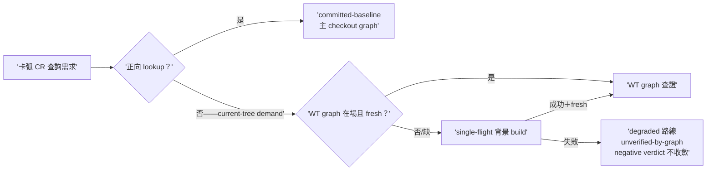
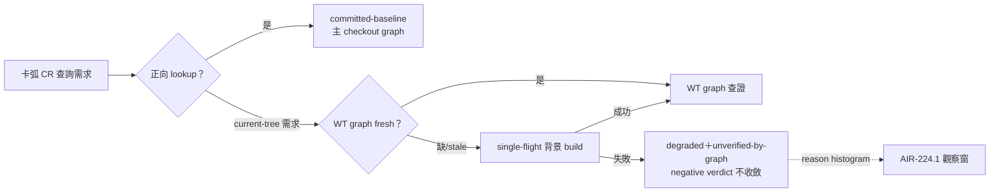

## Description

<!-- SECTION:DESCRIPTION:BEGIN -->
卡 worktree 的結構證據供給：開卡 WT 時不建 code-reality graph（保持開工快速路徑），導致卡弧內 CR 查證常態降級成文字搜尋。本卡把「何時補建 WT graph」定成證據需求驅動：不是生命週期事件，是查證需求出現才背景建一次。收斂自雙腿討論（codex 設計；另一腿的「等觀察窗數據」顧慮由本設計化解——成因已知不等數據；「build 失敗永不擋開工」作為本卡 invariant 吸收）。

做什麼（人話）：①cr-query doctrine 擴——卡 WT 缺自有 graph 或新鮮度不足時，committed-baseline（主 checkout 的 graph）可回答正向查找；需要 current-tree 結構證據時（branch 新增/修改 symbol 的 refs/callers/closure/impact 查證，或零 caller/唯一消費者/可刪/不影響 X 這類窮盡型判斷）→ single-flight 背景 build 一次。②build 失敗不擋開工、不擋實作——只限證據權限：該次查證走降級路線＋受影響主張逐條標 unverified-by-graph＋窮盡型結構判斷不得終局收斂（與 AIR-224 receipt 模型相容）。③背景 build 成功且新鮮後，後續查證升級為 current-tree 證據。④AIR-224.1 觀察窗 telemetry 區分「WT graph 缺席/過期」這個降級成因。route/receipt grammar 零改動；wt-open 腳本不動。

<!-- SECTION:DESCRIPTION:END -->

## Implementation Plan

<!-- SECTION:PLAN:BEGIN -->
〔Planning Contract——AIR-228（standard tier——控制面 doctrine＋telemetry 契約面，無新架構邊界；設計已由雙腿討論收斂）〕
**Baseline**：main @ 12f024b1；設計源＝.agent-tmp/lsp-wiring/verdict-codex.md 第 4 點（B2 evidence-demand trigger）＋verdict-muse.md 第 4 點（build 失敗永不擋開工 invariant）。
**已決策（勿重辯）**：①trigger＝evidence demand 非生命週期事件②committed-baseline 借用限正向 lookup③single-flight 併發去重④build 失敗只限證據權限（與 AIR-224 receipt 相容）⑤reason 建議值為 cr-query 區域慣例不動凍結 grammar⑥wt-open fast path 不動。
**Scope**：動＝skills/cr-query/SKILL.md（新節＋AIR-206 pointer）、skills/review-engine/SKILL.md（pointer）、skills/corrections-weekly/scripts/cr_usage.py（reason histogram）、tests/test_cr_usage_s4.py。不動＝wt-open.sh、workflow-review-pattern、bridge-dispatch、symbol-query-routing（fresh-F3 歸 AIR-229）。
**驗證式**：新節 rg 錨點＋全套件綠＋cr_usage 實跑分項行＋負向三面對帳。
<!-- SECTION:PLAN:END -->

## Acceptance Criteria

- [x] cr-query「card-WT 結構證據供給」節——committed-baseline 借用判準（正向 lookup only＋baseline-borrowed 凍結格式）＋current-tree demand trigger 封閉列舉＋single-flight 併發去重語義＋build 失敗只限證據權限（degraded＋unverified-by-graph＋negative verdict 不 terminal 收斂）＋WT-graph-absent/stale reason 慣例
- [x] review-engine card-WT pointer（不重抄 doctrine）
- [x] cr_usage degraded reason histogram 四分項＋新測＋golden 斷言（誤覆蓋自抓恢復經 fresh 抽驗）
- [x] 負向三面零改動：wt-open.sh／workflow-review-pattern grammar／bridge-dispatch route 值域
- [x] 全套件 2713 passed＋1 skipped——fresh 與 muse 兩腿各自獨立重現
- [x] 雙腿審查（fresh GO-WITH-FIXES＋muse GO）＋judge 裁決（F1/F2/F4 修復、F3 歸 AIR-229、F5 測試口徑慣例採納）；converged lint PASS（dogfood 第二輪）

## Implementation Notes

<!-- SECTION:NOTES:BEGIN -->
雙腿審查收齊：fresh GO-WITH-FIXES（F1 single-flight 上限讀法矛盾＋F2 baseline-borrowed 無機械格式——探針實證 lint RE 吸入污染＋F3 cross-doc reason 記載面未同步〔卡 fence 禁動 bridge-dispatch——歸 AIR-229 吸收〕＋F4 命令形對照＋F5 測試口徑慣例；全套件 2713 passed 獨立重現）／muse GO（invariant 逐字落地＋histogram 探針九形狀＋全套件綠；兩 Suggestion＝F4 同項＋F5 同項）。judge 裁決：F1/F2/F4 修（flash 跑中）；F3 追加 AIR-229 第四組（bridge-dispatch:66＋symbol-query-routing:25 no-cr-query-face 單值措辭→指涉 cr-query reason 值清單）；F5 採納為 commit message 慣例（測試口徑必註明）。

【收斂態落卡（AIR-121/224）】[air-228.md] findings=5 tables=1 decisions ✅=5/❌=0/⚠️=0 status resolved=1/verified=3/closed=1/open=0 未決=0（converged lint exit 0——dogfood 第二輪；全套件 2713 passed 兩腿獨立重現）。回執四欄：classification=boundary（控制面 doctrine＋telemetry 契約）｜review=fresh GO-WITH-FIXES＋muse GO（job-muq4sbkk-zn9xoq）＋judge 5/3 裁決（F1/F2/F4 修、F3 歸 AIR-229、F5 慣例採納）——verdicts 存檔 .agent-tmp/air-228/｜session-freshness=fresh（弧內 governing 檔零變更；bridge-dispatch skill 已於派工前載入）｜deployment-surfaces=N/A（doctrine 卡—— symlink 面零觸；cr_usage 實跑 exit 0 分項行在場）。Done 翻牌待 user。
【結案】user 拍板 Done（「可以翻done」，2026-10-02）。final refs：merge main（b0406b2e 實作＋f65b4fc8 修復）＋verdicts .agent-tmp/air-228/＋AIR-229（F-03 落點）＋converged lint dogfood 第二輪 PASS。
<!-- SECTION:NOTES:END -->

## Final Summary

<!-- SECTION:FINAL_SUMMARY:BEGIN -->
**as-built 終態**（main：b0406b2e＋f65b4fc8）：card WT 結構證據供給從「常態降級 rg」升級為 evidence-demand 驅動——正向 lookup 借 committed-baseline（主 checkout graph），current-tree 需求（branch symbol refs/callers/closure/impact 或窮盡型判斷）觸發 single-flight 背景 build；build 失敗永不擋工作只限證據權限；telemetry 以 reason histogram 區分降級成因餵 AIR-224.1 觀察窗。

<!-- SECTION:FINAL_SUMMARY:END -->
