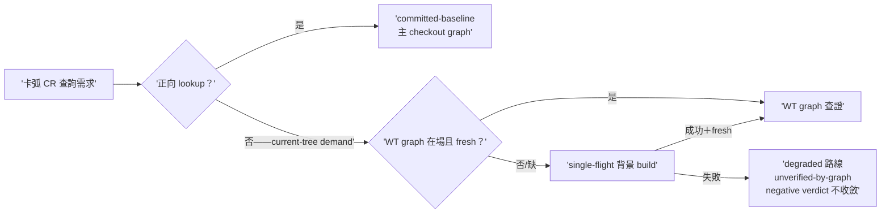

## Description

<!-- SECTION:DESCRIPTION:BEGIN -->
卡 worktree 的結構證據供給：開卡 WT 時不建 code-reality graph（保持開工快速路徑），導致卡弧內 CR 查證常態降級成文字搜尋。本卡把「何時補建 WT graph」定成證據需求驅動：不是生命週期事件，是查證需求出現才背景建一次。收斂自雙腿討論（codex 設計；另一腿的「等觀察窗數據」顧慮由本設計化解——成因已知不等數據；「build 失敗永不擋開工」作為本卡 invariant 吸收）。

做什麼（人話）：①cr-query doctrine 擴——卡 WT 缺自有 graph 或新鮮度不足時，committed-baseline（主 checkout 的 graph）可回答正向查找；需要 current-tree 結構證據時（branch 新增/修改 symbol 的 refs/callers/closure/impact 查證，或零 caller/唯一消費者/可刪/不影響 X 這類窮盡型判斷）→ single-flight 背景 build 一次。②build 失敗不擋開工、不擋實作——只限證據權限：該次查證走降級路線＋受影響主張逐條標 unverified-by-graph＋窮盡型結構判斷不得終局收斂（與 AIR-224 receipt 模型相容）。③背景 build 成功且新鮮後，後續查證升級為 current-tree 證據。④AIR-224.1 觀察窗 telemetry 區分「WT graph 缺席/過期」這個降級成因。route/receipt grammar 零改動；wt-open 腳本不動。

<!-- SECTION:DESCRIPTION:END -->
