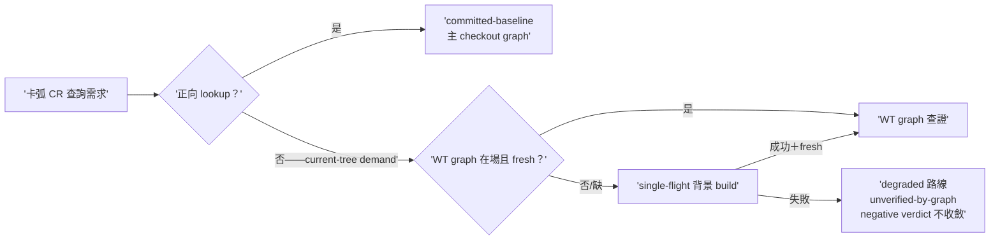

## Description

<!-- SECTION:DESCRIPTION:BEGIN -->
卡 worktree 的結構證據供給：開卡 WT 時不建 code-reality graph（保持開工快速路徑），導致卡弧內 CR 查證常態降級成文字搜尋。本卡把「何時補建 WT graph」定成證據需求驅動：不是生命週期事件，是查證需求出現才背景建一次。收斂自雙腿討論（codex 設計；另一腿的「等觀察窗數據」顧慮由本設計化解——成因已知不等數據；「build 失敗永不擋開工」作為本卡 invariant 吸收）。

做什麼（人話）：①cr-query doctrine 擴——卡 WT 缺自有 graph 或新鮮度不足時，committed-baseline（主 checkout 的 graph）可回答正向查找；需要 current-tree 結構證據時（branch 新增/修改 symbol 的 refs/callers/closure/impact 查證，或零 caller/唯一消費者/可刪/不影響 X 這類窮盡型判斷）→ single-flight 背景 build 一次。②build 失敗不擋開工、不擋實作——只限證據權限：該次查證走降級路線＋受影響主張逐條標 unverified-by-graph＋窮盡型結構判斷不得終局收斂（與 AIR-224 receipt 模型相容）。③背景 build 成功且新鮮後，後續查證升級為 current-tree 證據。④AIR-224.1 觀察窗 telemetry 區分「WT graph 缺席/過期」這個降級成因。route/receipt grammar 零改動；wt-open 腳本不動。

<!-- SECTION:DESCRIPTION:END -->

## Implementation Notes

<!-- SECTION:NOTES:BEGIN -->
雙腿審查收齊：fresh GO-WITH-FIXES（F1 single-flight 上限讀法矛盾＋F2 baseline-borrowed 無機械格式——探針實證 lint RE 吸入污染＋F3 cross-doc reason 記載面未同步〔卡 fence 禁動 bridge-dispatch——歸 AIR-229 吸收〕＋F4 命令形對照＋F5 測試口徑慣例；全套件 2713 passed 獨立重現）／muse GO（invariant 逐字落地＋histogram 探針九形狀＋全套件綠；兩 Suggestion＝F4 同項＋F5 同項）。judge 裁決：F1/F2/F4 修（flash 跑中）；F3 追加 AIR-229 第四組（bridge-dispatch:66＋symbol-query-routing:25 no-cr-query-face 單值措辭→指涉 cr-query reason 值清單）；F5 採納為 commit message 慣例（測試口徑必註明）。

【收斂態落卡（AIR-121/224）】[air-228.md] findings=5 tables=1 decisions ✅=5/❌=0/⚠️=0 status resolved=1/verified=3/closed=1/open=0 未決=0（converged lint exit 0——dogfood 第二輪；全套件 2713 passed 兩腿獨立重現）。回執四欄：classification=boundary（控制面 doctrine＋telemetry 契約）｜review=fresh GO-WITH-FIXES＋muse GO（job-muq4sbkk-zn9xoq）＋judge 5/3 裁決（F1/F2/F4 修、F3 歸 AIR-229、F5 慣例採納）——verdicts 存檔 .agent-tmp/air-228/｜session-freshness=fresh（弧內 governing 檔零變更；bridge-dispatch skill 已於派工前載入）｜deployment-surfaces=N/A（doctrine 卡—— symlink 面零觸；cr_usage 實跑 exit 0 分項行在場）。Done 翻牌待 user。
<!-- SECTION:NOTES:END -->
