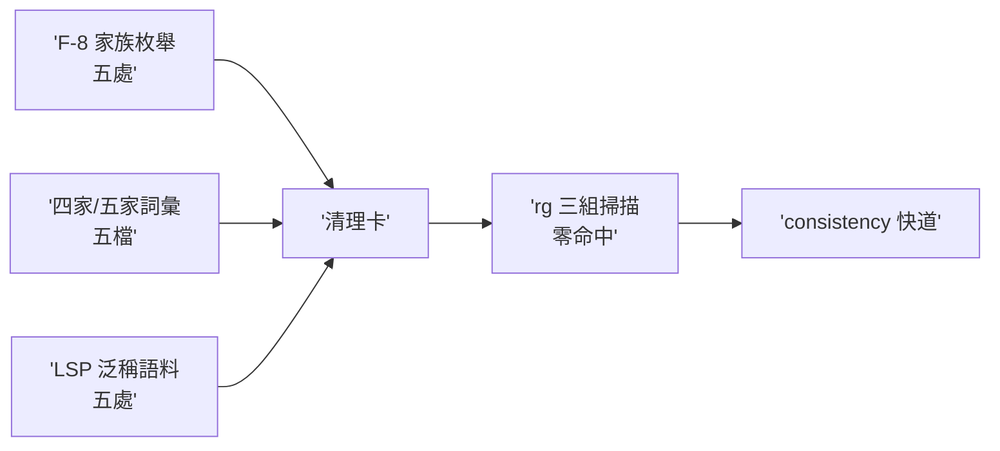

## Description

<!-- SECTION:DESCRIPTION:BEGIN -->
累積三組措辭/枚舉 drift 一次清（皆 pre-existing、低風險、控制面路徑小改）：①AIR-226 F-8 五處家族枚舉（AGENTS.md:114、work-order.md:3/:105/:170、state-review:5——動前 rg 重掃現值）②四家/五家詞彙 5 檔（CLAUDE.md wrapper、instruction-writing、instruction-init、model-routing、bridge-dispatch）③AIR-227 F-03 carrier-ambiguous LSP 泛稱語料五處（execution-plan:237/:276、cr-query:47-48/:112、ep-review:74/:86、fix-test:204——新 doctrine：結構面走 CR、lsp-bridge 無 references；泛稱 goToDefinition/findReferences 指令會靜默滑向 rg）。驗收：三組 rg 掃描零命中（歷史卡/歸檔除外）＋consistency 快道。

<!-- SECTION:DESCRIPTION:END -->

## Implementation Notes

<!-- SECTION:NOTES:BEGIN -->
第四組追加（AIR-228 fresh-F3 judge 裁決歸併）：bridge-dispatch:66＋symbol-query-routing:25 的降級原因記載仍為 no-cr-query-face 單值時代措辭——改為指涉 cr-query『card-WT 結構證據供給』節的 reason 值清單（no-cr-query-face／WT-graph-absent／WT-graph-stale）。
<!-- SECTION:NOTES:END -->
