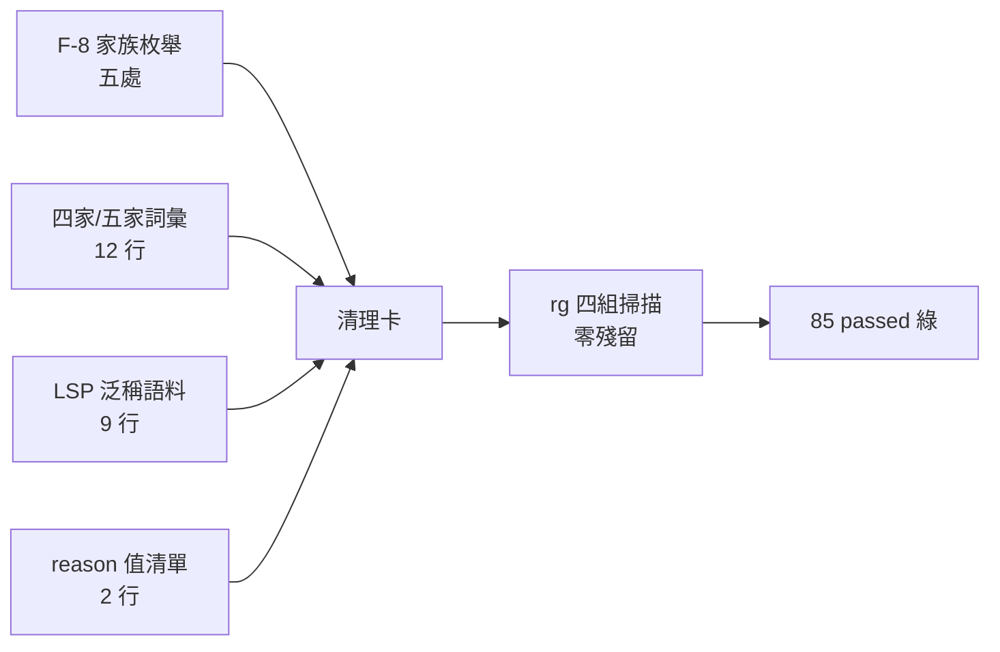
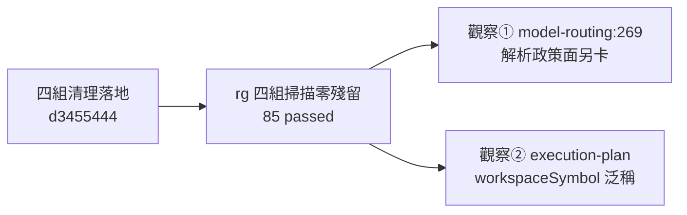

## Description

<!-- SECTION:DESCRIPTION:BEGIN -->
累積**四組**措辭/枚舉 drift 一次清（皆 pre-existing、低風險、控制面路徑小改）：①AIR-226 F-8 五處家族枚舉（AGENTS.md:114、work-order.md、state-review:5——動前 rg 重掃現值）②四家/五家詞彙五檔（CLAUDE.md wrapper、instruction-writing、instruction-init、model-routing、bridge-dispatch）③AIR-227 F-03 carrier-ambiguous LSP 泛稱語料（execution-plan、cr-query、ep-review、fix-test——新 doctrine：結構面走 CR、lsp-bridge 無 references；泛稱 goToDefinition/findReferences 指令會靜默滑向 rg）④AIR-228 fresh-F3——bridge-dispatch:66＋symbol-query-routing:25 的降級 reason 值清單同步（指涉 cr-query AIR-228 節）。驗收：四組 rg 掃描零殘留＋single-source suite 綠。

<!-- SECTION:DESCRIPTION:END -->

## Implementation Plan

<!-- SECTION:PLAN:BEGIN -->
〔Planning Contract——AIR-229（simple tier——純措辭/枚舉 drift 掃清，零行為變更）〕
**Baseline**：main @ c9094ae9。**Scope**：動＝skills/ 四組列舉檔＋AGENTS.md＋CLAUDE.md；不動＝cr-query 凍結節本體、bridge-dispatch route 段、workflow-review-pattern、wt-open.sh。**驗證式**：四組 rg 掃零殘留（歷史卡/歸檔除外）＋test_check_single_source 綠。
<!-- SECTION:PLAN:END -->

## Implementation Notes

## Implementation Notes

<!-- SECTION:NOTES:BEGIN -->
第四組追加（AIR-228 fresh-F3 judge 裁決歸併）：bridge-dispatch:66＋symbol-query-routing:25 的降級原因記載仍為 no-cr-query-face 單值時代措辭——改為指涉 cr-query『card-WT 結構證據供給』節的 reason 值清單（no-cr-query-face／WT-graph-absent／WT-graph-stale）。

【結案】四組清理落地（d3455444）：F-8 家族枚舉五處／詞彙 12 行／LSP 泛稱 9 行／reason 值清單 2 行；85 passed；marshal 機驗 rg 對帳全綠。範圍外觀察兩項遞交：①model-routing:269 跨家族解析表「相異家族僅剩 codex/glm」事實 stale（grok 開家後）——解析政策面非措辭，建議另卡；②execution-plan:236/:244/:275 workspaceSymbol 泛稱同款——下次動該檔一併補。user 授權脈絡：「２２９處理完了嗎？」＝催辦確認，值星自主弧。
<!-- SECTION:NOTES:END -->

## Acceptance Criteria

- [x] 組① F-8 家族枚舉五處——「三家族」全 repo 零命中（rg 實證）
- [x] 組② 四家/三端詞彙——殘留僅 bridge 面「四家族」正確形態（rg 實證）
- [x] 組③ LSP 泛稱語料——10 命中中 8 處帶 CR-first/carrier 限定，2 處範圍外註記
- [x] 組④ reason 值清單——bridge-dispatch:66＋symbol-query-routing:25 指涉 cr-query AIR-228 節
- [x] test_check_single_source 85 passed；14 檔 diff 全數為四組列舉目標（負向對帳）

## Final Summary

<!-- SECTION:FINAL_SUMMARY:BEGIN -->
**as-built 終態**（main @ d3455444）：四組措辭/枚舉 drift 掃清——五家 harness／bridge 四家族枚舉全 repo 一致；LSP 泛稱語料補 CR-first＋carrier 限定（lsp-bridge 無 references/definition 禁滑向 rg）；降級 reason 值清單單一源指涉 cr-query AIR-228 節。範圍外觀察兩項遞交：model-routing:269 解析政策面 stale（grok 開家後）＋execution-plan workspaceSymbol 泛稱——皆待另卡。

<!-- SECTION:FINAL_SUMMARY:END -->
