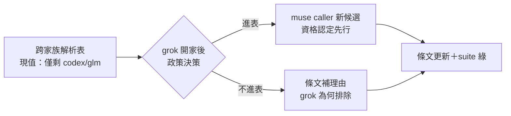

## Description

<!-- SECTION:DESCRIPTION:BEGIN -->
model-routing 的跨家族解析表還寫著「相異家族僅剩 codex／glm」（grok 開家前的事實）。grok 已於 2026-10-01 正式開家（AIR-226），解析政策面需要一次決策：muse caller 現在恆 fail-loud 是否仍對？grok 能不能作為跨家族第二意見的候選（它的審查資格／qualification 現值為何）？這是政策決策卡不是措辭卡——先裁決 grok 在解析表的地位，再動條文。

**做什麼**：裁決 grok 進不進跨家族解析表（含其 review qualification 資格認定）→ 更新 model-routing 跨家族解析表條文 → single-source suite 綠。
**不做什麼**：不動 grok 既有 binding／flag 事實（AIR-226 已定）；不做措辭掃蕩（那是 AIR-229 已完成的批次）。

<!-- SECTION:DESCRIPTION:END -->

## Implementation Plan

<!-- SECTION:PLAN:BEGIN -->
〔Planning Contract——AIR-230（standard tier——解析政策決策＋單檔條文更新）〕
**Baseline**：main @ 1a140ef0。**已決策勿重辯**：①grok 家族事實（binding／flag／sandbox authority）以 AIR-226 卡與 bridge-dispatch skill 為單一源，本卡不重驗；②家族措辭掃蕩不在本卡範圍（AIR-229 已結案）。**範圍**：動＝model-routing 跨家族解析表節＋（若裁決進表）reviewer 資格面相關節；不動＝bridge-dispatch 等其他檔的家族枚舉（除非 drift 掃描命中）。**驗收式**：解析表與 grok 現況一致（rg「相異家族僅剩」零殘留或語義更新）＋test_check_single_source 綠＋裁決理由入卡 notes。
<!-- SECTION:PLAN:END -->

## Implementation Notes

<!-- SECTION:NOTES:BEGIN -->
【user 裁決（2026-10-02）】grok 進跨家族解析表，待遇比照 muse 首次啟用：列為第二意見候選、qualification 標未認證（AIR-226 零繼承——AC10 驗的是沙箱非審查品質），資格確認＝下一個適合的真實弧派 grok 外審樣本（候選：AIR-231 的外審腿），樣本通過後轉正。條文更新照此落。
<!-- SECTION:NOTES:END -->

## Acceptance Criteria

- [x] 解析表更新：第二意見候選＝codex／glm／grok（explicit-only），「僅剩 codex」零殘留
- [x] grok 資格待遇節（:271）：qualification 未認證＋比照 muse 首次啟用＋樣本通過前不作唯一外審腿＋資格確認安排
- [x] test_check_single_source 85 passed；單檔變更零外溢

## Final Summary

<!-- SECTION:FINAL_SUMMARY:BEGIN -->
**as-built 終態**（main @ 51eddbbd）：跨家族解析表反映 grok 開家現實——第二意見候選三家族，grok qualification 未認證（比照 muse 首次啟用：真實弧外審樣本累積資格、通過前不作唯一外審腿、資格確認安排下一真實弧）。資格樣本取得後 update 本表狀態。

<!-- SECTION:FINAL_SUMMARY:END -->
