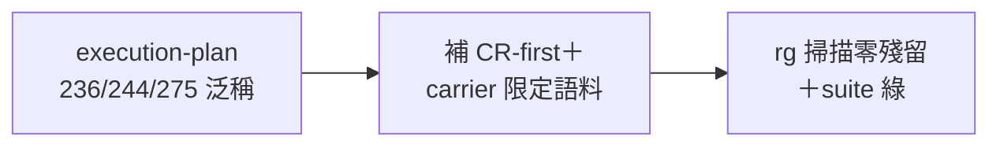
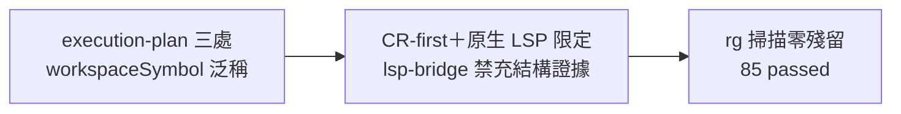

## Description

<!-- SECTION:DESCRIPTION:BEGIN -->
execution-plan 三處（236/244/275 行附近）寫著「LSP workspaceSymbol 搜尋相關 class/function」——這是泛稱 LSP 指令，但 lsp-bridge 沒有 workspaceSymbol／references／definition 這類操作（只有 hover／check_file）。照 AIR-227 後的新 doctrine：結構面查證走 code-reality（CR-first）、即時型別/簽名才走 lsp-bridge hover/check_file；泛稱指令會讓執行者靜默滑向 rg 當結構證據。

AIR-229 批次③清了其他檔的同款語料（execution-plan:236/:244/:275 當時標範圍外「下次動該檔一併補」），本卡把這三處補齊，補完泛稱掃描零殘留。

**做什麼**：三處泛稱補 CR-first＋carrier 限定語料（比照 AIR-229 批次③的修法）→ `rg workspaceSymbol` 掃 skills/ 零未限定殘留 → single-source suite 綠。
**不做什麼**：不重構 execution-plan 其他段落；不動已修完的其他檔。

<!-- SECTION:DESCRIPTION:END -->

## Implementation Plan

<!-- SECTION:PLAN:BEGIN -->
〔Planning Contract——AIR-231（simple tier——單檔泛稱語料補齊，零行為變更）〕
**Baseline**：main @ 1a140ef0。**已決策勿重辯**：①修法比照 AIR-229 批次③（CR-first＋carrier 限定：結構面走 CR、lsp-bridge 僅 hover/check_file、泛稱禁充結構證據）；②範圍限 execution-plan 三處，其他檔 AIR-229 已清不再動。**範圍**：動＝skills/execution-plan/SKILL.md:236/:244/:275 三處；不動＝該檔其餘段落。**驗收式**：rg「workspaceSymbol」skills/ 全域零未限定泛稱殘留＋test_check_single_source 綠。
<!-- SECTION:PLAN:END -->

## Acceptance Criteria

- [x] execution-plan 三處（:236/:244/:275）泛稱補 CR-first＋原生 LSP carrier 限定（lsp-bridge 無 workspaceSymbol/references/definition 禁充結構證據）
- [x] rg「workspaceSymbol」skills/ 全域零未限定泛稱殘留（範圍外遞交：review-engine:84-85 兩處 bare 形——同 AIR-229 先例另卡）
- [x] test_check_single_source 85 passed

## Final Summary

<!-- SECTION:FINAL_SUMMARY:BEGIN -->
**as-built 終態**（main @ c9061d53）：execution-plan 三處 LSP workspaceSymbol 泛稱補 CR-first＋carrier 限定（比照 AIR-229 批次③形態）——結構面查證回歸 code-reality、lsp-bridge 限定 hover/check_file。泛稱語料掃清至此涵蓋 execution-plan；範圍外遞交 review-engine:84-85。

<!-- SECTION:FINAL_SUMMARY:END -->
