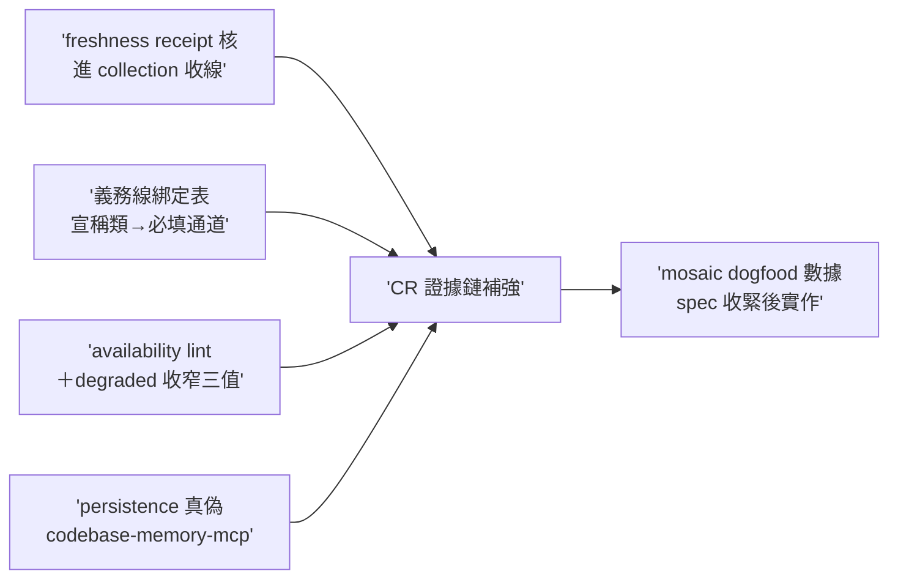
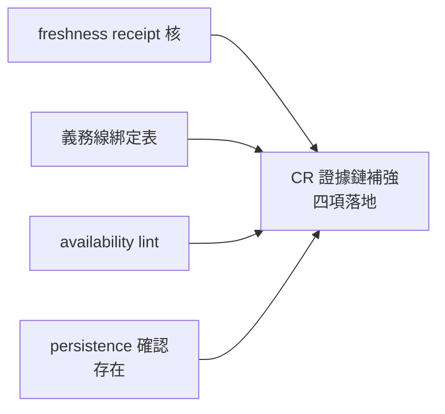

## Description

<!-- SECTION:DESCRIPTION:BEGIN -->
draft 態（To Do；spec 待 mosaic dogfood 數據回來收緊）。源＝mosaic MOS-168 弧後 tri 收斂信（材料指針：mosaic repo .agent-tmp/tri-cr-wt/ 三腿輸出＋brief；信件 id 見 mosaic 側送達回執，ai-guide-marshal 已消化）。

**事實更正（防漂——記錄本故事時以此為準）**：①graph artifact 分享（persistence 面）歸屬 codebase-memory-mcp 非 code-reality（mosaic 腿實查 code-reality crates 零命中）；②雙生守衛案例（mosaic case_manifest 與 alpha_forge 的同名同構函式）的抓法是 refs 同構搜尋（同名符號枚舉）非 callers——callers 對跨模組同名不命中，義務線設計須含同構發現。ai-guide 側掃描零錯誤存檔（rg 檢查 2026-10-02）。

**四項建置（ai-guide owner）**：①freshness receipt 核進 collection——AIR-216 histogram 只證 route 遵循不證 freshness，stale graph＋全套 live-cr＝洗白負存在斷言；收線核加 indexed identity vs 消費樹＋overlap 檢查（接線面：work-order 收線核對節＋bridge-dispatch collection）②Q5 義務線綁定表進 work-order 模板——宣稱類型綁定必填 evidence channel：消費者枚舉宣稱→必 callers／blast radius→必 closure 或 impact_radius／死碼可刪不影響 X→必 callers＋hub_refs hazard＋rg 補盲（動態派發字串鍵是 graph 盲區）／同構雙生疑慮→必 refs symbol 搜尋（雙生守衛案例教訓）；只對上四類宣稱觸發非逐 finding③dispatcher availability lint＋degraded 合法條件收窄三值（no-cr-query-face／WT-graph-absent／WT-graph-stale）＋face 在場而未查＝delivery defect 嚴格執行④persistence 真偽確認（codebase-memory-mcp 面——graph artifact 分享候選擱置中，確認存在與否定後續）。

**不做**：scope/增量 build（圖不全 false negative 比 stale 更危險——拒）；symlink 卡 WT .code-reality（build 寫穿污染 main 槽——拒）；唯讀槽（待工具原生支援）；引擎判準語義變更（AIR-135.2 freshness 判準不變，只加跨 WT 消費規則）。

**mosaic 分層對照**：A 層即刻慣例（dispatcher-preprovided／共享 graph 正向腿／freshness hook／紀律化 fallback）歸 mosaic 自主已跑；本卡＝B 層建置；C 層一行已記 AIR-224.1。

<!-- SECTION:DESCRIPTION:END -->

## Implementation Notes

<!-- SECTION:NOTES:BEGIN -->
【升級決策】四項不依賴 mosaic dogfood 數據（tri 報告已具體到可實作）——mosaic 數據回來後僅做事後驗證素材非阻塞；draft 態結束

【實作完成】四項全落地（main @ 8854099b）：①work-order freshness receipt 核（indexed identity vs 消費樹＋overlap——落 §7 指涉 bridge-dispatch 條款）②宣稱—證據通道綁定表（四類宣稱→必填通道，§7）③degraded 收窄三值＋availability lint（model-routing resolver 步驟 3）④persistence 真偽確認＝**存在**（owner codebase-memory-mcp：graph.db.zst export＋bootstrap，報告 .agent-tmp/air-232/persistence-verify.md）——分享候選擱置解除，啟動歸 owning 決策。85 passed。
<!-- SECTION:NOTES:END -->

## Acceptance Criteria

- [x] freshness receipt 核進 work-order（indexed identity vs 消費樹＋overlap 檢查——語義單一源指 cr-query/AIR-228 不重抄）
- [x] 宣稱—證據通道綁定表（四類宣稱→必填通道：枚舉→callers／blast→closure/impact／死碼→callers＋hub_refs＋rg／同構→refs）
- [x] degraded 合法值收窄三值＋face 在場未查＝delivery defect
- [x] dispatcher availability lint（model-routing resolver——結構義務腿禁派無 face carrier）
- [x] persistence 真偽確認：**存在**——owner＝codebase-memory-mcp（graph.db.zst export＋bootstrap，file:line 報告在弧暫存）
- [x] 85 passed＋單檔外零外溢

## Final Summary

<!-- SECTION:FINAL_SUMMARY:BEGIN -->
**as-built 終態**（main @ 8854099b）：MOS-168 tri B 層四項全落地——CR 證據鏈補強完成（freshness 核＋綁定表＋lint＋真偽確認）。persistence 分享候選（graph.db.zst）擱置解除——啟動歸 owning 決策。

<!-- SECTION:FINAL_SUMMARY:END -->
